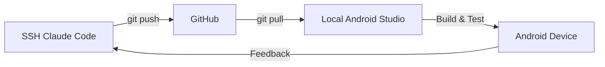

# Git 실시간 동기화 가이드

SSH 환경과 로컬 환경을 Git으로 실시간 동기화하며 개발하는 방법들입니다.

## 방법 1: Git Worktree (추천) ⭐

같은 저장소의 여러 브랜치를 동시에 작업할 수 있습니다.

### 설정 방법

**로컬에서:**
```bash
# 메인 저장소 클론
git clone https://github.com/crazybass81/DOT.git
cd DOT

# 개발용 워크트리 추가
git worktree add -b dev-local ../DOT-local
cd ../DOT-local
```

**SSH에서:**
```bash
# 개발용 브랜치 생성
git checkout -b dev-ssh
```

### 동기화 워크플로우
```bash
# SSH에서 작업 후
git add . && git commit -m "SSH changes"
git push origin dev-ssh

# 로컬에서 받기
git fetch origin
git merge origin/dev-ssh
```

---

## 방법 2: Git Auto-Sync 스크립트 🔄

자동으로 변경사항을 감지하고 동기화합니다.

### auto-sync.sh (SSH 서버용)
```bash
#!/bin/bash

# Git Auto Sync for SSH Development
PROJECT_DIR="/home/ec2-user/DOT"
BRANCH="auto-sync"
SYNC_INTERVAL=10  # seconds

cd $PROJECT_DIR

# 자동 커밋 및 푸시 함수
auto_commit_push() {
    if [[ -n $(git status -s) ]]; then
        echo "📝 Changes detected, syncing..."
        git add -A
        git commit -m "Auto-sync: $(date '+%Y-%m-%d %H:%M:%S')"
        git push origin $BRANCH
        echo "✅ Synced to remote"
    fi
}

# 브랜치 확인/생성
git checkout $BRANCH 2>/dev/null || git checkout -b $BRANCH

echo "🔄 Auto-sync started on branch: $BRANCH"
echo "Press Ctrl+C to stop"

# 메인 루프
while true; do
    auto_commit_push
    sleep $SYNC_INTERVAL
done
```

### local-sync.sh (로컬용)
```bash
#!/bin/bash

# Git Auto Pull for Local Development
PROJECT_DIR="/Users/you/DOT"
REMOTE_BRANCH="auto-sync"
SYNC_INTERVAL=10

cd $PROJECT_DIR

# 자동 풀 함수
auto_pull() {
    git fetch origin
    LOCAL=$(git rev-parse HEAD)
    REMOTE=$(git rev-parse origin/$REMOTE_BRANCH)
    
    if [ $LOCAL != $REMOTE ]; then
        echo "📥 Pulling changes..."
        git pull origin $REMOTE_BRANCH
        echo "✅ Updated from SSH"
    fi
}

echo "🔄 Auto-pull started from branch: $REMOTE_BRANCH"
echo "Press Ctrl+C to stop"

while true; do
    auto_pull
    sleep $SYNC_INTERVAL
done
```

---

## 방법 3: Git Hooks 실시간 동기화 🪝

Git hooks를 사용한 자동 동기화

### SSH 서버: .git/hooks/post-commit
```bash
#!/bin/bash
# 커밋 후 자동 푸시
git push origin HEAD
```

### 로컬: .git/hooks/post-merge
```bash
#!/bin/bash
# Pull 후 자동으로 Android Studio 새로고침
osascript -e 'tell application "Android Studio" to activate'
```

---

## 방법 4: rsync + Git 하이브리드 🚀

실시간 파일 동기화 + Git 버전 관리

### 실시간 동기화 (로컬에서 실행)
```bash
# 단방향 동기화 (SSH → 로컬)
while true; do
    rsync -avz --delete \
        --exclude='.git' \
        --exclude='node_modules' \
        --exclude='build' \
        user@ssh-server:/home/ec2-user/DOT/ \
        ~/DOT-sync/
    sleep 2
done
```

### 양방향 동기화 (Unison 사용)
```bash
# unison 설치
brew install unison  # macOS
apt install unison   # Linux

# 프로파일 생성 (~/.unison/dot.prf)
root = /Users/you/DOT
root = ssh://user@server//home/ec2-user/DOT
ignore = Path {.git,node_modules,build}
batch = true
repeat = 2
```

실행:
```bash
unison dot
```

---

## 방법 5: VS Code Live Share 🔴

VS Code의 Live Share로 실시간 협업

1. **SSH VS Code에서:**
   - Live Share 확장 설치
   - 세션 시작 및 링크 공유

2. **로컬 VS Code/Android Studio:**
   - 링크로 접속
   - 실시간 코드 편집

---

## 방법 6: Git Flow 통합 워크플로우 📊

구조화된 브랜치 전략으로 동기화

```bash
# 브랜치 구조
main
├── develop
│   ├── feature/ssh-work
│   └── feature/local-work
└── hotfix/
```

### SSH 작업
```bash
git checkout -b feature/ssh-$(date +%s)
# 작업...
git push origin feature/ssh-*
```

### 로컬 작업
```bash
git checkout -b feature/local-$(date +%s)
# Android Studio에서 작업...
git push origin feature/local-*
```

### 병합
```bash
git checkout develop
git merge feature/ssh-* feature/local-*
```

---

## 최적의 조합 추천 🎯

### 개발 단계별 추천

1. **초기 개발**: Git Worktree + 수동 동기화
2. **활발한 개발**: Auto-sync 스크립트
3. **테스트 단계**: rsync + Git
4. **협업**: VS Code Live Share

### 안드로이드 스튜디오 통합 워크플로우



### 실시간 동기화 설정 (추천)

**Step 1**: SSH에서 auto-sync.sh 실행
```bash
cd /home/ec2-user/DOT
./auto-sync.sh &
```

**Step 2**: 로컬에서 local-sync.sh 실행
```bash
cd ~/DOT
./local-sync.sh &
```

**Step 3**: Android Studio 자동 새로고침 설정
- Preferences → Build, Execution, Deployment → Compiler
- "Build project automatically" 체크
- Registry에서 "compiler.automake.allow.when.app.running" 활성화

---

## 문제 해결

### 충돌 발생 시
```bash
# SSH에서
git stash
git pull origin main
git stash pop

# 충돌 해결 후
git add .
git commit -m "Resolved conflicts"
git push
```

### 동기화 지연
- sync interval 줄이기 (2-5초)
- .gitignore 최적화로 불필요한 파일 제외
- 네트워크 상태 확인

### Android Studio 인식 안 됨
- File → Invalidate Caches and Restart
- Gradle sync 수동 실행
- .idea 폴더 삭제 후 재시작

---

## 보안 고려사항 🔐

1. **민감한 파일 제외**
   ```gitignore
   .env
   *.key
   secrets/
   ```

2. **브랜치 보호**
   - main 브랜치 직접 푸시 금지
   - PR 통한 병합만 허용

3. **SSH 키 사용**
   ```bash
   git remote set-url origin git@github.com:crazybass81/DOT.git
   ```

---

## 결론

**가장 실용적인 조합:**
1. Git auto-sync 스크립트로 실시간 동기화
2. Android Studio에서 로컬 저장소 열기
3. 변경사항은 자동으로 반영
4. Flutter hot reload로 즉시 테스트

이렇게 하면 SSH에서 Claude Code로 개발하고, 로컬 Android Studio에서 실시간으로 확인하며 디버깅할 수 있습니다!