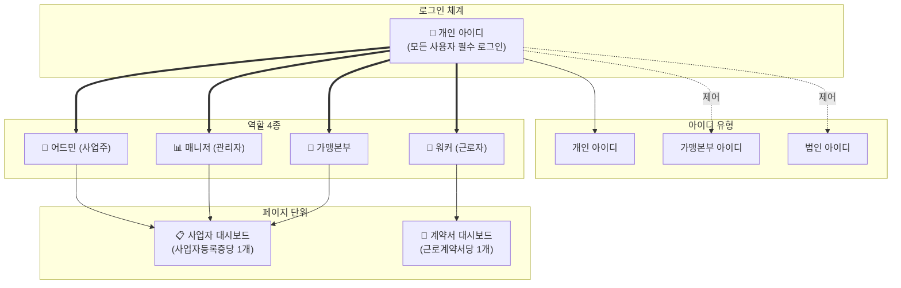
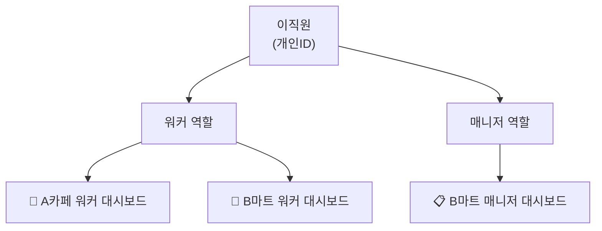
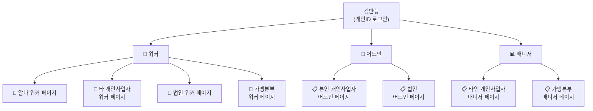
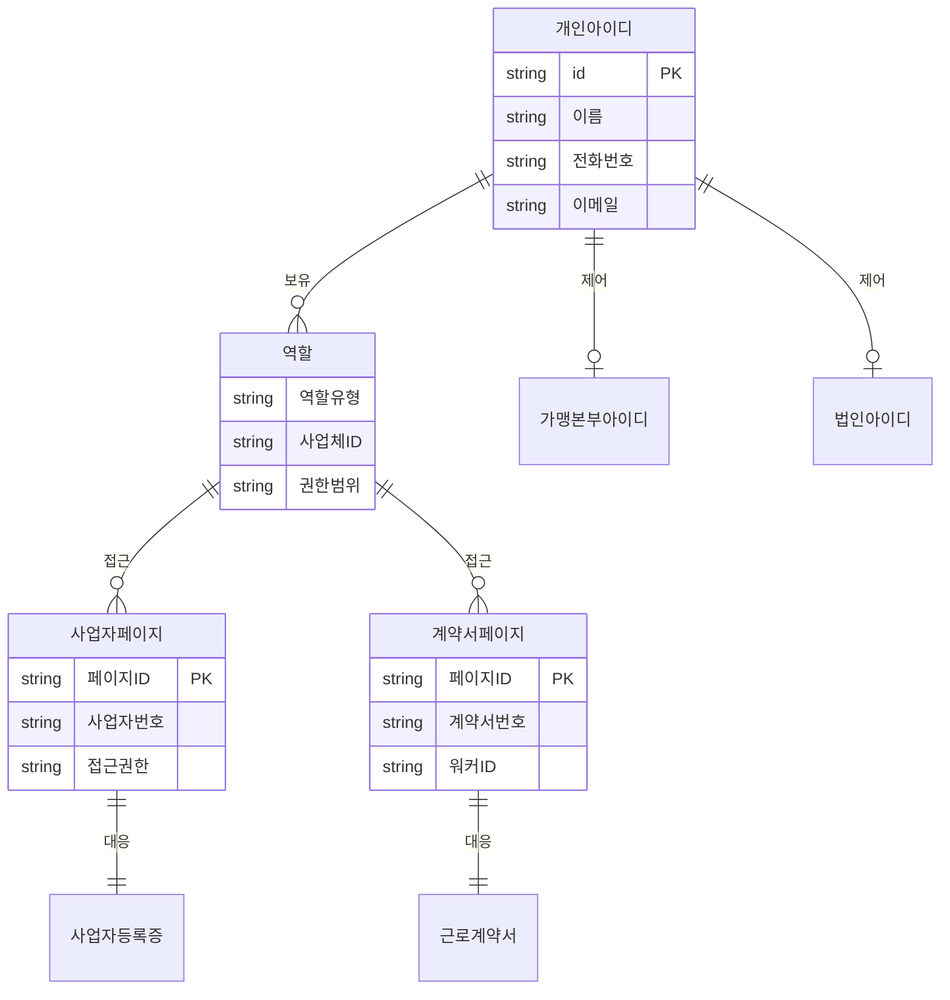

죄송합니다! 머메이드 다이어그램을 캔버스에서 제대로 렌더링해드리겠습니다.

## 사용자 권한 시스템 다이어그램

### 1. 아이디 체계와 역할 구조

### 2. 사용 케이스별 다이어그램

#### Case 1: 단순 워커 (알바생)

#### Case 2: 워커 + 매니저

#### Case 3: 최복잡 케이스

### 3. 데이터 관계도

캔버스에서 다이어그램이 제대로 보이시나요? 머메이드 형식으로 작성했는데, 혹시 다른 형식(플로우차트, 이미지 등)으로 다시 만들어드릴까요?