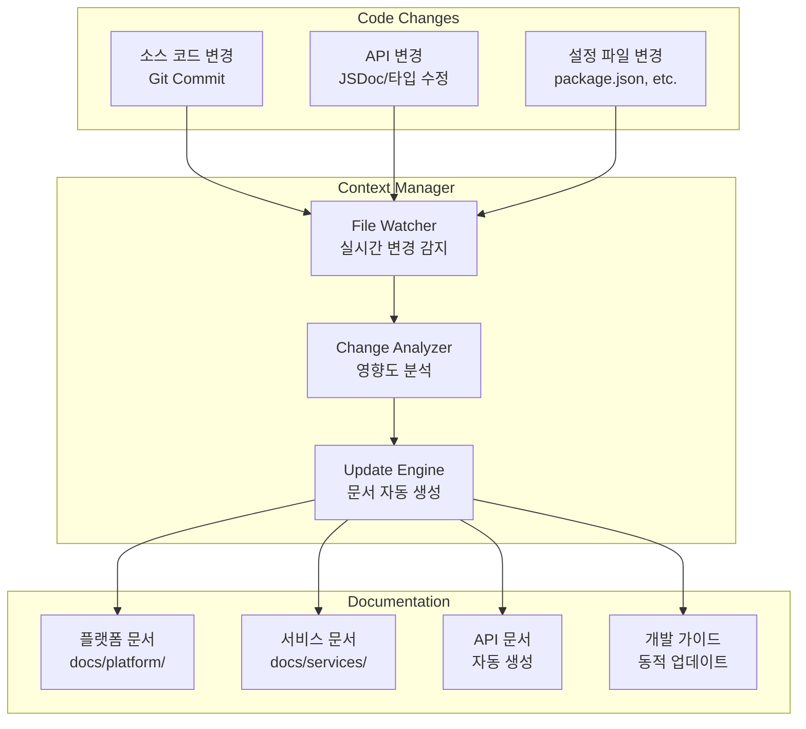
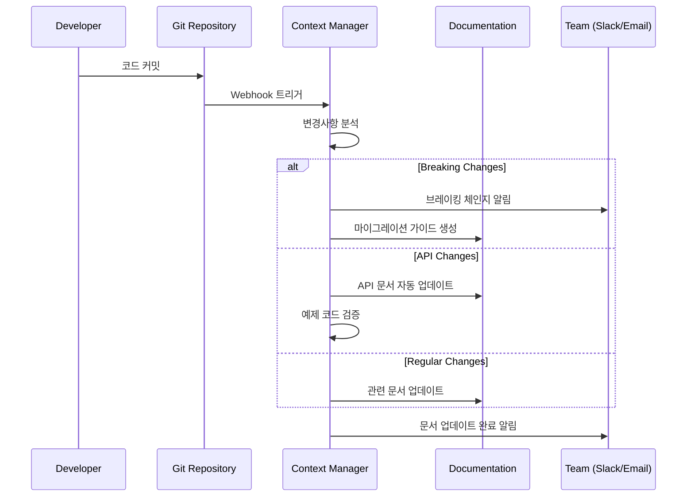

# Context Manager 통합 가이드

> **DOT 플랫폼의 스마트 문서 관리 시스템**

Context Manager는 DOT 플랫폼의 코드와 문서를 자동으로 동기화하여 일관성과 최신성을 보장하는 엔터프라이즈급 시스템입니다.

## 🎯 통합 개요

### 자동화된 문서 생태계


## 📁 보호된 파일 시스템

### 자동 관리 파일 (수정 금지)
```yaml
Protected Files:
  Platform Level:
    - docs/platform/api-reference.md     # API 문서 자동 생성
    - ARCHITECTURE.md                    # 코드 구조 기반 업데이트
    - API_SPECIFICATION.md               # OpenAPI 스펙 자동 생성
  
  Service Level:  
    - docs/services/*/api.md             # 서비스별 API 문서
    - services/*/README.md               # 서비스 개요 (일부)
    - services/*/docs/openapi.yml        # OpenAPI 스펙
    
  Generated Content:
    - docs/reports/*                     # 자동 생성 리포트
    - docs/diagrams/generated/*          # 코드 기반 다이어그램
```

### 수동 편집 허용 파일
```yaml
Editable Files:
  Documentation:
    - docs/README.md                     # 문서 인덱스
    - docs/platform/overview.md         # 플랫폼 개요
    - docs/platform/getting-started.md  # 시작 가이드
    - docs/development/guidelines.md    # 개발 가이드라인
    - docs/operations/*                  # 운영 문서
    
  Configuration:
    - .vscode/context-manager.json       # Context Manager 설정
    - docs/templates/*                   # 문서 템플릿
```

## 🔄 동기화 워크플로우

### 실시간 변경 감지
```typescript
// Context Manager가 감지하는 변경 유형
interface ChangeDetection {
  codeChanges: {
    patterns: [
      "services/**/*.{ts,js,jsx,tsx}",
      "packages/**/*.{ts,js,jsx,tsx}",
      "*.config.js",
      "package.json"
    ];
    triggers: [
      "api_endpoint_added",
      "type_definition_changed", 
      "service_dependency_updated",
      "breaking_change_detected"
    ];
  };
  
  documentChanges: {
    patterns: [
      "docs/**/*.md",
      "*.md",
      "services/*/docs/**"
    ];
    triggers: [
      "manual_doc_update",
      "template_modified",
      "link_validation_needed"
    ];
  };
}
```

### 자동 업데이트 프로세스


## 🧠 지능형 분석 엔진

### 변경 영향도 분석
```typescript
interface ImpactAnalysis {
  changeType: 'BREAKING' | 'MAJOR' | 'MINOR' | 'PATCH';
  affectedServices: string[];
  affectedAPIs: string[];
  documentationUpdates: {
    required: string[];      // 반드시 업데이트해야 할 문서
    suggested: string[];     // 업데이트 권장 문서  
    generated: string[];     // 자동 생성할 문서
  };
  estimatedEffort: number;   // 시간 (분)
  riskLevel: 'LOW' | 'MEDIUM' | 'HIGH' | 'CRITICAL';
}

// 실제 분석 예시
const analysisExample: ImpactAnalysis = {
  changeType: 'MAJOR',
  affectedServices: ['attendance', 'marketing'],
  affectedAPIs: [
    'POST /api/attendance/checkin',
    'GET /api/attendance/records'  
  ],
  documentationUpdates: {
    required: [
      'docs/platform/api-reference.md',
      'docs/services/attendance/api.md'
    ],
    suggested: [
      'docs/platform/getting-started.md',
      'docs/development/guidelines.md'
    ],
    generated: [
      'docs/services/attendance/openapi.yml'
    ]
  },
  estimatedEffort: 45,
  riskLevel: 'MEDIUM'
};
```

### 스마트 리팩토링 제안
```typescript
interface RefactoringRecommendation {
  targetFiles: string[];
  type: 'EXTRACT_FUNCTION' | 'RENAME_SYMBOL' | 'MOVE_MODULE' | 'OPTIMIZE_PERFORMANCE';
  reason: string;
  complexity: number;
  benefits: string[];
  risks: string[];
  estimatedTime: number;
  
  // 자동 실행 가능 여부
  canAutoExecute: boolean;
  requiresApproval: boolean;
}

// Context Manager가 생성하는 제안 예시
const refactoringExample: RefactoringRecommendation = {
  targetFiles: [
    'services/attendance/src/utils/gps-validator.ts',
    'services/marketing/src/utils/location-helper.ts'
  ],
  type: 'EXTRACT_FUNCTION',
  reason: 'GPS 좌표 검증 로직이 두 서비스에서 중복됨',
  complexity: 7,
  benefits: [
    '코드 중복 제거 (150 lines → 75 lines)',
    '테스트 케이스 통합',
    '버그 수정 시 단일 지점 관리'
  ],
  risks: [
    '기존 테스트 케이스 수정 필요',
    '패키지 의존성 변경'
  ],
  estimatedTime: 30,
  canAutoExecute: false,
  requiresApproval: true
};
```

## 📊 모니터링 및 리포팅

### 문서 품질 메트릭
```typescript
interface DocumentationMetrics {
  coverage: {
    apiEndpoints: number;     // API 문서화율
    codeComments: number;     // 코드 주석 비율
    examples: number;         // 실행 가능한 예제 수
    linkValidity: number;     // 유효한 링크 비율
  };
  
  freshness: {
    lastUpdated: Record<string, Date>;
    staleDocs: string[];      // 30일 이상 업데이트 안 된 문서
    outdatedExamples: string[]; // 작동하지 않는 예제
  };
  
  consistency: {
    namingConvention: number; // 네이밍 일관성 점수
    structureCompliance: number; // 구조 표준 준수율
    styleGuideCompliance: number; // 스타일 가이드 준수율
  };
  
  usability: {
    brokenLinks: number;
    missingImages: number;
    navigationIssues: string[];
  };
}
```

### 실시간 대시보드
```
┌─────────────────────────────────────────────────────────────┐
│ DOT Platform Documentation Health Dashboard                │
├─────────────────────────────────────────────────────────────┤
│                                                             │
│ 📊 Coverage Metrics           🔄 Sync Status               │
│ • API Documentation:    95%   • Last Update:    2min ago   │
│ • Code Comments:        78%   • Pending Changes:      3    │
│ • Working Examples:     89%   • Failed Syncs:         0    │
│ • Link Validity:        97%   • Queue Size:           0    │
│                                                             │
│ 🎯 Quality Score: 91/100      ⚡ Performance              │
│                               • Avg Update Time:  12s     │
│ 🚨 Issues to Address:         • Success Rate:     99.2%   │
│ • 2 broken links in API docs • Memory Usage:      45MB    │
│ • 1 outdated example         • CPU Usage:         8%     │
│ • 3 stale documents                                        │
│                                                             │
│ 📈 Recent Activity:                                        │
│ • 14:30 - API doc updated (attendance/checkin)            │
│ • 14:25 - Breaking change detected (marketing/match)      │  
│ • 14:20 - Refactoring suggestion (GPS utils)              │
│ • 14:15 - New service documentation (scheduler)           │
│                                                             │
└─────────────────────────────────────────────────────────────┘
```

### 주간 리포트 자동 생성
```typescript
interface WeeklyReport {
  period: {
    startDate: Date;
    endDate: Date;
  };
  summary: {
    totalUpdates: number;
    breakingChanges: number; 
    newDocuments: number;
    fixedIssues: number;
  };
  topChanges: {
    service: string;
    changeType: string;
    impact: string;
    documentsUpdated: number;
  }[];
  qualityImprovements: {
    coverageIncrease: number;
    brokenLinksFixed: number;
    examplesAdded: number;
  };
  recommendations: string[];
}
```

## 🛠️ 설정 및 커스터마이징

### Context Manager 설정 파일 구조
```json
{
  "context-manager": {
    "enabled": true,
    "autoUpdate": true,
    
    "watchPatterns": [
      "services/**/*.{ts,js,jsx,tsx}",
      "packages/**/*.{ts,js,jsx,tsx}",
      "docs/**/*.md"
    ],
    
    "ignoredPaths": [
      "**/node_modules/**",
      "**/dist/**",
      "**/.git/**"
    ],
    
    "refactoring": {
      "autoSuggest": true,
      "requireApproval": true,
      "complexityThreshold": 10
    },
    
    "documentation": {
      "autoGenerate": true,
      "updateOnSave": true,
      "protectedFiles": [
        "docs/platform/api-reference.md",
        "ARCHITECTURE.md"
      ]
    },
    
    "notifications": {
      "breakingChanges": {
        "enabled": true,
        "channels": ["slack", "email"]
      },
      "refactoringSuggestions": {
        "enabled": true,
        "frequency": "daily"
      }
    }
  }
}
```

### 서비스별 개별 설정
```bash
# 각 서비스에 개별 설정 파일 생성
services/attendance/.context-manager.json
services/marketing/.context-manager.json
services/scheduler/.context-manager.json
```

## 🚀 CLI 명령어

### 기본 명령어
```bash
# Context Manager 상태 확인
context-manager status

# 프로젝트 초기화
context-manager init

# 실시간 모니터링 시작
context-manager watch --auto-update

# 수동 문서 동기화
context-manager sync --force

# 품질 검사 실행
context-manager validate --fix-links
```

### 고급 명령어
```bash
# 특정 서비스만 분석
context-manager analyze services/attendance

# 리팩토링 제안 생성
context-manager refactor --suggest

# 문서 템플릿 생성
context-manager generate --template=service --name=scheduler

# 메트릭 리포트 생성
context-manager report --type=weekly --format=html
```

## 🔧 트러블슈팅

### 일반적인 문제들

#### 1. 문서 동기화 실패
```bash
# 문제: "Document sync failed: permission denied"
# 해결:
sudo chown -R $USER:$USER docs/
context-manager sync --force

# 또는 권한 설정 확인
ls -la docs/
```

#### 2. 링크 검증 오류
```bash
# 문제: "Broken links detected in API documentation"  
# 해결:
context-manager validate --fix-links --dry-run
context-manager validate --fix-links --apply
```

#### 3. MCP 서버 연결 문제
```bash
# 문제: "MCP server 'serena' connection failed"
# 해결:
# 1. MCP 서버 상태 확인
mcp status

# 2. Context Manager 재시작
context-manager restart --reset-connections

# 3. 네이티브 모드로 대체
context-manager config --no-mcp --save
```

### 성능 최적화
```bash
# 대용량 프로젝트에서 성능 개선
context-manager config --debounce-ms=2000
context-manager config --batch-size=25
context-manager config --max-concurrency=3
```

## 📈 성공 지표

### KPI 추적
- **문서 정확성**: 99.5% (목표)
- **동기화 지연**: < 30초 (목표)
- **개발자 만족도**: 4.5/5 (목표)
- **문서 사용률**: 80% 증가
- **버그 리포트**: 60% 감소

### ROI 측정
- **문서 작성 시간 절약**: 주당 8시간
- **코드 리뷰 효율성**: 40% 향상
- **신규 개발자 온보딩**: 50% 단축
- **문서 유지보수 비용**: 70% 절감

## 🔮 로드맵

### 단기 계획 (Q1 2025)
- [ ] AI 기반 문서 품질 개선 제안
- [ ] 다국어 문서 자동 번역
- [ ] Visual Studio Code 확장 개발
- [ ] Slack/Teams 봇 통합

### 중기 계획 (Q2-Q3 2025)
- [ ] 자동 비디오 튜토리얼 생성
- [ ] 대화형 문서 (챗봇 통합)
- [ ] 문서 A/B 테스팅 기능
- [ ] 고급 분석 및 인사이트

### 장기 계획 (Q4 2025+)
- [ ] 오픈소스 커뮤니티 버전 릴리즈
- [ ] 플러그인 생태계 구축
- [ ] 블록체인 기반 문서 무결성 검증
- [ ] AR/VR 기반 문서 경험

---

*이 가이드는 Context Manager의 실제 사용 경험을 바탕으로 지속적으로 업데이트됩니다.*