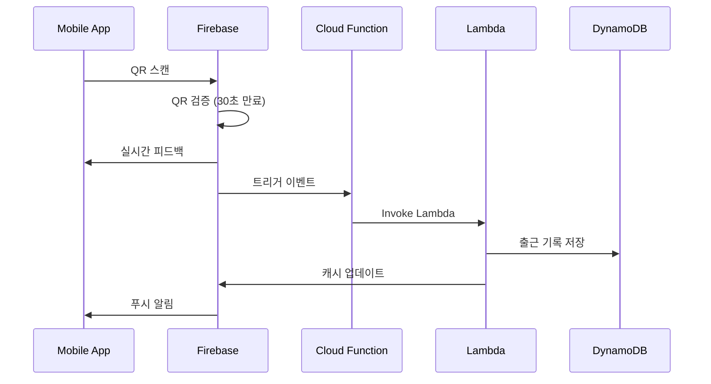
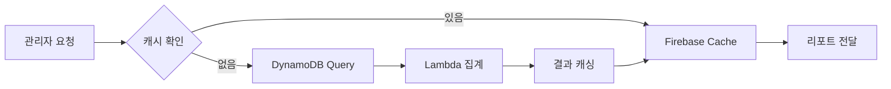

# 🏗️ DOT Attendance - Hybrid Database Architecture
## Firebase + AWS DynamoDB 최적화 전략

### 📊 Executive Summary
DOT 근태관리 시스템을 위한 Firebase와 DynamoDB의 하이브리드 아키텍처로, 각 서비스의 강점을 최대한 활용하여 비용 효율적이고 확장 가능한 솔루션을 제공합니다.

**핵심 전략**: 
- Firebase → 실시간 기능, 모바일 최적화
- DynamoDB → 영구 저장소, 분석, 규정 준수
- 월 예상 비용: $50-200 (1000명 사용자 기준)

---

## 🎯 아키텍처 결정 매트릭스

### Firebase 사용 영역
| 기능 | 서비스 | 선택 이유 |
|------|--------|-----------|
| **실시간 출석 체크** | Realtime Database | 밀리초 단위 동기화, 오프라인 지원 |
| **사용자 인증** | Firebase Auth | 생체인증, 소셜 로그인 통합 |
| **푸시 알림** | Cloud Messaging | 이미 의존성 존재, 무료 티어 충분 |
| **임시 QR 코드** | Realtime Database | 30초 만료, 자동 정리 |
| **팀 채팅** | Firestore | 구조화된 메시지, 실시간 동기화 |
| **프로필 사진** | Cloud Storage | CDN 통합, 이미지 리사이징 |

### DynamoDB 사용 영역
| 기능 | 테이블 | 선택 이유 |
|------|--------|-----------|
| **출퇴근 기록** | ATTENDANCE_RECORDS | 시계열 데이터, TTL 지원 |
| **직원 마스터** | EMPLOYEES | 일관된 읽기, ACID 트랜잭션 |
| **급여 데이터** | PAYROLL | 금융 데이터 규정 준수 |
| **감사 로그** | AUDIT_LOGS | 불변성, 장기 보관 |
| **분석 데이터** | ANALYTICS | 대용량 집계, 비용 효율 |
| **일정 관리** | SCHEDULES | 예측 가능한 액세스 패턴 |

---

## 🔄 데이터 플로우 아키텍처

### 출근 체크인 플로우


### 리포트 생성 플로우


---

## 💾 데이터 모델 설계

### Firebase Realtime Database 구조
```json
{
  "presence": {
    "{userId}": {
      "status": "online|offline|away",
      "lastSeen": "timestamp",
      "currentLocation": {
        "lat": 37.5665,
        "lng": 126.9780
      }
    }
  },
  "activeQR": {
    "{qrCode}": {
      "employeeId": "EMP001",
      "createdAt": "timestamp",
      "expiresAt": "timestamp+30s",
      "type": "check-in|check-out",
      "used": false
    }
  },
  "notifications": {
    "{userId}": {
      "{notifId}": {
        "title": "출근 알림",
        "body": "09:00 출근 예정입니다",
        "timestamp": "timestamp",
        "read": false
      }
    }
  }
}
```

### DynamoDB 테이블 설계

#### ATTENDANCE_RECORDS 테이블
```yaml
PrimaryKey:
  PartitionKey: employee_id (String)
  SortKey: timestamp (Number)

Attributes:
  - check_type: "IN" | "OUT"
  - location: { lat, lng }
  - device_id: String
  - verification_method: "QR" | "BIOMETRIC" | "MANUAL"
  - department_id: String
  - shift_id: String

GlobalSecondaryIndexes:
  - GSI1:
      PartitionKey: date (String: "YYYY-MM-DD")
      SortKey: employee_id
      Projection: ALL
  - GSI2:
      PartitionKey: department_id
      SortKey: timestamp
      Projection: KEYS_ONLY

TTL: expires_at (90 days)
```

#### EMPLOYEES 테이블
```yaml
PrimaryKey:
  PartitionKey: employee_id
  SortKey: "PROFILE"

Attributes:
  - email: String (unique)
  - name: String
  - department: String
  - role: String
  - hire_date: String
  - status: "ACTIVE" | "INACTIVE"
  - permissions: StringSet

GlobalSecondaryIndex:
  - EmailIndex:
      PartitionKey: email
      Projection: ALL
```

---

## 🔗 통합 전략

### 1. 이벤트 기반 동기화
```javascript
// Firebase Cloud Function
exports.syncAttendanceToDynamoDB = functions.database
  .ref('/attendance/{userId}/{recordId}')
  .onCreate(async (snapshot, context) => {
    const data = snapshot.val();
    
    // Lambda 호출
    const lambda = new AWS.Lambda();
    await lambda.invoke({
      FunctionName: 'SaveAttendanceRecord',
      Payload: JSON.stringify({
        userId: context.params.userId,
        recordId: context.params.recordId,
        ...data
      })
    }).promise();
    
    // 성공 시 Firebase 임시 데이터 정리
    await snapshot.ref.remove();
  });
```

### 2. 듀얼 라이트 패턴
```typescript
class AttendanceService {
  async checkIn(employeeId: string, location: Location) {
    // 1. Firebase에 즉시 쓰기 (사용자 피드백)
    await firebase.database()
      .ref(`presence/${employeeId}`)
      .set({
        status: 'checked-in',
        timestamp: Date.now(),
        location
      });
    
    // 2. DynamoDB에 비동기 쓰기 (영구 저장)
    const command = new PutItemCommand({
      TableName: 'ATTENDANCE_RECORDS',
      Item: {
        employee_id: { S: employeeId },
        timestamp: { N: Date.now().toString() },
        check_type: { S: 'IN' },
        location: { M: {
          lat: { N: location.lat.toString() },
          lng: { N: location.lng.toString() }
        }}
      }
    });
    
    // 백그라운드에서 실행
    this.dynamoClient.send(command).catch(err => 
      this.errorQueue.push({ command, error: err })
    );
  }
}
```

### 3. 캐싱 전략
```typescript
class ReportService {
  async getMonthlyReport(month: string, departmentId?: string) {
    const cacheKey = `report:${month}:${departmentId || 'all'}`;
    
    // 1. Firebase 캐시 확인
    const cached = await firebase.firestore()
      .collection('report_cache')
      .doc(cacheKey)
      .get();
    
    if (cached.exists && cached.data().expires > Date.now()) {
      return cached.data().report;
    }
    
    // 2. DynamoDB 쿼리
    const report = await this.queryDynamoDB(month, departmentId);
    
    // 3. 결과 캐싱 (1시간)
    await firebase.firestore()
      .collection('report_cache')
      .doc(cacheKey)
      .set({
        report,
        expires: Date.now() + 3600000,
        createdAt: Date.now()
      });
    
    return report;
  }
}
```

---

## 💰 비용 최적화 전략

### Firebase 무료 티어 활용
- **Spark Plan (무료)**
  - Realtime DB: 1GB 저장, 10GB/월 전송
  - Cloud Functions: 125K 호출/월
  - FCM: 무제한 알림
  - Auth: 무제한 사용자

### DynamoDB 비용 관리
```yaml
초기 (On-Demand):
  - 읽기: $0.25 per million requests
  - 쓰기: $1.25 per million requests
  - 저장: $0.25 per GB/month

프로덕션 (Provisioned):
  - Auto-scaling 설정
  - Reserved Capacity 할인 (최대 77%)
  - TTL로 오래된 데이터 자동 삭제
```

### 예상 월 비용 (1000명 기준)
| 서비스 | 사용량 | 비용 |
|--------|--------|------|
| Firebase | 무료 티어 | $0 |
| DynamoDB 저장 | 10GB | $2.50 |
| DynamoDB 요청 | 5M 읽기, 1M 쓰기 | $2.50 |
| Lambda | 100K 실행 | $2.00 |
| CloudWatch | 기본 메트릭 | $3.00 |
| **총계** | | **$10-50** |

---

## 🔒 보안 아키텍처

### 다층 보안 모델
```yaml
Layer 1 - Authentication:
  - Firebase Auth (클라이언트)
  - AWS Cognito (서버)
  - MFA 지원

Layer 2 - Authorization:
  - Firebase Security Rules
  - IAM Roles & Policies
  - API Gateway Authorizers

Layer 3 - Encryption:
  - TLS 1.3 (전송 중)
  - AES-256 (저장 시)
  - Field-level encryption (민감 데이터)

Layer 4 - Audit:
  - CloudTrail (AWS)
  - Firebase Audit Logs
  - Custom audit table in DynamoDB
```

### Firebase 보안 규칙
```javascript
{
  "rules": {
    "presence": {
      "$uid": {
        ".read": "$uid === auth.uid || auth.token.role === 'admin'",
        ".write": "$uid === auth.uid"
      }
    },
    "activeQR": {
      ".read": "auth.token.role === 'admin' || auth.token.role === 'scanner'",
      ".write": "auth.token.role === 'admin'"
    }
  }
}
```

---

## 📈 모니터링 및 관찰성

### 메트릭 대시보드
```yaml
Business Metrics:
  - 일일 활성 사용자 (DAU)
  - 체크인 성공률
  - 평균 응답 시간
  - QR 코드 스캔 성공률

Technical Metrics:
  - Firebase 연결 수
  - DynamoDB 읽기/쓰기 용량
  - Lambda 실행 시간
  - API Gateway 4xx/5xx 오류

Alerts:
  - 체크인 실패율 > 5%
  - DynamoDB 스로틀링
  - Lambda 콜드 스타트 > 1초
  - Firebase 할당량 80% 도달
```

---

## 🚀 구현 로드맵

### Phase 1: 기초 설정 (Week 1-2)
- [ ] Firebase 프로젝트 생성
- [ ] Firebase Auth 설정
- [ ] DynamoDB 테이블 생성 (CDK)
- [ ] 기본 Lambda 함수 작성

### Phase 2: 핵심 기능 (Week 3-4)
- [ ] QR 코드 생성/검증
- [ ] 실시간 체크인/아웃
- [ ] 위치 기반 검증
- [ ] 푸시 알림

### Phase 3: 통합 (Week 5-6)
- [ ] Cloud Functions ↔ Lambda 연동
- [ ] 듀얼 라이트 구현
- [ ] 에러 핸들링 및 재시도

### Phase 4: 최적화 (Week 7-8)
- [ ] 캐싱 레이어 구현
- [ ] 배치 처리 최적화
- [ ] 성능 튜닝

### Phase 5: 운영 준비 (Week 9-10)
- [ ] 모니터링 설정
- [ ] 보안 강화
- [ ] 부하 테스트
- [ ] 문서화

---

## 🎯 성공 지표

- **성능**: 체크인 응답 시간 < 500ms
- **가용성**: 99.9% 업타임
- **확장성**: 10,000 동시 사용자 지원
- **비용**: 사용자당 월 $0.05 이하
- **보안**: SOC2 Type II 준수

---

## 📚 참고 자료

- [Firebase Best Practices](https://firebase.google.com/docs/guides)
- [DynamoDB Design Patterns](https://docs.aws.amazon.com/amazondynamodb/latest/developerguide/best-practices.html)
- [Serverless Architecture Patterns](https://serverlessland.com/patterns)