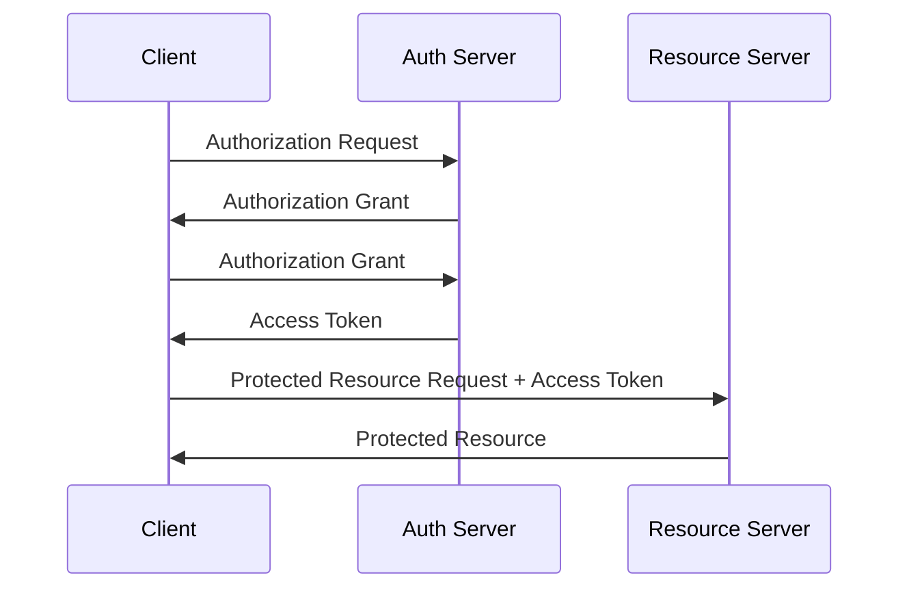

# DOT 플랫폼 API 참조

> **통합 API 문서** - DOT 플랫폼의 모든 서비스 API를 통합한 레퍼런스

이 문서는 Context Manager에 의해 소스 코드와 자동 동기화됩니다. 수동 편집보다는 소스 코드의 JSDoc/주석을 수정해주세요.

## 🌐 API 개요

### Base URLs
```
개발:     https://dev-api.dot.com
스테이징:  https://staging-api.dot.com  
프로덕션:  https://api.dot.com
```

### 인증
모든 API는 JWT Bearer 토큰 인증을 사용합니다.

```http
Authorization: Bearer <JWT_TOKEN>
Content-Type: application/json
```

### 공통 응답 형식
```typescript
interface APIResponse<T> {
  success: boolean;
  data?: T;
  error?: {
    code: string;
    message: string;
    details?: any;
  };
  meta?: {
    pagination?: {
      page: number;
      limit: number;
      total: number;
    };
    timestamp: string;
    requestId: string;
  };
}
```

## 🏢 Attendance Service API

### Base URL: `/api/attendance`

#### 출퇴근 체크인
```http
POST /api/attendance/checkin
```

**Request Body:**
```typescript
interface CheckInRequest {
  employeeId: string;
  location: {
    latitude: number;
    longitude: number;
    accuracy?: number;
  };
  timestamp?: Date;
  notes?: string;
}
```

**Response:**
```typescript
interface CheckInResponse {
  recordId: string;
  status: 'APPROVED' | 'PENDING' | 'REJECTED';
  checkInTime: Date;
  location: GeoLocation;
  requiresApproval: boolean;
  approvalReason?: string;
}
```

**Example:**
```bash
curl -X POST https://api.dot.com/api/attendance/checkin \
  -H "Authorization: Bearer $JWT_TOKEN" \
  -H "Content-Type: application/json" \
  -d '{
    "employeeId": "emp_12345",
    "location": {
      "latitude": 37.5665,
      "longitude": 126.9780,
      "accuracy": 5
    },
    "notes": "정상 출근"
  }'
```

#### 출퇴근 체크아웃
```http
POST /api/attendance/checkout
```

**Request Body:**
```typescript
interface CheckOutRequest {
  recordId: string;
  location: {
    latitude: number;
    longitude: number;
    accuracy?: number;
  };
  timestamp?: Date;
  notes?: string;
}
```

#### 출근 기록 조회
```http
GET /api/attendance/records
```

**Query Parameters:**
- `employeeId` (optional): 특정 직원 필터
- `startDate` (optional): 시작 날짜 (YYYY-MM-DD)
- `endDate` (optional): 종료 날짜 (YYYY-MM-DD)
- `status` (optional): APPROVED | PENDING | REJECTED
- `page` (optional): 페이지 번호 (기본값: 1)
- `limit` (optional): 페이지 크기 (기본값: 20, 최대: 100)

**Response:**
```typescript
interface AttendanceRecordsResponse {
  records: AttendanceRecord[];
  pagination: {
    page: number;
    limit: number;
    total: number;
    totalPages: number;
  };
}

interface AttendanceRecord {
  id: string;
  employeeId: string;
  employee: {
    name: string;
    department: string;
    role: string;
  };
  checkInTime: Date;
  checkOutTime?: Date;
  checkInLocation: GeoLocation;
  checkOutLocation?: GeoLocation;
  status: 'APPROVED' | 'PENDING' | 'REJECTED';
  workMinutes?: number;
  breakMinutes?: number;
  overtimeMinutes?: number;
  notes?: string;
  createdAt: Date;
  updatedAt: Date;
}
```

#### 승인 요청 처리
```http
PUT /api/attendance/approve/:recordId
```

**Request Body:**
```typescript
interface ApprovalRequest {
  action: 'APPROVE' | 'REJECT';
  reason?: string;
  approverId: string;
}
```

### WebSocket 실시간 업데이트

실시간 출퇴근 상태 업데이트를 위한 WebSocket 연결:

```javascript
const ws = new WebSocket('wss://api.dot.com/attendance/realtime');

ws.addEventListener('message', (event) => {
  const data = JSON.parse(event.data);
  
  switch (data.type) {
    case 'CHECKIN':
      console.log('New check-in:', data.payload);
      break;
    case 'CHECKOUT':
      console.log('New check-out:', data.payload);
      break;
    case 'APPROVAL_NEEDED':
      console.log('Approval needed:', data.payload);
      break;
  }
});
```

## 🎯 Marketing Service API

### Base URL: `/api/marketing`

#### 크리에이터 검색 및 매칭
```http
POST /api/marketing/match
```

**Request Body:**
```typescript
interface MatchRequest {
  campaignId: string;
  targetAudience: {
    ageRange: [number, number];
    gender?: 'MALE' | 'FEMALE' | 'ALL';
    interests: string[];
    location?: string[];
  };
  budget: {
    min: number;
    max: number;
    currency: 'KRW' | 'USD';
  };
  contentType: 'REVIEW' | 'UNBOXING' | 'TUTORIAL' | 'ENTERTAINMENT';
  campaignDuration: number; // days
}
```

**Response:**
```typescript
interface MatchResponse {
  matches: CreatorMatch[];
  totalMatches: number;
  searchId: string;
}

interface CreatorMatch {
  creatorId: string;
  channelName: string;
  subscriberCount: number;
  averageViews: number;
  matchScore: number; // 0-100
  compatibilityFactors: {
    audienceOverlap: number;
    categoryMatch: number;
    performancePrediction: number;
    budgetFit: number;
  };
  predictedMetrics: {
    expectedViews: number;
    expectedEngagement: number;
    expectedConversion: number;
    estimatedROI: number;
  };
  contactInfo?: {
    email: string;
    socialMedia: Record<string, string>;
  };
}
```

#### 캠페인 생성
```http
POST /api/marketing/campaigns
```

**Request Body:**
```typescript
interface CreateCampaignRequest {
  title: string;
  description: string;
  brandId: string;
  targetAudience: TargetAudience;
  budget: Budget;
  timeline: {
    startDate: Date;
    endDate: Date;
    applicationDeadline: Date;
  };
  requirements: {
    contentType: string[];
    deliverables: string[];
    restrictions?: string[];
  };
  compensation: {
    type: 'FIXED' | 'PERFORMANCE' | 'HYBRID';
    baseFee?: number;
    performanceBonus?: {
      metric: 'VIEWS' | 'CLICKS' | 'CONVERSIONS';
      threshold: number;
      bonus: number;
    };
  };
}
```

#### 성과 분석 조회
```http
GET /api/marketing/analytics/:campaignId
```

**Response:**
```typescript
interface CampaignAnalytics {
  campaignId: string;
  overview: {
    status: 'ACTIVE' | 'COMPLETED' | 'CANCELLED';
    totalSpent: number;
    totalROI: number;
    participatingCreators: number;
  };
  performance: {
    totalViews: number;
    totalEngagement: number;
    totalClicks: number;
    totalConversions: number;
    averageEngagementRate: number;
    averageCTR: number;
    averageConversionRate: number;
  };
  creatorBreakdown: CreatorPerformance[];
  timeline: PerformanceTimepoint[];
}

interface CreatorPerformance {
  creatorId: string;
  channelName: string;
  contentDelivered: number;
  views: number;
  engagement: number;
  clicks: number;
  conversions: number;
  revenue: number;
  roi: number;
}
```

#### YouTube 데이터 동기화
```http
POST /api/marketing/sync/youtube
```

시스템이 주기적으로 YouTube API에서 크리에이터 데이터를 동기화합니다.

**Request Body:**
```typescript
interface SyncRequest {
  channelIds?: string[]; // 특정 채널만 동기화
  forceSync?: boolean;   // 캐시 무시하고 강제 동기화
}
```

## 📅 Scheduler Service API *(개발 예정)*

### Base URL: `/api/scheduler`

#### 스케줄 생성 및 최적화
```http
POST /api/scheduler/optimize
```

**Request Body:**
```typescript
interface ScheduleOptimizationRequest {
  organizationId: string;
  period: {
    startDate: Date;
    endDate: Date;
  };
  shifts: ShiftTemplate[];
  employees: EmployeeAvailability[];
  constraints: SchedulingConstraints;
  objectives: {
    minimizeCost: number;      // 가중치 0-1
    maximizeCoverage: number;  // 가중치 0-1
    balanceWorkload: number;   // 가중치 0-1
    respectPreferences: number; // 가중치 0-1
  };
}

interface ShiftTemplate {
  id: string;
  name: string;
  startTime: string; // HH:mm
  endTime: string;   // HH:mm
  requiredStaff: number;
  skillsRequired: string[];
  priority: 'LOW' | 'MEDIUM' | 'HIGH' | 'CRITICAL';
}

interface EmployeeAvailability {
  employeeId: string;
  availability: {
    [day: string]: { // 'monday', 'tuesday', etc.
      available: boolean;
      preferredShifts?: string[];
      unavailableHours?: string[];
    }
  };
  skills: string[];
  hourlyRate: number;
  maxHoursPerWeek: number;
  preferences: {
    preferredDays: string[];
    preferredShifts: string[];
    avoidConsecutiveDays?: boolean;
  };
}
```

## 🔄 공통 API 패턴

### 에러 응답
```typescript
interface ErrorResponse {
  success: false;
  error: {
    code: string;
    message: string;
    details?: any;
  };
  meta: {
    timestamp: string;
    requestId: string;
  };
}
```

### 표준 HTTP 상태 코드
- `200` - 성공
- `201` - 생성 성공
- `400` - 잘못된 요청
- `401` - 인증 필요
- `403` - 권한 없음
- `404` - 리소스 없음
- `422` - 유효하지 않은 데이터
- `429` - 요청 한도 초과
- `500` - 서버 오류

### Rate Limiting
```http
X-RateLimit-Limit: 1000
X-RateLimit-Remaining: 999
X-RateLimit-Reset: 1642694400
```

각 API 엔드포인트별 제한:
- 일반 API: 1000 requests/hour per user
- 인증 API: 10 requests/minute per IP
- 대량 데이터 API: 100 requests/hour per user

### 페이지네이션
```typescript
interface PaginationParams {
  page?: number;    // 기본값: 1
  limit?: number;   // 기본값: 20, 최대: 100
  sortBy?: string;  // 정렬 필드
  sortOrder?: 'asc' | 'desc'; // 기본값: 'desc'
}

interface PaginationResponse {
  pagination: {
    page: number;
    limit: number;
    total: number;
    totalPages: number;
    hasNext: boolean;
    hasPrev: boolean;
  };
}
```

## 🔐 인증 및 권한

### JWT 토큰 구조
```typescript
interface JWTPayload {
  sub: string;        // 사용자 ID
  email: string;      // 사용자 이메일
  role: 'EMPLOYEE' | 'MANAGER' | 'ADMIN' | 'SUPER_ADMIN';
  organizationId: string;
  permissions: string[];
  iat: number;        // 발급 시간
  exp: number;        // 만료 시간
  iss: string;        // 발급자
  aud: string;        // 대상
}
```

### 권한 체계
```typescript
enum Permission {
  // Attendance 권한
  ATTENDANCE_VIEW_OWN = 'attendance:view:own',
  ATTENDANCE_VIEW_TEAM = 'attendance:view:team', 
  ATTENDANCE_VIEW_ALL = 'attendance:view:all',
  ATTENDANCE_APPROVE = 'attendance:approve',
  ATTENDANCE_MANAGE = 'attendance:manage',
  
  // Marketing 권한
  MARKETING_VIEW_CAMPAIGNS = 'marketing:view:campaigns',
  MARKETING_CREATE_CAMPAIGN = 'marketing:create:campaign',
  MARKETING_MANAGE_CAMPAIGNS = 'marketing:manage:campaigns',
  MARKETING_VIEW_ANALYTICS = 'marketing:view:analytics',
  
  // System 권한
  SYSTEM_ADMIN = 'system:admin',
  USER_MANAGEMENT = 'users:manage',
  ORGANIZATION_SETTINGS = 'organization:settings'
}
```

### OAuth 2.0 플로우


## 🔍 API 테스트

### Postman Collection
모든 API 엔드포인트에 대한 Postman Collection을 제공합니다:

```bash
# Collection 다운로드
curl -o dot-platform-api.json https://api.dot.com/docs/postman/collection.json

# Environment 설정 다운로드  
curl -o dot-platform-env.json https://api.dot.com/docs/postman/environment.json
```

### API 상태 확인
```http
GET /api/health
```

**Response:**
```json
{
  "status": "healthy",
  "services": {
    "attendance": "healthy",
    "marketing": "healthy", 
    "scheduler": "maintenance"
  },
  "version": "1.0.0",
  "uptime": 86400,
  "timestamp": "2024-01-15T10:00:00Z"
}
```

## 📊 API 메트릭스

### 실시간 API 상태
```
┌─────────────────────────────────────────────────────┐
│ DOT Platform API Status                             │
├─────────────────────────────────────────────────────┤
│ 🟢 Attendance API    99.9% uptime   ~150ms         │
│ 🟡 Marketing API     99.5% uptime   ~300ms         │
│ 🔴 Scheduler API     Maintenance     N/A           │
│                                                     │
│ Total Requests Today: 45,230                       │
│ Success Rate: 99.2%                                │
│ Average Response Time: 185ms                       │
└─────────────────────────────────────────────────────┘
```

### 사용량 통계
- **일일 요청**: ~50,000 requests
- **피크 시간**: 오전 9시, 오후 6시 (출퇴근 시간)
- **평균 응답시간**: 185ms
- **에러율**: 0.8%

## 🚀 향후 계획

### v1.1 (Q1 2025)
- GraphQL API 도입
- 실시간 알림 API 확장
- 배치 처리 API 추가

### v2.0 (Q2 2025)  
- API 버전 관리 체계 도입
- Webhook 시스템 구축
- 서드파티 통합 API

---

*이 문서는 Context Manager에 의해 소스 코드와 자동 동기화됩니다. 마지막 업데이트: {{ last_sync_time }}*