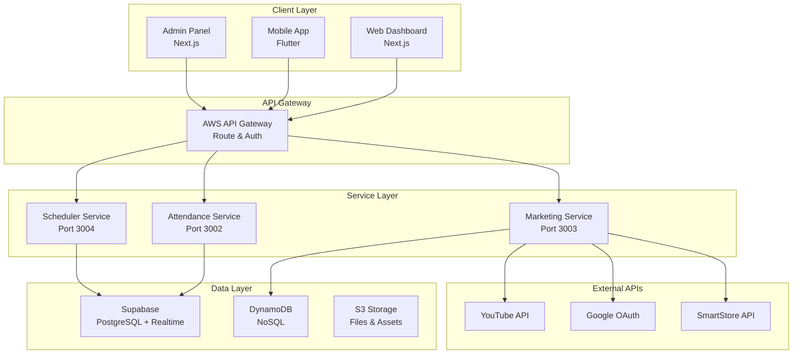
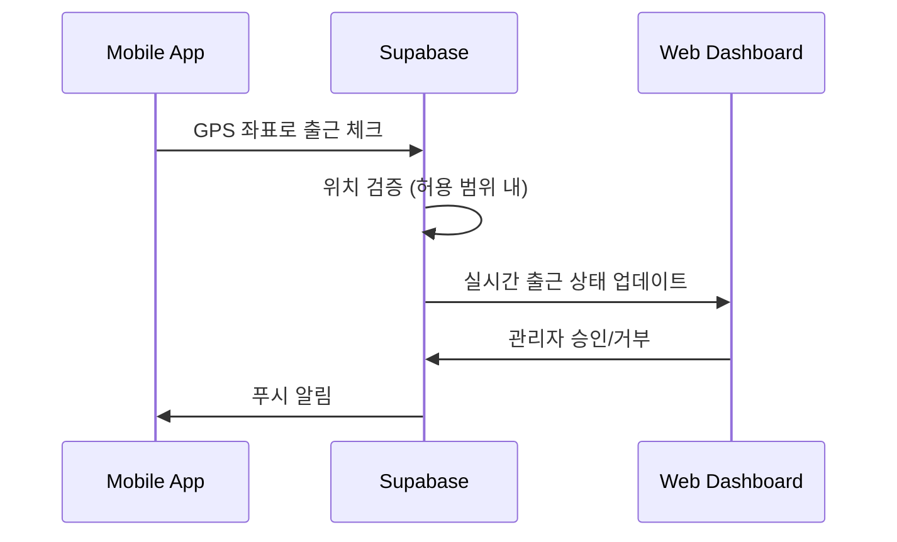
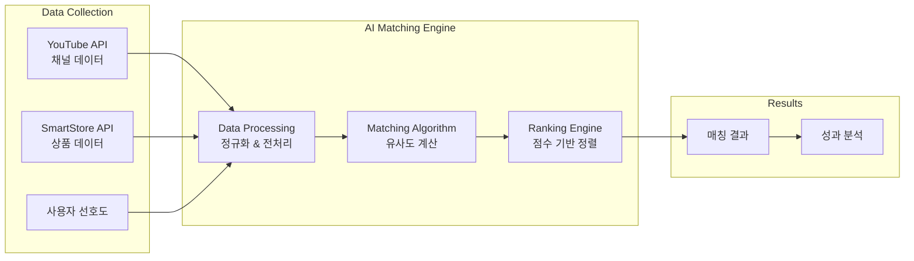
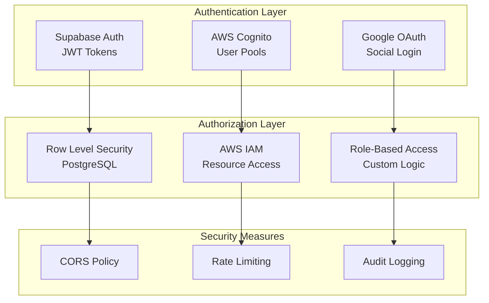
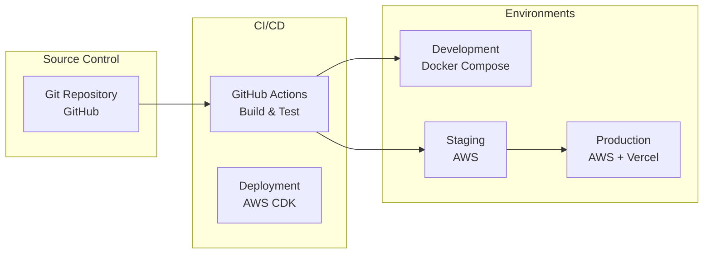

# DOT 플랫폼 아키텍처

## 🏗️ 전체 시스템 아키텍처

### 고수준 아키텍처


## 🎯 마이크로서비스 상세

### 1. Attendance Service
**GPS 기반 근태관리 서비스**

#### 기술 스택
- **Frontend**: Next.js 15 + TypeScript + Tailwind CSS
- **Mobile**: Flutter 3.x + Riverpod + Neo Brutal Theme
- **Backend**: Supabase (PostgreSQL + Auth + Realtime)
- **Infrastructure**: Vercel (Web) + FlutterFlow (Mobile)

#### 아키텍처 패턴
```typescript
// 레이어드 아키텍처
├── presentation/     # UI Components
├── application/      # Business Logic
├── domain/          # Core Models
├── infrastructure/  # Supabase Integration
└── shared/          # Common Utils
```

#### 핵심 기능 플로우


### 2. Marketing Service
**유튜버 크리에이터 매칭 플랫폼**

#### 기술 스택
- **Frontend**: React + TypeScript + Tailwind CSS
- **Backend**: AWS Lambda + Node.js + TypeScript
- **Database**: DynamoDB + DAX (캐싱)
- **Auth**: AWS Cognito + Google OAuth
- **API**: AWS API Gateway + CloudFront

#### 아키텍처 패턴
```typescript
// 헥사고날 아키텍처 (Ports & Adapters)
├── domain/          # Business Logic (순수)
├── ports/           # Interface 정의
├── adapters/        # 외부 시스템 연동
│   ├── web/         # HTTP 어댑터
│   ├── persistence/ # DynamoDB 어댑터
│   └── youtube/     # YouTube API 어댑터
└── infrastructure/  # AWS 인프라
```

#### 매칭 엔진 아키텍처


### 3. Scheduler Service *(개발 예정)*
**지능형 직원 스케줄링 서비스**

#### 계획된 기술 스택
- **Frontend**: Next.js + TypeScript + Tailwind CSS
- **Backend**: Supabase Functions + PostgreSQL
- **AI/ML**: TensorFlow.js + 최적화 알고리즘
- **Scheduler**: Cron Jobs + Queue System

#### 최적화 알고리즘 개념
```python
# 스케줄링 최적화 목표 함수
def optimize_schedule(employees, shifts, constraints):
    objectives = [
        minimize_labor_cost,      # 인건비 최소화
        maximize_coverage,        # 업무 커버리지 최대화
        balance_workload,         # 업무량 균형
        respect_preferences,      # 직원 선호도 반영
        comply_with_labor_law     # 노동법 준수
    ]
    return multi_objective_optimization(objectives, constraints)
```

## 🔄 서비스 간 통신

### 동기 통신 (Synchronous)
- **REST API**: 실시간 데이터 조회/수정
- **GraphQL**: 복잡한 데이터 관계 쿼리 *(향후 도입 예정)*

### 비동기 통신 (Asynchronous)
- **WebSocket**: Supabase Realtime (출퇴근 상태)
- **Server-Sent Events**: 실시간 알림
- **Message Queue**: AWS SQS *(향후 도입 예정)*

### 이벤트 기반 아키텍처
```typescript
// 도메인 이벤트 예시
interface AttendanceEvent {
  type: 'attendance.checked_in' | 'attendance.checked_out';
  employeeId: string;
  timestamp: Date;
  location: GeoLocation;
  metadata: Record<string, any>;
}

// 이벤트 핸들러
class AttendanceEventHandler {
  async handle(event: AttendanceEvent) {
    await this.updateSchedule(event);      // Scheduler Service
    await this.triggerPayroll(event);      // Future Payroll Service
    await this.sendNotification(event);    // Notification Service
  }
}
```

## 💾 데이터 아키텍처

### 데이터베이스 선택 기준
```mermaid
decision
    id decision
    title "데이터베이스 선택"
    
    decision "트랜잭션 필요?"
    decision --> postgresql: "Yes"
    decision --> nosql: "No"
    
    postgresql "PostgreSQL<br/>(Supabase)"
    nosql "DynamoDB<br/>(AWS)"
    
    postgresql --> attendance: "Attendance"
    postgresql --> scheduler: "Scheduler"
    nosql --> marketing: "Marketing"
```

### 데이터 일관성 전략
- **ACID 트랜잭션**: 출퇴근, 급여 계산 (PostgreSQL)
- **Eventually Consistent**: 마케팅 통계, 분석 (DynamoDB)
- **Event Sourcing**: 중요 비즈니스 이벤트 추적 *(향후 도입)*

## 🔐 보안 아키텍처

### 인증 및 권한


### 데이터 보호
- **암호화**: 전송 중 (HTTPS/WSS), 저장 중 (KMS)
- **접근 제어**: 최소 권한 원칙 적용
- **감사 로그**: 모든 민감한 작업 기록
- **백업**: 자동 백업 및 Point-in-Time Recovery

## 📊 모니터링 및 관측성

### 메트릭 수집
```yaml
# Prometheus 메트릭 예시
attendance_checkin_total: 출근 체크인 횟수
attendance_checkin_duration: 체크인 처리 시간
marketing_match_accuracy: 매칭 정확도
marketing_api_requests: API 요청 수
scheduler_optimization_time: 스케줄 최적화 소요 시간
```

### 로깅 전략
```json
{
  "service": "attendance",
  "level": "info",
  "message": "Employee checked in",
  "userId": "emp_12345",
  "location": {"lat": 37.5665, "lng": 126.9780},
  "timestamp": "2024-01-15T09:00:00Z",
  "requestId": "req_abcd1234"
}
```

### 알림 및 대응
- **SLA 모니터링**: 99.9% 가용성 목표
- **성능 임계값**: 응답시간 < 200ms
- **자동 복구**: Circuit Breaker + Retry Logic
- **장애 대응**: PagerDuty + Slack 통합

## 🚀 배포 아키텍처

### CI/CD 파이프라인


### Infrastructure as Code
- **AWS CDK**: TypeScript로 인프라 정의
- **Docker**: 로컬 개발 환경 일관성
- **Terraform**: 멀티 클라우드 지원 *(미래 고려사항)*

## 🔮 미래 아키텍처 고려사항

### 확장성 개선
- **Service Mesh**: Istio를 통한 서비스 간 통신 최적화
- **Event Sourcing**: 도메인 이벤트 기반 상태 관리
- **CQRS**: 읽기/쓰기 모델 분리

### 성능 최적화
- **CDN**: CloudFront를 통한 전역 캐싱
- **Database Sharding**: 대용량 데이터 수평 분할
- **Caching Layer**: Redis를 통한 메모리 캐싱

### 운영 효율성
- **Auto Scaling**: 트래픽 기반 자동 확장
- **Multi-Region**: 장애 복구 및 지연 시간 최적화
- **Observability**: OpenTelemetry 기반 분산 추적

---

*이 문서는 시스템 변경에 따라 자동으로 업데이트됩니다 | Context Manager v1.0*