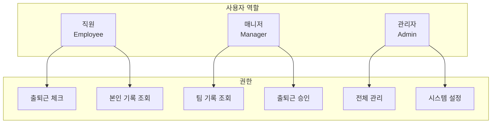
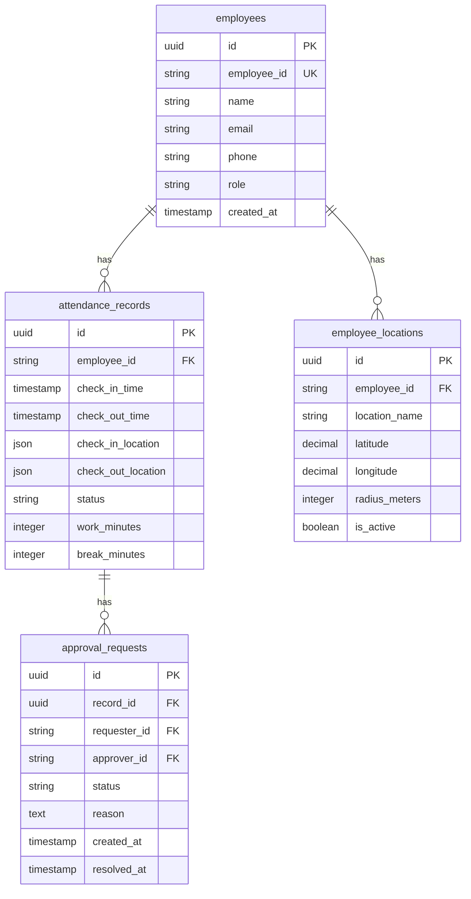
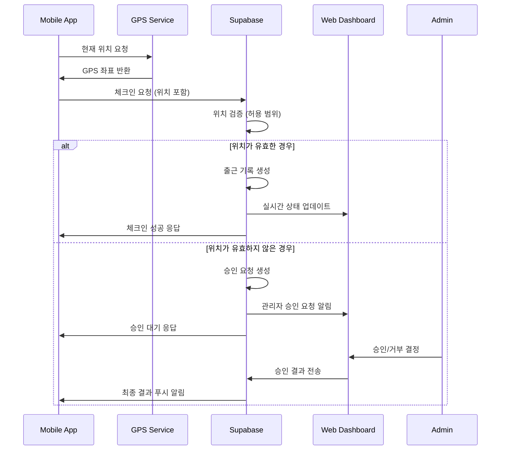
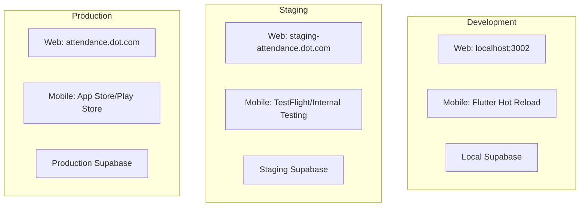

# Attendance Service 문서

> **GPS 기반 스마트 근태관리 시스템**

Attendance Service는 DOT 플랫폼의 핵심 서비스로, GPS 위치 기반의 정확한 출퇴근 관리를 제공합니다.

## 📋 목차

- **[서비스 개요](#-서비스-개요)** - 기능 및 특징
- **[아키텍처](#-아키텍처)** - 시스템 구조 및 설계
- **[API 문서](./api.md)** - RESTful API 및 실시간 통신
- **[배포 가이드](./deployment.md)** - 프로덕션 배포 방법
- **[개발 가이드](./development.md)** - 로컬 개발 환경 설정

## 🎯 서비스 개요

### 핵심 기능
- **GPS 기반 출퇴근**: 정확한 위치 기반 근태 관리
- **실시간 모니터링**: 관리자 대시보드에서 실시간 근무 상태 확인
- **모바일 앱**: 직원용 Flutter 앱으로 간편한 출퇴근 체크
- **자동 계산**: 근무시간, 연장근무, 휴게시간 자동 산출
- **승인 워크플로우**: 관리자 승인/거부 시스템

### 사용자 타입


## 🏗️ 아키텍처

### 시스템 구조
```
attendance/
├── web/                    # 관리자 웹 대시보드
│   ├── app/               # Next.js 15 App Router
│   ├── components/        # React 컴포넌트
│   ├── lib/              # 유틸리티 및 설정
│   └── types/            # TypeScript 타입 정의
│
├── mobile/               # 직원 모바일 앱
│   ├── lib/             # Flutter 메인 코드
│   ├── assets/          # 이미지, 아이콘 등
│   └── test/            # Flutter 테스트
│
├── supabase/            # 백엔드 설정
│   ├── migrations/      # 데이터베이스 스키마
│   ├── functions/       # Edge Functions
│   └── config.toml      # Supabase 설정
│
└── docs/                # 서비스 문서
```

### 데이터 모델


### 기술 스택

#### 웹 대시보드 (Port 3002)
- **Frontend**: Next.js 15, React 19, TypeScript 5.9
- **Styling**: Tailwind CSS 3.4
- **State Management**: React Query + Zustand
- **Authentication**: Supabase Auth
- **Real-time**: Supabase Realtime WebSocket

#### 모바일 앱
- **Framework**: Flutter 3.10+
- **State Management**: Riverpod 2.x
- **Design**: Neo Brutal Theme
- **Location**: Geolocator Plugin
- **Push Notifications**: Firebase Cloud Messaging

#### 백엔드
- **Database**: PostgreSQL (Supabase)
- **Authentication**: Supabase Auth (JWT)
- **Real-time**: Supabase Realtime
- **Edge Functions**: Deno-based serverless
- **File Storage**: Supabase Storage

## 🔄 주요 워크플로우

### 출근 체크인 플로우


### 실시간 모니터링
```typescript
// 실시간 출퇴근 상태 구독
const { data: attendanceRecords } = useSubscription({
  table: 'attendance_records',
  filter: `created_at.gte.${today}`,
  event: '*',
  callback: (payload) => {
    // UI 자동 업데이트
    updateDashboard(payload);
    
    // 알림 처리
    if (payload.eventType === 'INSERT') {
      showNotification(`${payload.new.employee_name}님이 출근했습니다`);
    }
  }
});
```

## 📊 성능 및 메트릭

### 핵심 지표
- **가용성**: 99.9% (월 43분 다운타임 이하)
- **응답시간**: 평균 < 200ms, 95% < 500ms
- **GPS 정확도**: 5m 이내 오차
- **실시간 지연**: < 1초

### 모니터링 대시보드
```
┌─────────────────────────────────────────────────┐
│ Attendance Service Metrics                      │
├─────────────────────────────────────────────────┤
│ • 일일 출근/퇴근: 1,200/1,150                   │
│ • 평균 응답시간: 180ms                          │
│ • GPS 오류율: 0.5%                             │
│ • 승인 대기 건수: 5                             │
│ • 활성 사용자: 120/150                          │
└─────────────────────────────────────────────────┘
```

## 🔐 보안 및 개인정보보호

### 데이터 보호
- **위치 정보 암호화**: AES-256 암호화로 GPS 좌표 저장
- **접근 권한 제어**: Supabase RLS로 데이터 접근 제한
- **감사 로그**: 모든 중요 작업 기록
- **GDPR 준수**: 개인정보 삭제 권리 지원

### Row Level Security (RLS) 정책
```sql
-- 직원은 본인의 출근기록만 조회 가능
CREATE POLICY "직원 본인 기록 조회" ON attendance_records
FOR SELECT USING (auth.uid()::text = employee_id);

-- 매니저는 소속 팀원의 기록 조회 가능
CREATE POLICY "매니저 팀원 기록 조회" ON attendance_records
FOR SELECT USING (
  EXISTS (
    SELECT 1 FROM team_members 
    WHERE manager_id = auth.uid()::text 
    AND employee_id = attendance_records.employee_id
  )
);
```

## 🧪 테스트 전략

### 테스트 구조
```
tests/
├── unit/                 # 단위 테스트
│   ├── components/       # React 컴포넌트 테스트
│   ├── hooks/           # Custom Hook 테스트
│   └── utils/           # 유틸리티 함수 테스트
│
├── integration/         # 통합 테스트
│   ├── api/            # API 엔드포인트 테스트
│   ├── database/       # 데이터베이스 연동 테스트
│   └── auth/           # 인증/권한 테스트
│
└── e2e/                # E2E 테스트
    ├── checkin/        # 출퇴근 시나리오
    ├── dashboard/      # 대시보드 워크플로우
    └── mobile/         # 모바일 앱 테스트
```

### 테스트 실행
```bash
# 전체 테스트 실행
npm run test

# 특정 테스트 타입
npm run test:unit           # 단위 테스트
npm run test:integration    # 통합 테스트
npm run test:e2e           # E2E 테스트

# 모바일 앱 테스트
cd mobile && flutter test

# 커버리지 리포트
npm run test:coverage
```

## 🚀 배포 및 운영

### 환경 구성


### 배포 명령
```bash
# 개발 환경
npm run dev:attendance:web
npm run dev:attendance:mobile

# 스테이징 배포
npm run deploy:staging:attendance

# 프로덕션 배포
npm run deploy:production:attendance
```

## 📈 로드맵

### 완료된 기능 ✅
- GPS 기반 출퇴근 체크
- 실시간 대시보드
- Flutter 모바일 앱
- 관리자 승인 시스템
- 기본 통계 및 리포트

### 진행 중 🚧
- 고급 분석 대시보드
- 푸시 알림 개선
- 오프라인 모드 지원

### 계획 중 📋
- 얼굴 인식 기반 인증
- Apple Watch/Wear OS 지원
- 급여 시스템 연동
- 다중 지역 지원
- AI 기반 근무 패턴 분석

## 🔗 관련 문서

### 개발 문서
- **[API 문서](./api.md)** - RESTful API 및 실시간 통신 상세
- **[개발 가이드](./development.md)** - 로컬 개발 환경 설정
- **[배포 가이드](./deployment.md)** - 프로덕션 배포 및 운영

### 플랫폼 문서
- **[전체 아키텍처](../../platform/architecture.md)** - DOT 플랫폼 시스템 아키텍처
- **[시작 가이드](../../platform/getting-started.md)** - 개발 환경 초기 설정

### 운영 문서
- **[모니터링](../../operations/monitoring.md)** - 서비스 모니터링 및 알림
- **[보안](../../operations/security.md)** - 보안 가이드라인 및 정책

---

*이 문서는 Context Manager에 의해 코드 변경사항과 자동 동기화됩니다.*