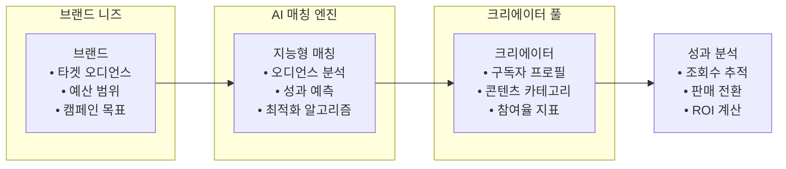
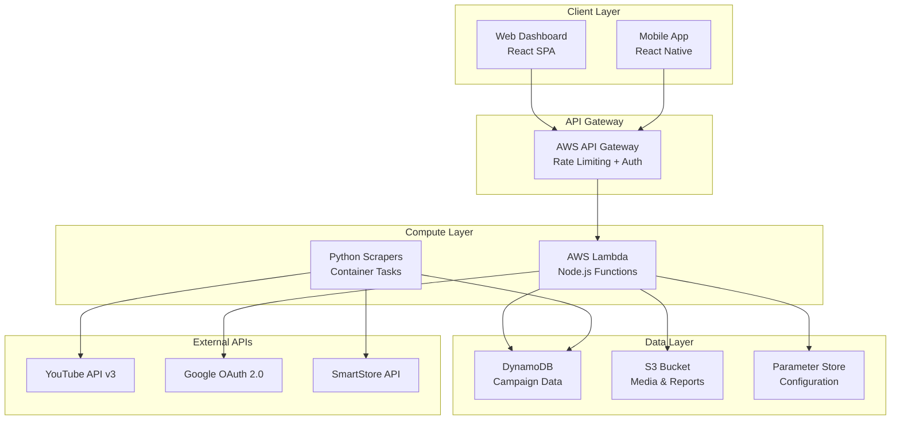
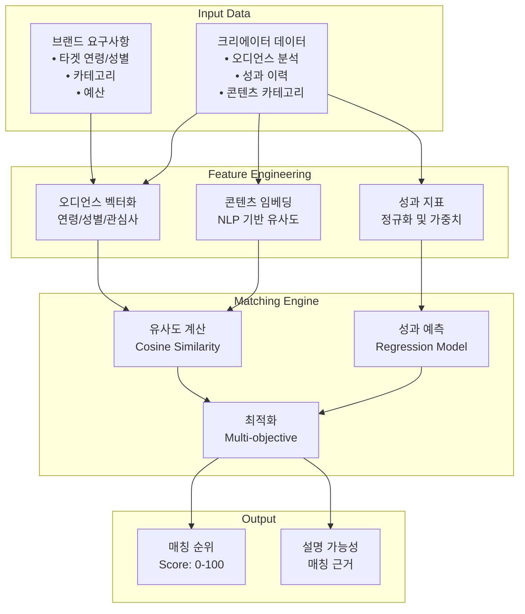
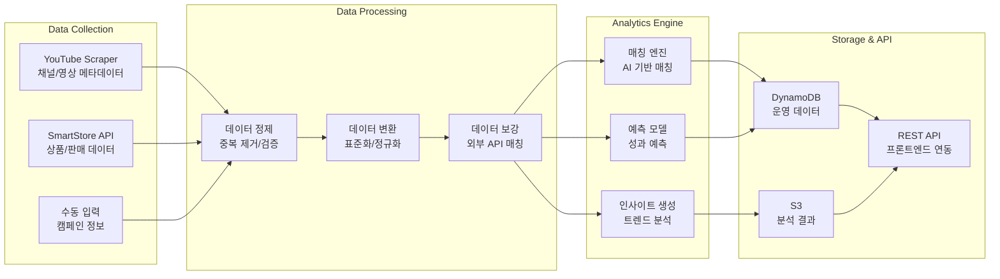
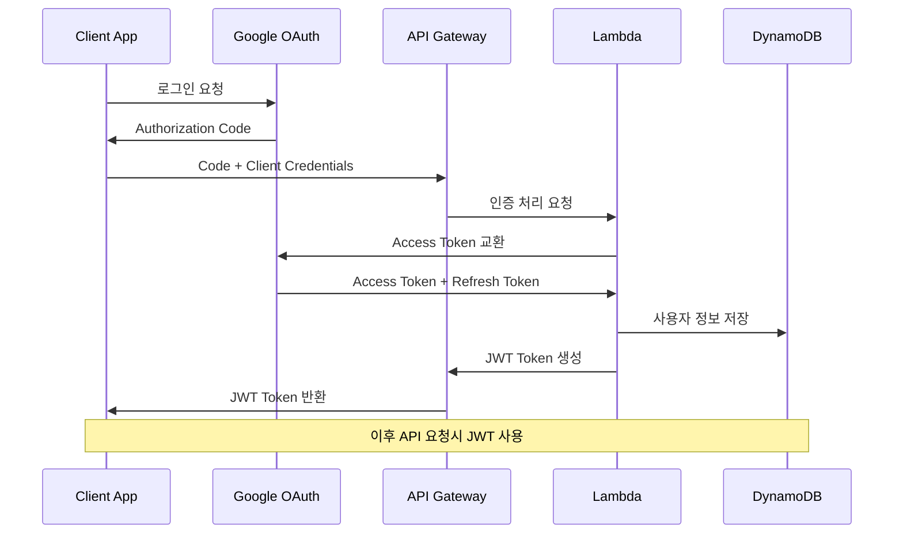

# Marketing Service 문서

> **AI 기반 유튜버 크리에이터 매칭 플랫폼**

Marketing Service는 브랜드와 유튜브 크리에이터를 지능적으로 매칭하는 마케팅 자동화 플랫폼입니다.

## 📋 목차

- **[서비스 개요](#-서비스-개요)** - 기능 및 특징
- **[아키텍처](#-아키텍처)** - 시스템 구조 및 설계  
- **[AI 매칭 엔진](#-ai-매칭-엔진)** - 매칭 알고리즘 및 전략
- **[API 문서](./api.md)** - RESTful API 상세
- **[배포 가이드](./deployment.md)** - AWS 배포 방법
- **[개발 가이드](./development.md)** - 로컬 개발 환경

## 🎯 서비스 개요

### 핵심 가치 제안
Marketing Service는 **데이터 기반의 정확한 매칭**을 통해 마케팅 ROI를 극대화합니다.



### 핵심 기능

#### 1. 스마트 매칭
- **AI 기반 매칭**: 브랜드와 크리에이터의 완벽한 조화 추천
- **오디언스 분석**: 구독자 데이터 기반 타겟 정확도 극대화
- **성과 예측**: 역사적 데이터 기반 캠페인 성과 사전 예측

#### 2. 자동화 워크플로우
- **캠페인 관리**: 제안부터 계약까지 전 과정 자동화
- **성과 추적**: 실시간 조회수, 참여율, 판매 전환 모니터링
- **정산 시스템**: 자동 수수료 계산 및 정산 처리

#### 3. 통합 데이터 분석
- **YouTube Analytics**: 크리에이터 채널 심층 분석
- **SmartStore 연동**: 실제 판매 데이터 추적
- **ROI 대시보드**: 투자 대비 수익률 실시간 시각화

## 🏗️ 아키텍처

### 시스템 구조
```
marketing/
├── src/                    # 메인 애플리케이션
│   ├── handlers/          # AWS Lambda 핸들러
│   ├── services/          # 비즈니스 로직
│   ├── models/            # 데이터 모델
│   └── utils/             # 공통 유틸리티
│
├── scraper-python/        # 데이터 수집 엔진
│   ├── youtube_scraper.py # YouTube 데이터 수집
│   ├── smartstore_api.py  # 스마트스토어 API
│   └── data_processor.py  # 데이터 전처리
│
├── infrastructure/        # AWS CDK 인프라
│   ├── stacks/           # CDK 스택 정의
│   └── constructs/       # 재사용 가능한 컴포넌트
│
└── docs/                 # 서비스 문서
```

### AWS 아키텍처


### 데이터 모델 (DynamoDB)
```typescript
// 크리에이터 프로필
interface CreatorProfile {
  PK: 'CREATOR#${channelId}';
  SK: 'PROFILE';
  channelId: string;
  channelName: string;
  subscriberCount: number;
  averageViews: number;
  categories: string[];
  audienceData: AudienceMetrics;
  performanceHistory: PerformanceData[];
  createdAt: string;
  updatedAt: string;
}

// 캠페인 데이터
interface Campaign {
  PK: 'CAMPAIGN#${campaignId}';
  SK: 'DETAILS';
  campaignId: string;
  brandId: string;
  title: string;
  targetAudience: TargetCriteria;
  budget: number;
  status: 'ACTIVE' | 'PAUSED' | 'COMPLETED';
  matchedCreators: MatchResult[];
  performanceMetrics: CampaignMetrics;
}

// 매칭 결과
interface MatchResult {
  PK: 'MATCH#${campaignId}';
  SK: 'CREATOR#${channelId}';
  campaignId: string;
  channelId: string;
  matchScore: number; // 0-100
  compatibilityFactors: {
    audienceOverlap: number;
    categoryMatch: number;
    performancePrediction: number;
    budgetFit: number;
  };
  predictedMetrics: {
    expectedViews: number;
    expectedEngagement: number;
    expectedConversion: number;
  };
}
```

## 🤖 AI 매칭 엔진

### 매칭 알고리즘 아키텍처


### 매칭 점수 계산 로직
```python
def calculate_match_score(brand_profile, creator_profile):
    """
    매칭 점수 계산 (0-100점)
    """
    weights = {
        'audience_overlap': 0.35,    # 오디언스 겹치는 정도
        'category_match': 0.25,      # 카테고리 일치도
        'performance_pred': 0.25,    # 성과 예측
        'budget_efficiency': 0.15    # 예산 효율성
    }
    
    # 1. 오디언스 오버랩 계산
    audience_score = calculate_audience_similarity(
        brand_profile.target_audience,
        creator_profile.audience_data
    )
    
    # 2. 카테고리 매칭 점수
    category_score = calculate_category_match(
        brand_profile.industry_category,
        creator_profile.content_categories
    )
    
    # 3. 성과 예측 점수
    performance_score = predict_campaign_performance(
        creator_profile.performance_history,
        brand_profile.campaign_type
    )
    
    # 4. 예산 효율성
    budget_score = calculate_budget_efficiency(
        brand_profile.budget_range,
        creator_profile.average_cost_per_view
    )
    
    # 가중 평균으로 최종 점수 계산
    final_score = (
        audience_score * weights['audience_overlap'] +
        category_score * weights['category_match'] +
        performance_score * weights['performance_pred'] +
        budget_score * weights['budget_efficiency']
    )
    
    return min(100, max(0, final_score))
```

### 실시간 성과 예측
```typescript
interface PerformancePrediction {
  expectedViews: {
    min: number;
    max: number;
    confidence: number;
  };
  expectedEngagement: {
    likes: number;
    comments: number;
    shares: number;
  };
  expectedConversion: {
    clickthrough: number;    // %
    purchaseRate: number;    // %
    estimatedSales: number;  // 원
  };
  riskFactors: string[];
  confidenceLevel: number;   // 0-1
}
```

## 📊 데이터 파이프라인

### 수집 → 처리 → 분석 워크플로우


### 스크래핑 전략
```python
# YouTube 데이터 수집 예시
class YouTubeScraper:
    def __init__(self, api_key: str):
        self.youtube = build('youtube', 'v3', developerKey=api_key)
        
    async def collect_channel_data(self, channel_id: str):
        """채널 기본 정보 + 최근 영상 성과 수집"""
        
        # 1. 채널 정보
        channel_data = self.youtube.channels().list(
            part='snippet,statistics,demographics',
            id=channel_id
        ).execute()
        
        # 2. 최근 영상 목록 (50개)
        videos_data = self.youtube.search().list(
            part='snippet',
            channelId=channel_id,
            maxResults=50,
            order='date'
        ).execute()
        
        # 3. 각 영상의 상세 통계
        video_statistics = []
        for video in videos_data['items']:
            stats = self.youtube.videos().list(
                part='statistics,contentDetails',
                id=video['id']['videoId']
            ).execute()
            video_statistics.append(stats)
        
        # 4. 데이터 통합 및 분석
        return self.process_channel_analytics(
            channel_data, videos_data, video_statistics
        )
```

## 🔐 보안 및 인증

### OAuth 2.0 플로우


### API 보안 계층
```typescript
// API Gateway에서의 인증/권한 검증
export const authMiddleware = async (event: APIGatewayProxyEvent) => {
  // 1. JWT 토큰 검증
  const token = extractTokenFromHeader(event.headers);
  const decoded = await verifyJWT(token);
  
  // 2. 사용자 권한 확인
  const userPermissions = await getUserPermissions(decoded.userId);
  
  // 3. 리소스 접근 권한 검증
  const hasAccess = await checkResourceAccess(
    decoded.userId,
    event.resource,
    event.httpMethod
  );
  
  if (!hasAccess) {
    throw new UnauthorizedError('접근 권한이 없습니다');
  }
  
  return decoded;
};

// Rate Limiting
export const rateLimitMiddleware = async (userId: string) => {
  const key = `rate_limit:${userId}`;
  const current = await redis.get(key);
  
  if (current && parseInt(current) > RATE_LIMIT_THRESHOLD) {
    throw new TooManyRequestsError('요청 한도를 초과했습니다');
  }
  
  await redis.incr(key);
  await redis.expire(key, RATE_LIMIT_WINDOW);
};
```

## 📈 성능 및 모니터링

### 핵심 지표 (KPIs)
```yaml
Performance Metrics:
  API Response Time:
    Target: < 300ms
    Current: 180ms (P95)
  
  Matching Accuracy:
    Target: > 85%
    Current: 87.3%
  
  Data Freshness:
    YouTube: < 1 hour
    SmartStore: < 30 minutes
  
Business Metrics:
  Campaign Success Rate: 73%
  Average ROI: 320%
  Creator Satisfaction: 4.2/5
  Brand Retention Rate: 82%
```

### 실시간 모니터링 대시보드
```
┌──────────────────────────────────────────────────────────┐
│ Marketing Service - Real-time Dashboard                 │
├──────────────────────────────────────────────────────────┤
│ 🎯 Active Campaigns: 45        🔍 Daily Matches: 1,230 │
│ 📊 Total ROI: 425%            ⚡ Avg Response: 165ms   │
│ 👥 Active Creators: 2,847     🏢 Active Brands: 156    │
│ 🚨 Failed Scrapes: 0          📈 Revenue YTD: ₩2.3B    │
└──────────────────────────────────────────────────────────┘

Recent Activities:
• 15:30 - New creator profile: "테크리뷰어김" (구독자 45K)
• 15:28 - Campaign match: "스마트폰 런칭" → 92% 매칭점수
• 15:25 - Performance update: +15% 예상 전환율
• 15:22 - SmartStore sync: 1,250개 상품 업데이트
```

### 알람 및 모니터링 설정
```typescript
// CloudWatch 알람 설정
const performanceAlarms = {
  highLatency: {
    metric: 'ResponseTime',
    threshold: 500, // ms
    action: 'scale-out'
  },
  
  lowMatchingAccuracy: {
    metric: 'MatchingAccuracy',
    threshold: 80, // %
    action: 'notify-team'
  },
  
  scraperFailures: {
    metric: 'ScraperFailureRate',
    threshold: 5, // %
    action: 'restart-service'
  }
};
```

## 🚀 배포 및 운영

### 환경별 구성
```yaml
Development:
  API Endpoint: https://dev-api.marketing.dot.com
  Database: DynamoDB (dev-marketing-*)
  Scraping Frequency: Every 6 hours
  Rate Limits: 1000 req/min
  
Staging:
  API Endpoint: https://staging-api.marketing.dot.com  
  Database: DynamoDB (staging-marketing-*)
  Scraping Frequency: Every 2 hours
  Rate Limits: 5000 req/min
  
Production:
  API Endpoint: https://api.marketing.dot.com
  Database: DynamoDB (prod-marketing-*)
  Scraping Frequency: Every 1 hour
  Rate Limits: 10000 req/min
```

### CI/CD 파이프라인

```mermaid
graph LR
    subgraph "Source"
        GIT[Git Push<br/>feature branch]
    end
    
    subgraph "Build"
        TEST[Unit Tests<br/>Jest + TypeScript]
        LINT[Code Quality<br/>ESLint + Prettier]
        BUILD[Lambda Package<br/>esbuild]
    end
    
    subgraph "Deploy"
        CDK[AWS CDK Deploy<br/>Infrastructure]
        LAMBDA[Lambda Functions<br/>Blue/Green]
        API[API Gateway<br/>Version Update]
    end
    
    subgraph "Verify"
        E2E[E2E Tests<br/>Postman + Newman]
        SMOKE[Smoke Tests<br/>Health Checks]
        ROLLBACK[Auto Rollback<br/>On Failure]
    end
    
    GIT --> TEST
    TEST --> LINT
    LINT --> BUILD
    BUILD --> CDK
    CDK --> LAMBDA
    LAMBDA --> API
    API --> E2E
    E2E --> SMOKE
    SMOKE --> ROLLBACK
```


## 📋 로드맵

### 현재 상태 (v0.9) 🚧
- ✅ 기본 매칭 엔진 (87% 정확도)
- ✅ YouTube/SmartStore 데이터 파이프라인
- ✅ Google OAuth 통합
- ✅ 기본 대시보드
- 🔄 성과 분석 시스템 (80% 완성)

### 다음 마일스톤 (v1.0) 📅 Q1 2025
- 📋 고급 AI 매칭 (>90% 정확도 목표)
- 📋 실시간 ROI 추적
- 📋 자동 계약 생성 시스템
- 📋 크리에이터 온보딩 자동화

### 장기 계획 (v2.0+) 🔮
- 📋 인플루언서 외 채널 확장 (TikTok, Instagram)
- 📋 예측 분석 및 트렌드 예측
- 📋 블록체인 기반 투명한 정산
- 📋 글로벌 시장 진출

## 🔗 관련 문서

### 기술 문서
- **[API 문서](./api.md)** - RESTful API 상세 명세
- **[개발 가이드](./development.md)** - 로컬 개발 환경 설정
- **[배포 가이드](./deployment.md)** - AWS 배포 및 운영

### 비즈니스 문서
- **[매칭 전략](./matching-strategy.md)** - AI 매칭 알고리즘 상세
- **[성과 분석](./analytics.md)** - 데이터 분석 및 인사이트
- **[사용자 가이드](./user-guide.md)** - 브랜드/크리에이터 매뉴얼

---

*이 문서는 Context Manager에 의해 시스템 변경사항과 자동 동기화됩니다.*