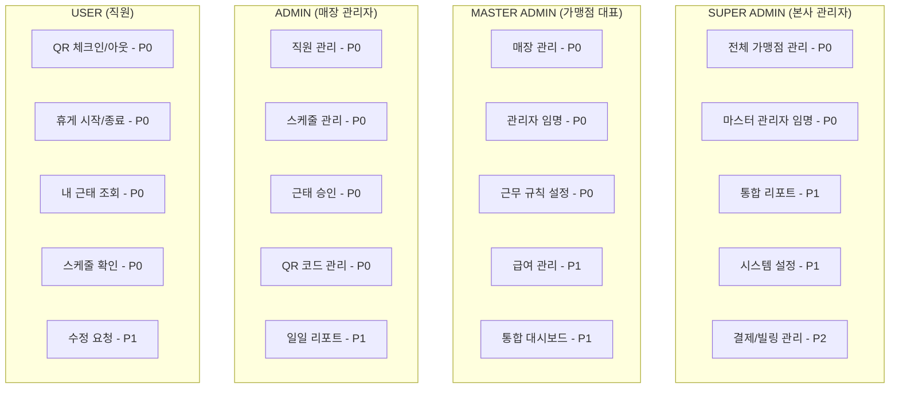
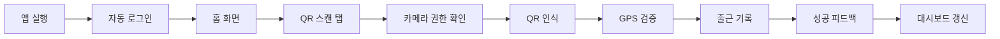
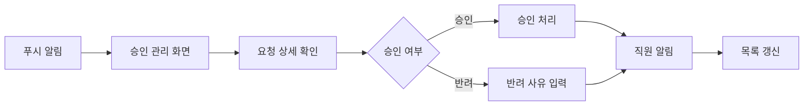
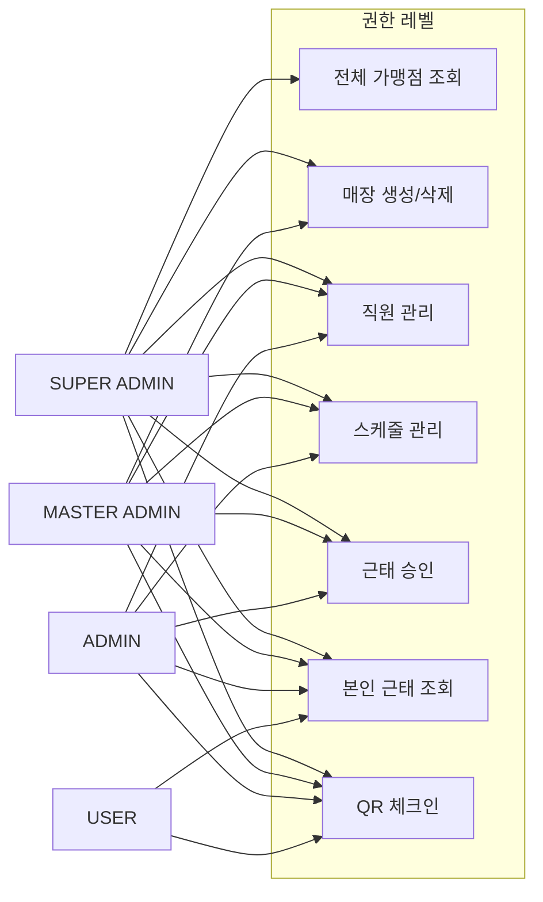
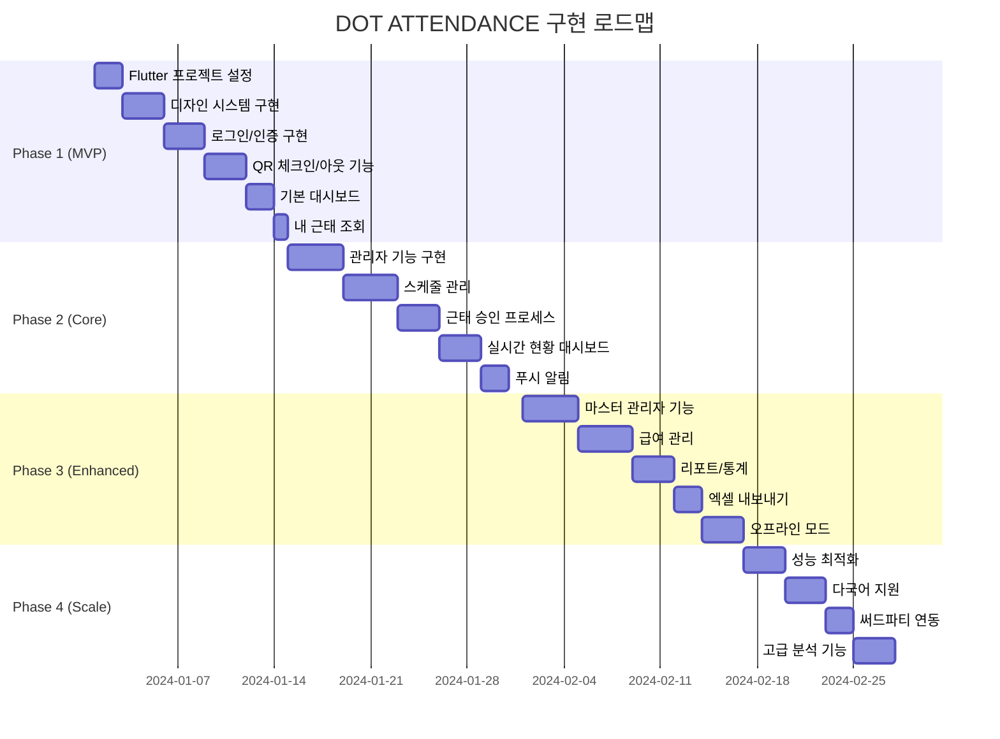

# DOT ATTENDANCE 시스템 설계서

## 📱 시스템 개요

### 1. 프로젝트 정보
- **프로젝트명**: DOT ATTENDANCE (근퇴관리 시스템)
- **플랫폼**: Flutter (iOS/Android 통합 앱)
- **아키텍처**: 모바일 앱 + 클라우드 백엔드
- **디자인**: 네오브루탈리즘 (흑백 + 형광옐로 강조)
- **타겟**: 프랜차이즈/소상공인 근태관리

### 2. 핵심 가치
- **간편함**: QR 체크인/아웃으로 1초 출퇴근
- **정확성**: GPS + QR 이중 검증
- **투명성**: 실시간 근태 현황 공유
- **접근성**: 모든 디바이스에서 동일한 경험

## 🎨 디자인 시스템

### 색상 토큰
```dart
class AppColors {
  // Primary
  static const bg = Color(0xFFFFFFFF);      // 배경
  static const fg = Color(0xFF000000);      // 텍스트
  static const line = Color(0xFF000000);    // 윤곽선
  static const hi = Color(0xFFCCFF00);      // 형광옐로 강조
  static const hiInk = Color(0xFF000000);   // 강조 위 텍스트
  
  // Status
  static const success = Color(0xFF00C853);
  static const error = Color(0xFFD32F2F);
  static const warning = Color(0xFFFFAB00);
  static const info = Color(0xFF2962FF);
  
  // Pastel (사용 제한 10%)
  static const pastelMint = Color(0xFF6EE7B7);
  static const pastelPink = Color(0xFFF472B6);
  static const pastelLilac = Color(0xFFA78BFA);
  static const pastelSky = Color(0xFF60A5FA);
}
```

### 타이포그래피
```dart
class AppTypography {
  static const display = TextStyle(
    fontFamily: 'DoHyeon',
    fontSize: 28,
    height: 34/28,
    fontWeight: FontWeight.w700,
  );
  
  static const title = TextStyle(
    fontFamily: 'DoHyeon',
    fontSize: 22,
    height: 28/22,
    fontWeight: FontWeight.w700,
  );
  
  static const heading = TextStyle(
    fontFamily: 'Orbit',
    fontSize: 18,
    height: 24/18,
    fontWeight: FontWeight.w700,
  );
  
  static const body = TextStyle(
    fontFamily: 'Orbit',
    fontSize: 16,
    height: 22/16,
    fontWeight: FontWeight.w400,
  );
}
```

## 👥 사용자 유형별 기능 매트릭스



## 📱 화면 구성

### 공통 화면
1. **스플래시** - 앱 로딩
2. **로그인** - 이메일/비밀번호 또는 생체인증
3. **권한 요청** - 카메라/위치 권한
4. **프로필** - 개인정보 관리

### 직원(USER) 전용 화면
```
📱 홈 (대시보드)
├── 오늘의 근무 상태 카드
├── 빠른 액션 버튼 (출근/퇴근/휴게)
├── 이번주 근무 시간 요약
└── 공지사항 배너

📷 QR 스캔
├── 카메라 뷰
├── 수동 코드 입력
└── 위치 검증 상태

📊 내 근태
├── 캘린더 뷰
├── 일별 상세 기록
├── 월간 통계
└── 수정 요청 목록

📅 스케줄
├── 주간 뷰
├── 월간 뷰
├── 교대 요청
└── 휴가 신청

🔔 알림
├── 스케줄 변경
├── 승인/반려
└── 공지사항
```

### 관리자(ADMIN) 전용 화면
```
📊 관리자 대시보드
├── 실시간 출근 현황
├── 오늘의 스케줄
├── 승인 대기 항목
└── 주요 지표 카드

👥 직원 관리
├── 직원 목록
├── 직원 추가/수정
├── 권한 설정
└── 근태 기록 조회

📅 스케줄 관리
├── 드래그 앤 드롭 일정표
├── 시프트 패턴 설정
├── 자동 스케줄링
└── 휴가 승인

✅ 승인 관리
├── 수정 요청 목록
├── 상세 내역 확인
├── 일괄 승인
└── 반려 사유 입력

🏢 매장 설정
├── QR 코드 관리
├── 근무 규칙 설정
├── GPS 경계 설정
└── 알림 설정

📈 리포트
├── 일별/주별/월별 리포트
├── 직원별 통계
├── 초과근무 분석
└── 엑셀 내보내기
```

### 마스터 관리자(MASTER) 추가 화면
```
🏬 매장 통합 관리
├── 매장별 대시보드
├── 매장 간 비교
├── 통합 리포트
└── 비용 분석

💰 급여 관리
├── 급여 규칙 설정
├── 정산 내역
├── 지급 관리
└── 명세서 발행
```

## 🔄 주요 사용자 플로우

### 1. 직원 출근 플로우


### 2. 관리자 승인 플로우


## 💾 데이터 구조

### 1. User (사용자)
```typescript
interface User {
  id: string;
  email: string;
  name: string;
  phone: string;
  role: 'SUPER_ADMIN' | 'MASTER_ADMIN' | 'ADMIN' | 'USER';
  storeIds: string[];  // 소속 매장
  profileImage?: string;
  employeeNumber?: string;
  department?: string;
  position?: string;
  hireDate: Date;
  wage?: {
    type: 'HOURLY' | 'MONTHLY';
    amount: number;
  };
  createdAt: Date;
  updatedAt: Date;
}
```

### 2. Store (매장)
```typescript
interface Store {
  id: string;
  franchiseId?: string;  // 프랜차이즈 ID
  name: string;
  address: string;
  location: {
    latitude: number;
    longitude: number;
    radius: number;  // GPS 체크인 반경(미터)
  };
  qrCode: {
    value: string;
    expiresAt: Date;
  };
  workRules: {
    workStartTime: string;  // "09:00"
    workEndTime: string;    // "18:00"
    breakMinutes: number;   // 60
    overtimeAllowed: boolean;
  };
  createdAt: Date;
  updatedAt: Date;
}
```

### 3. Attendance (근태 기록)
```typescript
interface Attendance {
  id: string;
  userId: string;
  storeId: string;
  date: Date;
  clockIn?: {
    time: Date;
    method: 'QR' | 'GPS' | 'MANUAL';
    location?: GeoPoint;
  };
  clockOut?: {
    time: Date;
    method: 'QR' | 'GPS' | 'MANUAL';
    location?: GeoPoint;
  };
  breaks: Array<{
    start: Date;
    end: Date;
  }>;
  totalWorkMinutes: number;
  totalBreakMinutes: number;
  overtimeMinutes: number;
  status: 'WORKING' | 'BREAK' | 'COMPLETED' | 'ABSENT';
  approvalStatus?: 'PENDING' | 'APPROVED' | 'REJECTED';
  modifiedBy?: string;
  modificationReason?: string;
  createdAt: Date;
  updatedAt: Date;
}
```

### 4. Schedule (근무 일정)
```typescript
interface Schedule {
  id: string;
  storeId: string;
  userId: string;
  date: Date;
  shift: {
    start: string;  // "09:00"
    end: string;    // "18:00"
  };
  isHoliday: boolean;
  notes?: string;
  createdBy: string;
  createdAt: Date;
  updatedAt: Date;
}
```

## 🔐 보안 및 권한

### 인증/인가
- JWT 토큰 기반 인증
- 역할 기반 접근 제어 (RBAC)
- 생체 인증 지원 (지문/얼굴)
- 세션 타임아웃 (30분)

### 데이터 보안
- HTTPS 통신 필수
- 민감 데이터 암호화
- PII 마스킹 처리
- 감사 로그 기록

### 권한 매트릭스



## 📡 API 엔드포인트

### 인증
- `POST /auth/login` - 로그인
- `POST /auth/logout` - 로그아웃
- `POST /auth/refresh` - 토큰 갱신
- `POST /auth/verify-otp` - OTP 인증

### 근태
- `POST /attendance/clock-in` - 출근
- `POST /attendance/clock-out` - 퇴근
- `POST /attendance/break/start` - 휴게 시작
- `POST /attendance/break/end` - 휴게 종료
- `GET /attendance/my` - 내 근태 조회
- `GET /attendance/store/:storeId` - 매장 근태 조회
- `PUT /attendance/:id` - 근태 수정
- `POST /attendance/:id/approve` - 근태 승인

### 스케줄
- `GET /schedule/my` - 내 스케줄
- `GET /schedule/store/:storeId` - 매장 스케줄
- `POST /schedule` - 스케줄 생성
- `PUT /schedule/:id` - 스케줄 수정
- `DELETE /schedule/:id` - 스케줄 삭제

### 관리
- `GET /store` - 매장 목록
- `POST /store` - 매장 생성
- `PUT /store/:id` - 매장 수정
- `GET /store/:id/qr` - QR 코드 조회
- `POST /store/:id/qr/refresh` - QR 코드 갱신

## 🚀 구현 로드맵



## 📋 체크리스트

### 개발 준비
- [ ] Flutter 개발 환경 설정
- [ ] Firebase 프로젝트 생성
- [ ] 디자인 토큰 정의
- [ ] API 명세 확정
- [ ] 테스트 계정 생성

### 품질 보증
- [ ] 단위 테스트 작성
- [ ] 통합 테스트 작성
- [ ] 접근성 검증
- [ ] 성능 프로파일링
- [ ] 보안 감사

### 배포 준비
- [ ] 앱 스토어 등록
- [ ] 프로덕션 서버 설정
- [ ] 모니터링 설정
- [ ] 백업 전략 수립
- [ ] 운영 매뉴얼 작성

## 📌 주요 고려사항

### 기술적 결정
- **Flutter 선택 이유**: 단일 코드베이스로 iOS/Android 동시 지원
- **Firebase 백엔드**: 실시간 동기화, 푸시 알림, 인증 통합
- **QR + GPS 이중 검증**: 부정 출퇴근 방지
- **오프라인 우선**: 네트워크 불안정 환경 대응

### UX 원칙
- **1초 체크인**: QR 스캔 즉시 출근 완료
- **명확한 피드백**: 모든 액션에 즉각적 반응
- **최소 탭**: 핵심 기능은 2탭 이내 접근
- **일관된 디자인**: 네오브루탈리즘 스타일 유지

### 확장성
- 멀티테넌시 아키텍처
- 마이크로서비스 준비
- API 버저닝 전략
- 플러그인 시스템 고려

---

*이 문서는 DOT ATTENDANCE 시스템의 전체 설계를 담고 있으며, 구현 시 참조해야 할 핵심 가이드라인입니다.*