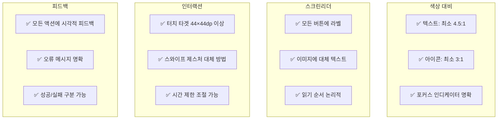

# DOT ATTENDANCE UI 페이지 상세 설계

## 🎨 디자인 언어: 네오브루탈리즘

### 핵심 비주얼 요소
- **굵은 검은 테두리** (2-3px)
- **하드 섀도우** (pure black #000)
- **흑백 대비** + **형광 옐로 강조** (#CCFF00)
- **플랫 디자인** (그래디언트/블러 없음)
- **8pt 그리드 시스템**

---

## 📱 USER (직원) 페이지

### 1. 홈 대시보드
```
┌─────────────────────────────┐
│  DOT ATTENDANCE    👤 프로필 │ ← 상단바 (Do Hyeon 22pt)
├─────────────────────────────┤
│                             │
│  ┌───────────────────────┐  │
│  │  오늘의 근무 상태      │  │ ← 메인 카드 (bg-hi)
│  │  ■ 근무중 08:32:15    │  │    border-3 shadow-elev3
│  │  출근: 09:00          │  │
│  │  예상 퇴근: 18:00     │  │
│  └───────────────────────┘  │
│                             │
│  ┌─────────┐ ┌─────────┐   │
│  │  출 근   │ │  휴 게   │   │ ← 액션 버튼
│  └─────────┘ └─────────┘   │    border-2 r-12
│  ┌─────────┐ ┌─────────┐   │    활성: bg-hi
│  │ 휴게종료 │ │  퇴 근   │   │
│  └─────────┘ └─────────┘   │
│                             │
│  이번 주 근무 시간           │ ← Orbit 16pt
│  ┌───────────────────────┐  │
│  │ 월 화 수 목 금 토 일   │  │ ← 주간 바 차트
│  │ ██ ██ ██ ▒▒ ▒▒ -- -- │  │    
│  │ 8h 8h 4h              │  │
│  └───────────────────────┘  │
│                             │
│  📢 공지사항                │
│  ┌───────────────────────┐  │
│  │ • 12월 연말 회식 안내  │  │ ← border-2
│  │ • 급여명세서 확인요청   │  │
│  └───────────────────────┘  │
│                             │
├─────────────────────────────┤
│  🏠  📷  📊  📅  🔔         │ ← 하단 탭바
└─────────────────────────────┘
```

**주요 기능**
- 실시간 근무 타이머
- 원터치 출퇴근 버튼
- 주간 근무 현황 시각화
- 최신 공지사항 3개

### 2. QR 스캔 화면
```
┌─────────────────────────────┐
│  ← QR 체크인                │
├─────────────────────────────┤
│                             │
│  ┌───────────────────────┐  │
│  │                       │  │
│  │   📷 카메라 뷰포트     │  │ ← border-3 dashed
│  │                       │  │    corner markers
│  │   ┌─────────────┐     │  │
│  │   │             │     │  │
│  │   │  QR 영역     │     │  │
│  │   │             │     │  │
│  │   └─────────────┘     │  │
│  │                       │  │
│  └───────────────────────┘  │
│                             │
│  QR 코드를 스캔하세요        │ ← Orbit 16pt
│                             │
│  ┌───────────────────────┐  │
│  │  수동 코드 입력 🔢      │  │ ← border-2 r-12
│  └───────────────────────┘  │
│                             │
│  📍 위치 확인중...           │ ← 실시간 상태
│  강남점 (50m 이내) ✅        │
│                             │
└─────────────────────────────┘
```

**인터랙션**
- QR 인식 시: 테두리 hi 플래시 + 햅틱
- 성공: bg-success 토스트
- 실패: bg-error 배너 + 재시도

### 3. 내 근태 화면
```
┌─────────────────────────────┐
│  ← 내 근태 기록             │
├─────────────────────────────┤
│                             │
│  < 2024년 12월 >            │ ← 월 선택
│                             │
│  ┌───────────────────────┐  │
│  │ 일 월 화 수 목 금 토   │  │ ← 캘린더 그리드
│  │ -- -- -- -- -- 01 02  │  │    border-2
│  │ 03 04 05 06 07 08 09  │  │    오늘: bg-hi
│  │ 10 11 12 ▓▓ 14 15 16  │  │    선택: border-hi
│  │ 17 18 19 20 21 22 23  │  │
│  │ 24 25 26 27 28 29 30  │  │
│  │ 31 -- -- -- -- -- --  │  │
│  └───────────────────────┘  │
│                             │
│  12월 13일 (목)              │ ← Do Hyeon 22pt
│  ┌───────────────────────┐  │
│  │ 출근: 09:00 ✅         │  │ ← 일별 상세
│  │ 휴게: 12:00-13:00     │  │    border-2
│  │ 퇴근: 18:30 ✅        │  │
│  │ 총 근무: 8시간 30분    │  │
│  └───────────────────────┘  │
│                             │
│  ┌───────────────────────┐  │
│  │  근태 수정 요청 ✏️     │  │ ← border-2 r-12
│  └───────────────────────┘  │
│                             │
│  월간 통계                  │
│  • 총 근무: 176시간         │
│  • 초과 근무: 8시간         │
│  • 지각/조퇴: 0회           │
│                             │
└─────────────────────────────┘
```

### 4. 스케줄 화면
```
┌─────────────────────────────┐
│  ← 근무 스케줄              │
├─────────────────────────────┤
│                             │
│  [주간] [월간]              │ ← 탭 선택
│                             │
│  12.11 - 12.17              │
│  ┌───────────────────────┐  │
│  │ 월 │ 09:00 - 18:00    │  │ ← 주간 스케줄
│  ├───┼──────────────────┤  │    border-2
│  │ 화 │ 09:00 - 18:00    │  │    오늘: bg-hi
│  ├───┼──────────────────┤  │
│  │ 수 │ 09:00 - 18:00    │  │
│  ├───┼──────────────────┤  │
│  │ 목 │ 13:00 - 22:00    │  │ ← 오후 근무
│  ├───┼──────────────────┤  │
│  │ 금 │ 09:00 - 18:00    │  │
│  ├───┼──────────────────┤  │
│  │ 토 │ 휴무            │  │
│  ├───┼──────────────────┤  │
│  │ 일 │ 휴무            │  │
│  └───────────────────────┘  │
│                             │
│  다음 주 스케줄              │
│  ┌───────────────────────┐  │
│  │ 📅 스케줄 미확정        │  │ ← Empty state
│  │ 관리자에게 문의하세요   │  │    border-2 dashed
│  └───────────────────────┘  │
│                             │
│  ┌───────────────────────┐  │
│  │  휴가 신청 📝          │  │ ← border-2 r-12
│  └───────────────────────┘  │
│                             │
└─────────────────────────────┘
```

---

## 👔 ADMIN (관리자) 페이지

### 1. 관리자 대시보드
```
┌─────────────────────────────┐
│  DOT 관리자    🔄 새로고침   │
├─────────────────────────────┤
│                             │
│  강남점 현황                 │ ← Do Hyeon 22pt
│                             │
│  ┌───────────────────────┐  │
│  │ 현재 근무중: 12명 👥    │  │ ← 실시간 현황
│  │ ▓▓▓▓▓▓▓▓▓▓▓▓░░░░░    │  │    bg-hi 카드
│  └───────────────────────┘  │
│                             │
│  ┌──────────┬────────────┐  │
│  │ 출근 예정 │ 퇴근 예정  │  │ ← 2열 그리드
│  │    3명    │    5명     │  │    border-2
│  └──────────┴────────────┘  │
│                             │
│  승인 대기 3건 🔴            │ ← 알림 배지
│  ┌───────────────────────┐  │
│  │ • 김철수 - 근태 수정   │  │
│  │ • 이영희 - 휴가 신청   │  │
│  │ • 박민수 - 교대 요청   │  │
│  └───────────────────────┘  │
│                             │
│  오늘의 스케줄               │
│  ┌───────────────────────┐  │
│  │ 09-18 │ 김철수 외 8명  │  │
│  │ 13-22 │ 이영희 외 4명  │  │
│  │ 18-02 │ 박민수 외 3명  │  │
│  └───────────────────────┘  │
│                             │
│  빠른 실행                  │
│  ┌─────────┐ ┌─────────┐   │
│  │ QR 생성  │ │직원 추가 │   │
│  └─────────┘ └─────────┘   │
│                             │
├─────────────────────────────┤
│  📊  👥  📅  ✅  ⚙️         │
└─────────────────────────────┘
```

### 2. 직원 관리
```
┌─────────────────────────────┐
│  ← 직원 관리                │
├─────────────────────────────┤
│                             │
│  🔍 검색...        [+ 추가] │ ← 검색바 + 액션
│                             │
│  전체 15명 | 근무중 12명     │
│                             │
│  ┌───────────────────────┐  │
│  │ 👤 김철수               │  │ ← 직원 카드
│  │ 정직원 | 주방           │  │    border-2
│  │ ● 근무중 (09:00~)      │  │    shadow-elev2
│  └───────────────────────┘  │
│                             │
│  ┌───────────────────────┐  │
│  │ 👤 이영희               │  │
│  │ 파트타임 | 홀           │  │
│  │ ○ 휴무                │  │
│  └───────────────────────┘  │
│                             │
│  ┌───────────────────────┐  │
│  │ 👤 박민수               │  │
│  │ 정직원 | 주방           │  │
│  │ ● 휴게중 (12:00~)      │  │
│  └───────────────────────┘  │
│                             │
└─────────────────────────────┘

[직원 상세/편집 모달]
┌───────────────────────────┐
│ 직원 정보         [X 닫기] │
├───────────────────────────┤
│                           │
│ 이름: [김철수]            │ ← Input border-2
│ 직급: [정직원 ▼]          │
│ 부서: [주방 ▼]            │
│ 시급: [₩ 10,000]          │
│ 전화: [010-1234-5678]     │
│ 이메일: [kim@example.com] │
│                           │
│ 권한: □ 관리자 권한       │
│                           │
│ [취소]      [저장]        │ ← 저장: bg-hi
└───────────────────────────┘
```

### 3. 스케줄 관리 (드래그 앤 드롭)
```
┌─────────────────────────────┐
│  ← 스케줄 관리              │
├─────────────────────────────┤
│                             │
│  < 2024년 12월 2주차 >      │
│                             │
│  ┌───────────────────────┐  │
│  │    │월│화│수│목│금│토│일│  │ ← 주간 그리드
│  ├───┼─┼─┼─┼─┼─┼─┼─┤  │    border-2
│  │09 │김│김│김│  │김│  │  │  │    드래그 가능
│  │10 │철│철│철│  │철│  │  │  │
│  │11 │수│수│수│  │수│  │  │  │
│  │12 │  │  │  │이│  │박│박│  │
│  │13 │  │  │  │영│  │민│민│  │ ← 오후 시프트
│  │14 │이│이│이│희│이│수│수│  │    bg-pastelSky
│  │15 │영│영│영│  │영│  │  │  │
│  │16 │희│희│희│  │희│  │  │  │
│  │17 │  │  │  │  │  │  │  │  │
│  │18 │박│박│박│박│  │  │  │  │ ← 야간 시프트
│  │19 │민│민│민│민│  │  │  │  │    bg-pastelLilac
│  │20 │수│수│수│수│  │  │  │  │
│  └───────────────────────┘  │
│                             │
│  직원별 주간 시간            │
│  • 김철수: 40h              │
│  • 이영희: 35h              │
│  • 박민수: 32h              │
│                             │
│  [패턴 적용] [자동 배치]     │
│                             │
└─────────────────────────────┘
```

### 4. 승인 관리
```
┌─────────────────────────────┐
│  ← 승인 관리                │
├─────────────────────────────┤
│                             │
│  대기중 3 | 처리완료 28      │
│                             │
│  ┌───────────────────────┐  │
│  │ 🔄 근태 수정 요청       │  │ ← 요청 카드
│  │ 김철수 | 12월 10일      │  │    border-3
│  │ 출근: 09:00 → 08:50    │  │    bg-warning
│  │ "지하철 연착으로..."    │  │
│  │                        │  │
│  │ [반려] [승인]          │  │ ← 승인: bg-hi
│  └───────────────────────┘  │
│                             │
│  ┌───────────────────────┐  │
│  │ 🏖️ 휴가 신청           │  │
│  │ 이영희 | 12.20-12.22    │  │
│  │ 연차 사용 (잔여: 5일)   │  │
│  │ "가족 여행"            │  │
│  │                        │  │
│  │ [반려] [승인]          │  │
│  └───────────────────────┘  │
│                             │
│  [전체 선택] [일괄 승인]     │
│                             │
└─────────────────────────────┘
```

### 5. QR 코드 관리
```
┌─────────────────────────────┐
│  ← QR 코드 관리             │
├─────────────────────────────┤
│                             │
│  현재 QR 코드                │
│                             │
│  ┌───────────────────────┐  │
│  │                       │  │
│  │   ████████████████    │  │ ← QR 코드
│  │   ██          ██      │  │    border-3
│  │   ██  ▓▓▓▓▓▓  ██      │  │    shadow-elev3
│  │   ██  ▓▓▓▓▓▓  ██      │  │
│  │   ██          ██      │  │
│  │   ████████████████    │  │
│  │                       │  │
│  │   강남점 체크인 코드    │  │
│  └───────────────────────┘  │
│                             │
│  유효기간: 2024.12.31까지    │
│  코드: STORE-GANGNAM-2024    │
│                             │
│  ┌───────────────────────┐  │
│  │  🔄 QR 코드 재생성      │  │ ← bg-hi
│  └───────────────────────┘  │
│                             │
│  ┌───────────────────────┐  │
│  │  💾 이미지 다운로드      │  │ ← border-2
│  └───────────────────────┘  │
│                             │
│  ┌───────────────────────┐  │
│  │  🖨️ 인쇄하기           │  │ ← border-2
│  └───────────────────────┘  │
│                             │
└─────────────────────────────┘
```

---

## 🏢 MASTER ADMIN (마스터 관리자) 추가 페이지

### 1. 통합 대시보드
```
┌─────────────────────────────┐
│  DOT 마스터 관리            │
├─────────────────────────────┤
│                             │
│  전체 매장 현황              │ ← Do Hyeon 22pt
│                             │
│  ┌───────────────────────┐  │
│  │ 📊 종합 지표           │  │ ← bg-hi 메인 카드
│  │ 매장: 5개 | 직원: 78명 │  │
│  │ 현재 근무: 45명        │  │
│  └───────────────────────┘  │
│                             │
│  매장별 현황                 │
│  ┌───────────────────────┐  │
│  │ 강남점 ● 12/15 근무중  │  │ ← 매장 카드들
│  ├───────────────────────┤  │    border-2
│  │ 역삼점 ● 8/10 근무중   │  │
│  ├───────────────────────┤  │
│  │ 선릉점 ● 10/12 근무중  │  │
│  ├───────────────────────┤  │
│  │ 삼성점 ○ 0/8 (휴무)    │  │
│  ├───────────────────────┤  │
│  │ 대치점 ● 15/18 근무중  │  │
│  └───────────────────────┘  │
│                             │
│  월간 인건비: ₩45,280,000   │
│  전월 대비: +5.2% ↑          │
│                             │
└─────────────────────────────┘
```

### 2. 매장 관리
```
┌─────────────────────────────┐
│  ← 매장 관리                │
├─────────────────────────────┤
│                             │
│  [+ 새 매장 추가]            │
│                             │
│  ┌───────────────────────┐  │
│  │ 🏪 강남점              │  │ ← 매장 카드
│  │ 서울 강남구 테헤란로    │  │    border-3
│  │ 관리자: 김철수          │  │    shadow-elev2
│  │ 직원: 15명 | QR: 활성   │  │
│  │                        │  │
│  │ [상세] [수정] [삭제]    │  │
│  └───────────────────────┘  │
│                             │
└─────────────────────────────┘

[매장 설정 모달]
┌───────────────────────────┐
│ 매장 설정         [X 닫기] │
├───────────────────────────┤
│                           │
│ 기본 정보                 │
│ 매장명: [강남점]          │
│ 주소: [서울 강남구...]     │
│ 전화: [02-1234-5678]      │
│                           │
│ 근무 규칙                 │
│ 업무시작: [09:00]         │
│ 업무종료: [22:00]         │
│ 휴게시간: [60]분          │
│ GPS 반경: [100]m          │
│                           │
│ 관리자 지정               │
│ [김철수 ▼]               │
│                           │
│ [취소]      [저장]        │
└───────────────────────────┘
```

### 3. 급여 관리
```
┌─────────────────────────────┐
│  ← 급여 관리                │
├─────────────────────────────┤
│                             │
│  2024년 12월 정산            │
│                             │
│  ┌───────────────────────┐  │
│  │ 총 지급액              │  │ ← 요약 카드
│  │ ₩45,280,000           │  │    bg-hi
│  │ 78명 | 12.25 지급예정  │  │
│  └───────────────────────┘  │
│                             │
│  매장별 급여 현황            │
│  ┌───────────────────────┐  │
│  │ 강남점 | ₩12,340,000  │  │
│  │ 15명 | 승인완료 ✅     │  │
│  ├───────────────────────┤  │
│  │ 역삼점 | ₩8,920,000   │  │
│  │ 10명 | 검토중 🔄      │  │
│  └───────────────────────┘  │
│                             │
│  [명세서 생성] [일괄 승인]   │
│  [엑셀 내보내기]            │
│                             │
└─────────────────────────────┘
```

---

## 🎭 상태별 UI 패턴

### 로딩 상태
```
┌───────────────────────┐
│ ⊙ ⊙ ⊙                │ ← 3개 점 애니메이션
│ 불러오는 중...         │    120ms 간격
└───────────────────────┘
```

### 빈 상태 (Empty State)
```
┌───────────────────────┐
│                       │
│    📭                 │ ← 라인 아이콘
│                       │
│ 아직 데이터가 없어요   │ ← Orbit 16pt
│                       │
│ [+ 추가하기]          │ ← bg-hi 버튼
│                       │
└───────────────────────┘ border-2 dashed
```

### 오류 상태
```
┌───────────────────────┐
│ ⚠️ 오류가 발생했어요   │ ← bg-error 배너
│ 잠시 후 다시 시도하세요 │
│ [재시도]              │ ← border-2 버튼
└───────────────────────┘
```

### 성공 피드백
```
┌───────────────────────┐
│ ✅ 저장되었습니다      │ ← bg-success 토스트
└───────────────────────┘ 2초 후 사라짐
```

### 확인 모달
```
┌───────────────────────┐
│ 정말 삭제하시겠습니까? │ ← Do Hyeon 18pt
│                       │
│ 이 작업은 되돌릴 수    │
│ 없습니다.             │
│                       │
│ [취소]    [삭제]      │ ← 삭제: bg-error
└───────────────────────┘ border-3 shadow-elev3
```

---

## 🔄 화면 전환 애니메이션

### 페이지 전환
- **Push**: X축 +16dp 슬라이드 + fade (240ms)
- **Pop**: X축 -16dp 슬라이드 + fade (240ms)

### 모달/바텀시트
- **열기**: Y축 아래→위 슬라이드 (240ms)
- **닫기**: Y축 위→아래 슬라이드 (180ms)

### 버튼 인터랙션
- **Press**: translateY(+2px) + shadow 감소
- **Release**: 원상 복구 (120ms)

### 토스트/스낵바
- **표시**: 아래→위 슬라이드 + fade in (240ms)
- **숨김**: fade out (180ms)

---

## 📐 레이아웃 규칙

### 간격 (8pt 그리드)
- 최소 간격: 8dp
- 컴포넌트 간격: 16dp
- 섹션 간격: 24dp
- 화면 패딩: 16dp

### 터치 타겟
- 최소 크기: 44×44dp
- 버튼 높이: 48dp
- 리스트 아이템: 56dp

### 테두리
- 기본: 2px solid #000
- 강조: 3px solid #000
- 포커스: 2px solid #CCFF00

### 그림자
- elev1: 0 2px 0 #000
- elev2: 4px 4px 0 #000  
- elev3: 8px 8px 0 #000

### 모서리
- 버튼: 12dp
- 카드: 16dp
- 입력필드: 8dp

---

## 🎯 접근성 체크리스트



---

*이 문서는 DOT ATTENDANCE의 모든 UI 페이지 설계를 담고 있으며, Flutter 구현 시 직접 참조할 수 있는 상세 가이드입니다.*