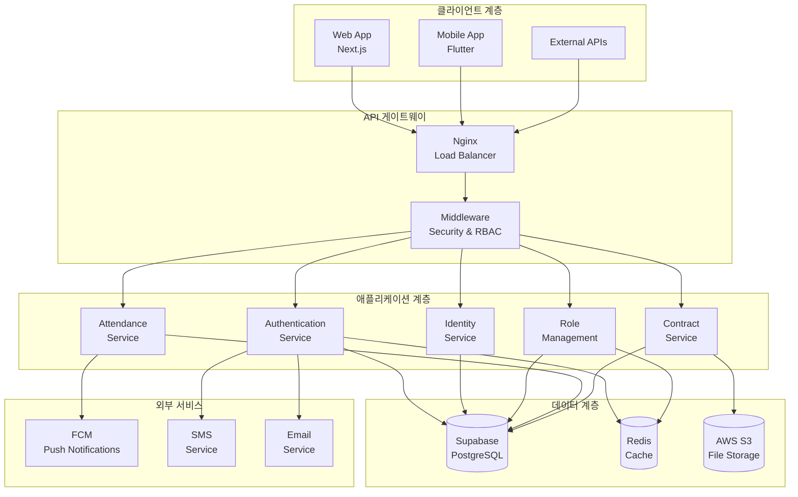
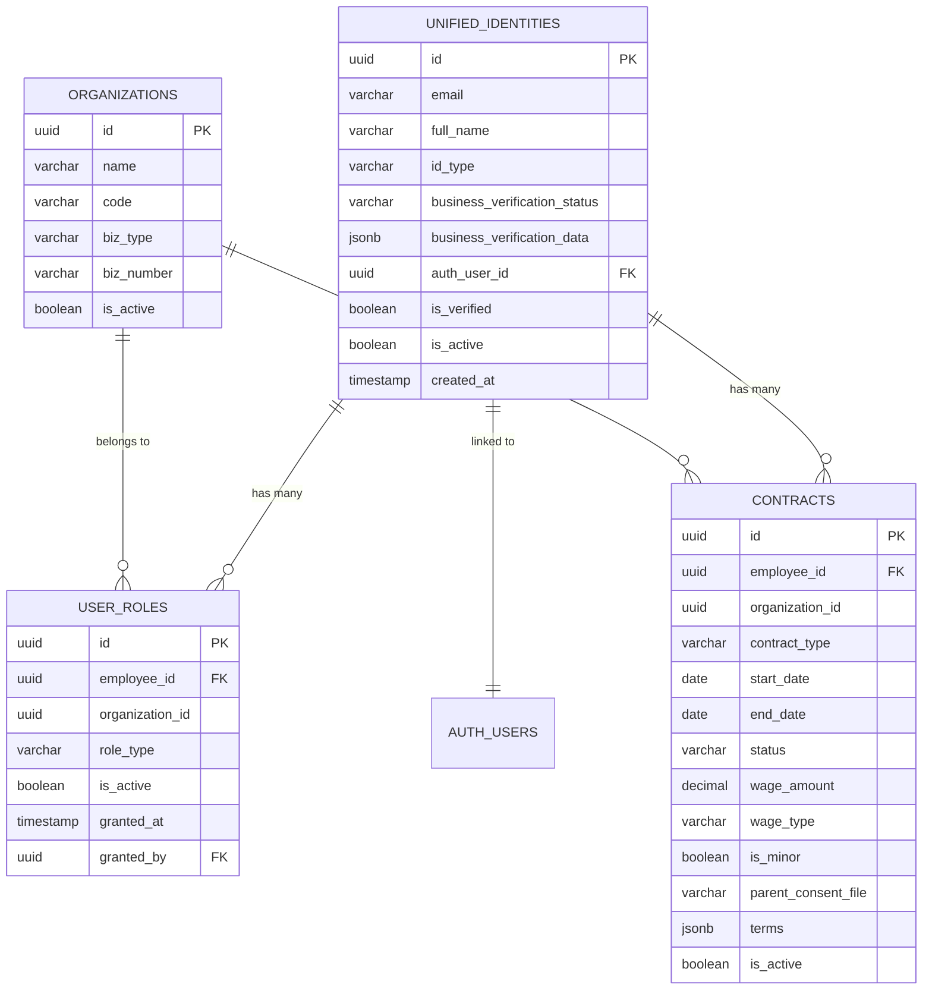
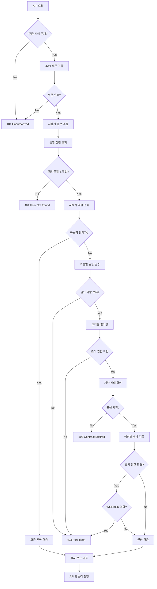
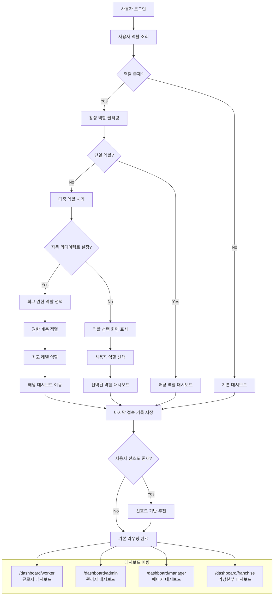
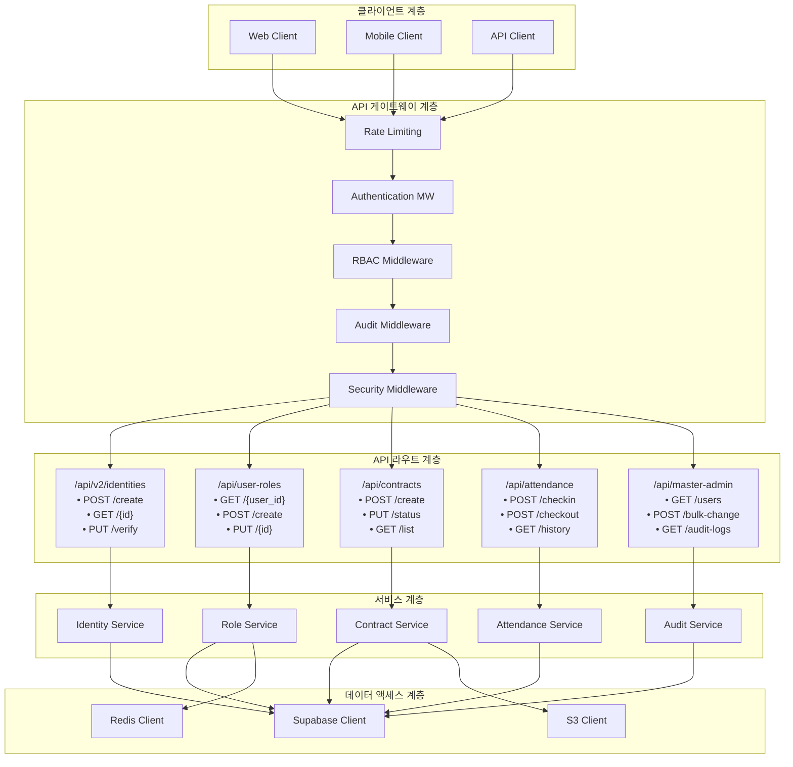
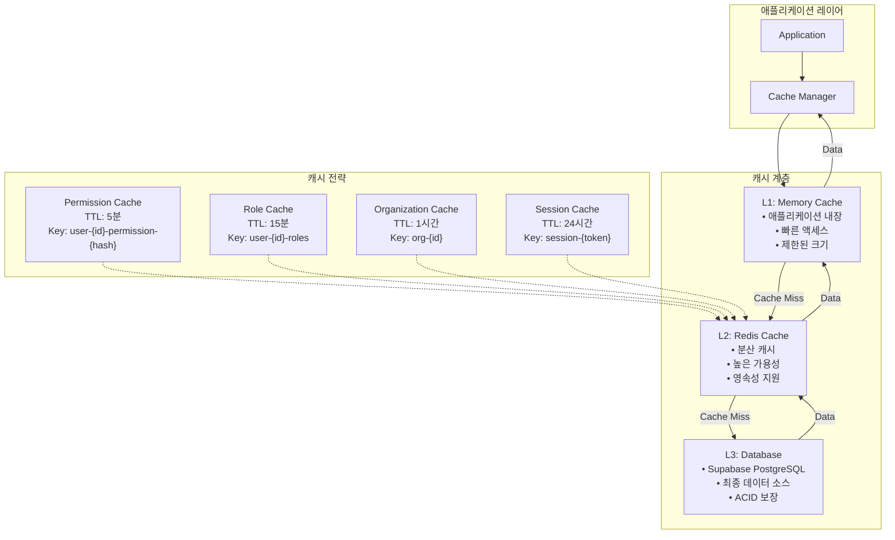
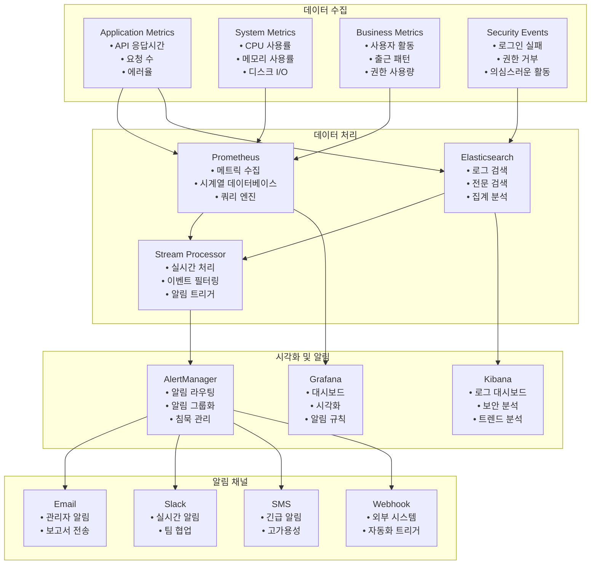
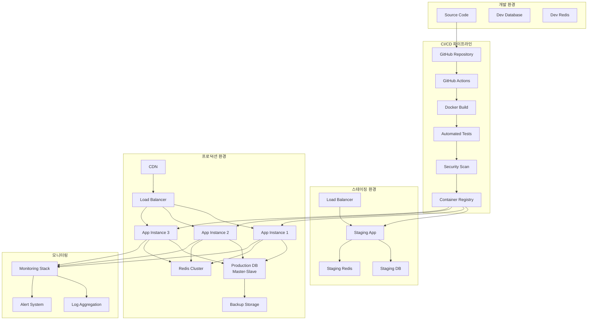

# DOT Attendance Service: 아키텍처 다이어그램

## 개요

이 문서는 DOT 출석 서비스의 ID-Role-Paper 분기 아키텍처를 시각적으로 표현한 다이어그램들을 제공합니다.

## 목차
1. [전체 시스템 아키텍처](#전체-시스템-아키텍처)
2. [ID-Role-Paper 관계도](#id-role-paper-관계도)
3. [권한 검증 플로우](#권한-검증-플로우)
4. [스마트 라우팅 플로우](#스마트-라우팅-플로우)
5. [데이터베이스 스키마](#데이터베이스-스키마)
6. [API 계층 구조](#api-계층-구조)
7. [보안 아키텍처](#보안-아키텍처)

## 전체 시스템 아키텍처



## ID-Role-Paper 관계도



## 권한 검증 플로우



## 스마트 라우팅 플로우



## 데이터베이스 스키마

```mermaid
graph LR
    subgraph "신원 관리"
        ID[unified_identities<br/>• id (PK)<br/>• email (unique)<br/>• full_name<br/>• id_type<br/>• verification_status<br/>• auth_user_id (FK)]
    end
    
    subgraph "역할 관리"
        ROLE[user_roles<br/>• id (PK)<br/>• employee_id (FK)<br/>• organization_id<br/>• role_type<br/>• is_active<br/>• granted_at]
    end
    
    subgraph "계약 관리"
        CONTRACT[contracts<br/>• id (PK)<br/>• employee_id (FK)<br/>• organization_id<br/>• contract_type<br/>• status<br/>• wage_info]
    end
    
    subgraph "조직 관리"
        ORG[organizations<br/>• id (PK)<br/>• name<br/>• biz_type<br/>• is_active]
    end
    
    subgraph "출근 관리"
        ATTEND[attendance_records<br/>• id (PK)<br/>• user_id (FK)<br/>• organization_id<br/>• check_in_time<br/>• check_out_time<br/>• status]
    end
    
    subgraph "감사 추적"
        AUDIT[audit_logs<br/>• id (PK)<br/>• user_id<br/>• action<br/>• resource<br/>• timestamp<br/>• ip_address]
    end
    
    ID -->|1:N| ROLE
    ID -->|1:N| CONTRACT
    ID -->|1:N| ATTEND
    ID -->|1:N| AUDIT
    
    ORG -->|1:N| ROLE
    ORG -->|1:N| CONTRACT
    ORG -->|1:N| ATTEND
    
    ROLE -.->|참조| ATTEND
    CONTRACT -.->|참조| ATTEND
```

## API 계층 구조



## 보안 아키텍처

```mermaid
graph TB
    subgraph "외부 위협"
        ATTACKER[공격자]
        BOT[봇/크롤러]
        DDOS[DDoS 공격]
    end
    
    subgraph "1차 방어선: 네트워크 보안"
        FIREWALL[방화벽]
        WAF[Web Application Firewall]
        CDN[CDN/DDoS Protection]
    end
    
    subgraph "2차 방어선: 애플리케이션 보안"
        RATE_LIMITER[Rate Limiting<br/>• IP별 요청 제한<br/>• 사용자별 요청 제한]
        
        INPUT_VALIDATOR[Input Validation<br/>• SQL Injection 방지<br/>• XSS 방지<br/>• CSRF 방지]
        
        AUTH_LAYER[Authentication Layer<br/>• JWT 토큰 검증<br/>• 세션 관리<br/>• MFA 지원]
    end
    
    subgraph "3차 방어선: 권한 제어"
        RBAC_ENGINE[RBAC Engine<br/>• 역할 기반 접근 제어<br/>• 조직별 권한 분리<br/>• 계약 상태 검증]
        
        PERMISSION_CACHE[Permission Cache<br/>• Redis 기반 캐싱<br/>• 성능 최적화<br/>• 자동 무효화]
    end
    
    subgraph "4차 방어선: 감시 및 대응"
        AUDIT_LOGGER[Audit Logger<br/>• 모든 액션 기록<br/>• 실시간 로깅<br/>• 이상 행위 탐지]
        
        SECURITY_MONITOR[Security Monitor<br/>• 실시간 모니터링<br/>• 자동 알림<br/>• 자동 차단]
        
        ANOMALY_DETECTOR[Anomaly Detector<br/>• 패턴 분석<br/>• 머신러닝 기반<br/>• 예측적 차단]
    end
    
    subgraph "데이터 보호"
        ENCRYPTION[Data Encryption<br/>• 전송 중 암호화 (TLS)<br/>• 저장 중 암호화<br/>• 필드 레벨 암호화]
        
        BACKUP[Backup & Recovery<br/>• 자동 백업<br/>• 포인트인타임 복구<br/>• 지리적 분산]
    end
    
    ATTACKER --> FIREWALL
    BOT --> WAF
    DDOS --> CDN
    
    FIREWALL --> RATE_LIMITER
    WAF --> INPUT_VALIDATOR
    CDN --> AUTH_LAYER
    
    RATE_LIMITER --> RBAC_ENGINE
    INPUT_VALIDATOR --> RBAC_ENGINE
    AUTH_LAYER --> RBAC_ENGINE
    
    RBAC_ENGINE --> PERMISSION_CACHE
    RBAC_ENGINE --> AUDIT_LOGGER
    
    AUDIT_LOGGER --> SECURITY_MONITOR
    SECURITY_MONITOR --> ANOMALY_DETECTOR
    
    RBAC_ENGINE -.-> ENCRYPTION
    AUDIT_LOGGER -.-> BACKUP
```

## 캐싱 전략 다이어그램



## 모니터링 아키텍처



## 배포 아키텍처



---

이러한 다이어그램들은 DOT 출석 서비스의 복잡한 ID-Role-Paper 분기 아키텍처를 이해하는 데 도움이 되며, 시스템의 전체적인 구조와 데이터 흐름을 시각적으로 파악할 수 있게 해줍니다.

각 다이어그램은 Mermaid 문법으로 작성되어 있어 GitHub, GitLab, 또는 다른 Markdown 지원 플랫폼에서 자동으로 렌더링됩니다.