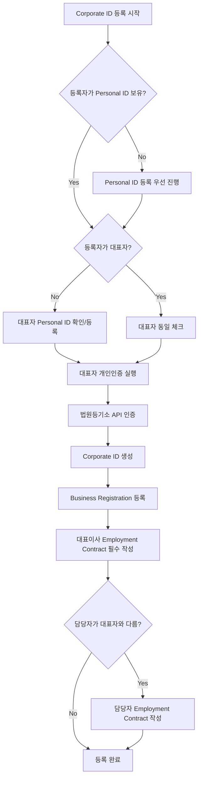
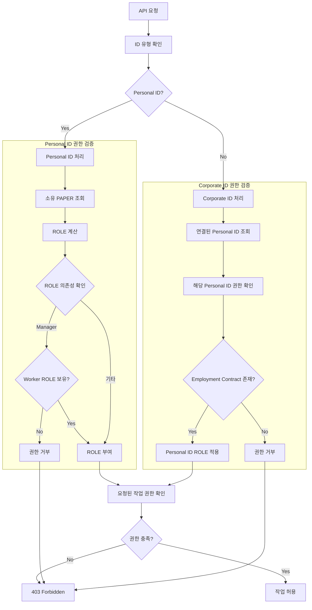

# DOT Attendance Service: 확정된 ID-ROLE-PAPER 아키텍처

## 개요

이 문서는 DOT 출석 서비스의 최종 확정된 ID-ROLE-PAPER 분기 아키텍처를 정의합니다. 이 시스템은 Personal ID와 Corporate ID를 기반으로 하며, 다양한 PAPER(서류)를 통해 ROLE을 동적으로 결정하는 구조입니다.

## ID (신원) 체계

### 1. Personal ID
**정의**: DOT 서비스를 사용하는 모든 사용자에게 부여되는 기본 ID

#### 특징
- **1인 1ID 원칙**: 개인인증을 통해 1인 1ID만 등록 가능
- **다중 PAPER 소유**: 여러 Business Registration, Employment Contract, Authority Delegation 등을 소유 가능
- **동적 ROLE 부여**: 소유한 PAPER에 따라 ROLE이 결정됨

#### ROLE 결정 규칙
```typescript
interface PersonalIdRoleRule {
  papers: string[];
  resultRole: RoleType;
  description: string;
}

const PERSONAL_ID_ROLE_RULES: PersonalIdRoleRule[] = [
  {
    papers: [],
    resultRole: 'SEEKER',
    description: '어떤 PAPER도 갖지 않는 경우'
  },
  {
    papers: ['Business Registration'],
    resultRole: 'OWNER',
    description: '사업자등록증만 소유'
  },
  {
    papers: ['Employment Contract'],
    resultRole: 'WORKER',
    description: '근로계약서만 소유'
  },
  {
    papers: ['Employment Contract', 'Authority Delegation'],
    resultRole: 'MANAGER',
    description: '근로계약서 + 권한위임장'
  },
  {
    papers: ['Business Registration(Franchise Agreement)'],
    resultRole: 'FRANCHISEE',
    description: '가맹계약을 체결한 사업자'
  },
  {
    papers: ['Business Registration(Franchise HQ Registration)'],
    resultRole: 'FRANCHISOR',
    description: '가맹본부 등록증을 소유한 사업자'
  },
  {
    papers: ['Employment Contract', 'Supervisor Authority Delegation'],
    resultRole: 'SUPERVISOR',
    description: '근로계약서 + 수퍼바이저 권한위임장'
  }
];
```

### 2. Corporate ID
**정의**: DOT 서비스를 법인 자격으로 이용하기 위한 ID

#### 등록 프로세스


#### 특징
- **법인 직원만 등록 가능**: 대표자 또는 관리 담당 직원
- **반드시 Personal ID 연결**: 대표자의 Personal ID 필수
- **법원등기소 API 인증**: 법인등록번호, 대표자 정보 일치 확인
- **스스로 ROLE 부여 불가**: Corporate ID 자체는 ROLE을 갖지 않음
- **필수 Employment Contract**: Business Registration 등록 후 대표이사 근로계약 필수

## PAPER (서류) 체계

### 1. Business Registration (사업자등록증)
**정의**: Personal ID나 Corporate ID가 사업을 위해 발급받은 세무서 서류

#### 기능 및 권한
- **사업장 대표 서류**: 해당 사업장을 공식적으로 대표
- **다중 소유 가능**: 하나의 ID가 여러 사업자등록증 소유 가능
- **API 인증**: 개인사업자(주민등록번호), 법인사업자(법인등록번호) 대조
- **Authority Delegation 발급**: Employment Contract를 맺은 Personal ID에게 권한 위임 가능
- **Franchise HQ Registration 소유 가능**: 가맹본부 자격 획득

### 2. Employment Contract (근로계약서)
**정의**: Business Registration(사업장)과 Personal ID 간의 근무 조건 계약서

#### 특징
- **양방향 소유**: Personal ID와 Business Registration 모두 소유
- **양방향 인증**: 사업주와 근로자 모두의 인증 필요
- **다중 계약 가능**: 각각 여러 계약 소유 가능
- **Corporate ID 필수 조건**: 법인은 최소 1개의 대표이사 계약 필수
- **ROLE 회수**: 계약 종료 시 관련 ROLE과 권한 자동 회수

#### 직위별 특별 규칙
```typescript
interface EmploymentContractRule {
  position: string;
  specialRules: string[];
  roleImpact: string;
}

const EMPLOYMENT_CONTRACT_RULES: EmploymentContractRule[] = [
  {
    position: '대표이사',
    specialRules: [
      'Corporate ID 소유 Business Registration 필수',
      'Owner ROLE 자동 부여',
      '대표이사 변경 시 ROLE 이전'
    ],
    roleImpact: 'Owner ROLE 부여'
  },
  {
    position: '일반직원',
    specialRules: [
      'Worker ROLE 부여',
      'Authority Delegation 받을 시 Manager ROLE 추가'
    ],
    roleImpact: 'Worker ROLE 부여'
  }
];
```

### 3. Authority Delegation (권한위임장)
**정의**: Business Registration의 관리 권한을 Personal ID에게 위임하는 문서

#### 권한 등급 체계
```typescript
enum AuthorityLevel {
  BASIC = 1,    // 기본 운영 권한 (출퇴근 관리, 일정 관리)
  STANDARD = 2, // 중간 관리 권한 (직원 채용, 업무 배정, 재고 관리)
  FULL = 3      // 전체 관리 권한 (급여 조회, 개인정보 접근)
}

interface AuthorityScope {
  level: AuthorityLevel;
  permissions: string[];
  restrictions: string[];
}

const AUTHORITY_SCOPES: AuthorityScope[] = [
  {
    level: AuthorityLevel.BASIC,
    permissions: [
      'attendance_management',
      'schedule_management',
      'basic_reporting'
    ],
    restrictions: [
      'no_employee_hiring',
      'no_salary_access',
      'no_personal_info_access'
    ]
  },
  {
    level: AuthorityLevel.STANDARD,
    permissions: [
      'employee_hiring',
      'task_assignment',
      'inventory_management',
      'basic_hr_management'
    ],
    restrictions: [
      'no_salary_access',
      'no_personal_info_access',
      'no_business_info_change'
    ]
  },
  {
    level: AuthorityLevel.FULL,
    permissions: [
      'salary_inquiry',
      'personal_info_access',
      'advanced_reporting',
      'full_hr_management'
    ],
    restrictions: [
      'no_business_registration_change',
      'no_corporate_info_change'
    ]
  }
];
```

#### 위임 규칙
- **Personal ID 소유 Business Registration**: Owner ROLE이 자동으로 대표자에게 위임
- **Corporate ID 소유 Business Registration**: 대표이사 직위의 Personal ID가 Owner ROLE 획득
- **Manager 제한**: Business Registration 및 Corporate ID 정보 변경 권한 없음
- **의존성**: Employment Contract 비활성화 시 Authority Delegation 자동 무효화

### 4. Supervisor Authority Delegation (수퍼바이저 권한위임장)
**정의**: Franchise HQ Registration을 소유한 Business Registration이 발급하는 가맹점 관리 권한 문서

#### 특징
- **제한적 권한**: Franchise Agreement에 명시된 항목으로 제한
- **Franchisor 의존**: Franchisor가 정의한 권한만 위임 가능
- **가맹점 관리**: 특정 가맹점에 대한 관리 권한

### 5. Franchise Agreement (가맹계약서)
**정의**: Franchise HQ Registration을 소유한 Business Registration과 다른 Business Registration 간의 가맹 계약

#### 제약 조건
- **1:1 관계**: 하나의 Business Registration은 하나의 가맹계약만 체결 가능
- **자동 ROLE 부여**: 계약 체결 시 해당 사업자에게 Franchisee ROLE 자동 부여

### 6. Franchise HQ Registration (가맹본부등록증)
**정의**: Business Registration이 가맹본부로서 사업할 수 있음을 증명하는 서류

#### 기능
- **가맹계약 체결 권한**: 다른 사업자와 Franchise Agreement 작성 가능
- **Supervisor Authority Delegation 발급**: 수퍼바이저 권한 위임 가능

## ROLE (역할) 체계

### 역할 정의 및 권한
```typescript
enum RoleType {
  SEEKER = 'SEEKER',           // 구직자
  WORKER = 'WORKER',           // 워커
  MANAGER = 'MANAGER',         // 매니저
  OWNER = 'OWNER',             // 사업자관리자
  FRANCHISEE = 'FRANCHISEE',   // 가맹점주
  FRANCHISOR = 'FRANCHISOR',   // 가맹본부관리자
  SUPERVISOR = 'SUPERVISOR'    // 수퍼바이저
}

interface RoleDefinition {
  role: RoleType;
  requirements: string[];
  permissions: string[];
  dashboardPath: string;
  dependencies?: RoleType[];
}

const ROLE_DEFINITIONS: RoleDefinition[] = [
  {
    role: RoleType.SEEKER,
    requirements: ['Personal ID', 'No PAPER'],
    permissions: [
      'view_job_listings',
      'apply_for_jobs',
      'manage_profile'
    ],
    dashboardPath: '/dashboard/seeker'
  },
  {
    role: RoleType.WORKER,
    requirements: ['Personal ID', 'Employment Contract'],
    permissions: [
      'clock_in_out',
      'view_own_attendance',
      'view_schedule',
      'submit_leave_request'
    ],
    dashboardPath: '/dashboard/worker'
  },
  {
    role: RoleType.MANAGER,
    requirements: [
      'Personal ID', 
      'Employment Contract', 
      'Authority Delegation'
    ],
    permissions: [
      'manage_team_attendance',
      'approve_leave_requests',
      'assign_tasks',
      'view_team_reports'
    ],
    dashboardPath: '/dashboard/manager',
    dependencies: [RoleType.WORKER] // Manager는 반드시 Worker 선행 조건
  },
  {
    role: RoleType.OWNER,
    requirements: ['Personal ID', 'Business Registration'],
    permissions: [
      'manage_business',
      'hire_employees',
      'access_financial_data',
      'manage_contracts'
    ],
    dashboardPath: '/dashboard/owner'
  },
  {
    role: RoleType.FRANCHISEE,
    requirements: [
      'Personal ID', 
      'Business Registration', 
      'Franchise Agreement'
    ],
    permissions: [
      'manage_franchise_business',
      'follow_franchise_guidelines',
      'report_to_franchisor'
    ],
    dashboardPath: '/dashboard/franchisee'
  },
  {
    role: RoleType.FRANCHISOR,
    requirements: [
      'Personal ID', 
      'Business Registration', 
      'Franchise HQ Registration'
    ],
    permissions: [
      'manage_franchise_network',
      'create_franchise_agreements',
      'monitor_franchisees',
      'issue_supervisor_delegations'
    ],
    dashboardPath: '/dashboard/franchisor'
  },
  {
    role: RoleType.SUPERVISOR,
    requirements: [
      'Personal ID', 
      'Employment Contract', 
      'Supervisor Authority Delegation'
    ],
    permissions: [
      'monitor_franchisees',
      'audit_franchise_operations',
      'provide_guidance',
      'report_to_franchisor'
    ],
    dashboardPath: '/dashboard/supervisor'
  }
];
```

## SYSTEM RULES (시스템 규칙)

### 1. 대시보드 접근 규칙
```typescript
interface DashboardAccessRule {
  condition: string;
  access: 'single' | 'multiple' | 'switcher';
  defaultDashboard?: string;
  description: string;
}

const DASHBOARD_ACCESS_RULES: DashboardAccessRule[] = [
  {
    condition: '단일 ROLE 보유',
    access: 'single',
    description: '해당 ROLE의 대시보드로 직접 이동'
  },
  {
    condition: '다중 ROLE 보유',
    access: 'switcher',
    description: '대시보드 선택기 표시 후 사용자 선택'
  },
  {
    condition: 'ROLE 없음 (Seeker)',
    access: 'single',
    defaultDashboard: '/dashboard/seeker',
    description: 'Seeker 대시보드로 이동'
  }
];
```

### 2. ROLE 의존성 규칙
```typescript
interface RoleDependencyRule {
  parentRole: RoleType;
  childRole: RoleType;
  enforcement: 'strict' | 'soft';
  description: string;
}

const ROLE_DEPENDENCY_RULES: RoleDependencyRule[] = [
  {
    parentRole: RoleType.WORKER,
    childRole: RoleType.MANAGER,
    enforcement: 'strict',
    description: 'Manager ROLE은 반드시 Worker ROLE을 선행 조건으로 함'
  }
];
```

### 3. 데이터 영속성 규칙
```typescript
interface DataPersistenceRule {
  event: string;
  dataHandling: 'preserve' | 'transfer' | 'archive';
  description: string;
}

const DATA_PERSISTENCE_RULES: DataPersistenceRule[] = [
  {
    event: 'ROLE 이전',
    dataHandling: 'transfer',
    description: '관련 데이터는 삭제되지 않고 새 소유자에게 이전'
  },
  {
    event: 'Employment Contract 종료',
    dataHandling: 'archive',
    description: 'ROLE과 권한은 회수하되 데이터는 보관'
  },
  {
    event: '대표이사 변경',
    dataHandling: 'transfer',
    description: 'Owner ROLE과 기존 데이터를 새 대표이사에게 이전'
  }
];
```

## 권한 검증 플로우



## 실제 시나리오 예시

### 시나리오 1: 개인 카페 사장
```typescript
const scenario1 = {
  id: 'personal-001',
  idType: 'Personal',
  papers: [
    {
      type: 'Business Registration',
      businessNumber: '123-45-67890',
      businessType: '개인사업자'
    }
  ],
  resultingRoles: ['OWNER'],
  dashboardAccess: '/dashboard/owner',
  permissions: [
    'manage_business',
    'hire_employees',
    'access_financial_data'
  ]
};
```

### 시나리오 2: 법인 대표이사
```typescript
const scenario2 = {
  id: 'corporate-001',
  idType: 'Corporate',
  representative: {
    personalId: 'personal-002',
    papers: [
      {
        type: 'Employment Contract',
        position: '대표이사',
        businessRegistration: 'corp-business-001'
      }
    ]
  },
  resultingRoles: ['OWNER'], // Personal ID에 부여
  dashboardAccess: '/dashboard/owner',
  specialRules: [
    'Corporate ID 자체는 ROLE 없음',
    'Personal ID를 통해 권한 행사'
  ]
};
```

### 시나리오 3: 매니저 권한을 받은 직원
```typescript
const scenario3 = {
  id: 'personal-003',
  idType: 'Personal',
  papers: [
    {
      type: 'Employment Contract',
      position: '팀장',
      businessRegistration: 'business-002'
    },
    {
      type: 'Authority Delegation',
      level: 'STANDARD',
      grantor: 'business-002-owner'
    }
  ],
  resultingRoles: ['WORKER', 'MANAGER'], // Worker는 Manager의 선행 조건
  dashboardAccess: '/dashboard/manager',
  permissions: [
    'clock_in_out', // Worker 권한
    'view_own_attendance', // Worker 권한
    'manage_team_attendance', // Manager 권한
    'approve_leave_requests' // Manager 권한
  ]
};
```

### 시나리오 4: 가맹본부 수퍼바이저
```typescript
const scenario4 = {
  id: 'personal-004',
  idType: 'Personal',
  papers: [
    {
      type: 'Employment Contract',
      position: '수퍼바이저',
      businessRegistration: 'franchise-hq-001'
    },
    {
      type: 'Supervisor Authority Delegation',
      franchiseHq: 'franchise-hq-001',
      targetFranchises: ['franchise-store-001', 'franchise-store-002']
    }
  ],
  resultingRoles: ['WORKER', 'SUPERVISOR'],
  dashboardAccess: '/dashboard/supervisor',
  permissions: [
    'monitor_franchisees',
    'audit_franchise_operations',
    'provide_guidance'
  ]
};
```

---

이 확정된 ID-ROLE-PAPER 아키텍처는 DOT 출석 서비스의 복잡한 비즈니스 요구사항을 체계적으로 지원하며, 개인과 법인의 다양한 고용 형태와 사업 구조를 모두 포괄하는 유연하고 확장 가능한 시스템을 제공합니다.