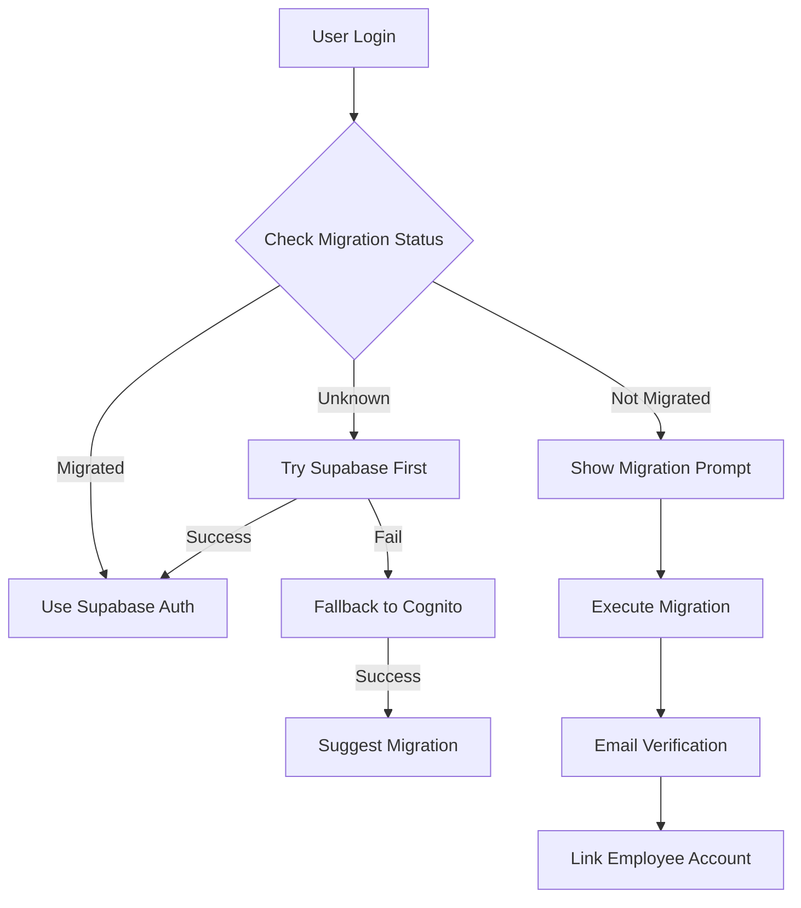

# AWS Cognito to Supabase Auth Migration Guide

## Overview

This document provides a comprehensive guide for migrating the DOT attendance web application from AWS Cognito to Supabase Auth, aligning with the mobile application's authentication system.

## Current State

- **Web App**: Uses AWS Cognito with Amplify SDK
- **Mobile App**: Already uses Supabase Auth successfully  
- **Backend**: Uses Supabase database with JWT-based authentication
- **Database Schema**: Ready with `auth_user_id UUID REFERENCES auth.users(id)`

## Migration Strategy

### Phase 1: Preparation & Setup (1-2 days)

#### 1.1 Install Dependencies
```bash
npm install @supabase/supabase-js@^2.39.7
```

#### 1.2 Environment Configuration
Add to your `.env.local`:
```env
# Supabase Configuration (Primary Authentication)
NEXT_PUBLIC_SUPABASE_URL=https://mljyiuzetchtjudbcfvd.supabase.co
NEXT_PUBLIC_SUPABASE_ANON_KEY=your_anon_key_here

# Migration Feature Flags
NEXT_PUBLIC_ENABLE_SUPABASE_AUTH=true
NEXT_PUBLIC_ENABLE_MIGRATION_FLOW=true
NEXT_PUBLIC_ENABLE_COGNITO_FALLBACK=true
NEXT_PUBLIC_FORCE_SUPABASE_NEW_USERS=true

# Migration Configuration
MIGRATION_BATCH_SIZE=5
MIGRATION_DELAY_MS=2000
MIGRATION_DRY_RUN=false
```

#### 1.3 Verify Database Setup
Ensure your Supabase database has:
- Row Level Security (RLS) enabled on all tables
- Proper auth policies configured
- Employee table with `auth_user_id` column

### Phase 2: Implementation (3-4 days)

#### 2.1 New Service Architecture

The migration implements a multi-layered authentication system:

```
┌─────────────────┐
│  Unified Auth   │ ← Main interface for components
│    Service      │
└─────────────────┘
         │
    ┌────┴────┐
    │         │
┌───▼───┐ ┌──▼──────┐
│Supabase│ │ Cognito │ ← Legacy fallback
│  Auth  │ │  Auth   │
└────────┘ └─────────┘
```

#### 2.2 Key Components Created

1. **`supabaseAuthService.ts`** - Core Supabase authentication
2. **`unifiedAuthService.ts`** - Handles both auth systems during migration
3. **`migrationService.ts`** - User migration utilities
4. **`useSupabaseAuth.ts`** - React hooks for auth state
5. **`migrate-users.ts`** - CLI migration script

#### 2.3 Authentication Flow



### Phase 3: Gradual Migration (1-2 weeks)

#### 3.1 Feature Flag Configuration

Control migration rollout with feature flags:

```typescript
// Enable/disable systems during migration
await unifiedAuthService.enableSupabaseAuth(true);
await unifiedAuthService.enableMigrationFlow(true);
await unifiedAuthService.enableCognitoFallback(true);
```

#### 3.2 User Communication Strategy

1. **In-app notifications** about upcoming changes
2. **Email notifications** for migration instructions  
3. **Support documentation** for troubleshooting
4. **Admin dashboard** for monitoring migration progress

#### 3.3 Migration Execution

**Option A: Automated Migration**
```bash
# Run migration script for all users
npm run migrate:users

# Run for specific users
npm run migrate:users --users=user1@example.com,user2@example.com

# Dry run to preview changes
npm run migrate:users --dry-run
```

**Option B: User-Initiated Migration**
Users migrate their own accounts through the web interface when prompted.

### Phase 4: Full Transition (1 week)

#### 4.1 Switch Primary Authentication
```typescript
// Update feature flags
await unifiedAuthService.enableSupabaseAuth(true);
await unifiedAuthService.enableCognitoFallback(false);
```

#### 4.2 Cleanup Process
1. Remove Cognito dependencies from package.json
2. Delete Cognito configuration from environment
3. Remove legacy auth service files
4. Update documentation

## Implementation Details

### Master Admin Role Support

The new system supports master admin functionality:

```typescript
// Check master admin status
const isMasterAdmin = await supabaseAuthService.isMasterAdmin();

// Backend validation
if (user.employee?.is_master_admin) {
  // Grant master admin access
}
```

### Approval Workflow Enforcement

Integration with existing approval system:

```typescript
// Check approval status
const isApproved = await supabaseAuthService.isApproved();

// Middleware enforcement
const checkApprovalStatus = (allowedStatuses = ['APPROVED']) => {
  // Existing middleware logic remains the same
};
```

### Session Continuity

Maintain user sessions during migration:

```typescript
// Preserve session data during migration
const migrationToken = localStorage.getItem('migration_temp_token');
if (migrationToken) {
  await completeMigrationAfterVerification(email, otp);
}
```

## Configuration Requirements

### Supabase Configuration

```sql
-- Ensure RLS policies exist for web access
CREATE POLICY "Web users can access their data" ON employees
  FOR ALL USING (auth.uid() = auth_user_id);

-- Master admin access policy  
CREATE POLICY "Master admin full access" ON employees
  FOR ALL USING (
    EXISTS (
      SELECT 1 FROM employees 
      WHERE auth_user_id = auth.uid() 
      AND is_master_admin = true
    )
  );
```

### Environment Variables

**Production Environment:**
```env
# Primary Supabase Configuration
NEXT_PUBLIC_SUPABASE_URL=https://your-project.supabase.co
NEXT_PUBLIC_SUPABASE_ANON_KEY=your_anon_key

# Feature Flags (adjust during migration phases)
NEXT_PUBLIC_ENABLE_SUPABASE_AUTH=true
NEXT_PUBLIC_ENABLE_MIGRATION_FLOW=false  # Disable after migration
NEXT_PUBLIC_ENABLE_COGNITO_FALLBACK=false # Disable after migration
```

**Development Environment:**
```env
# Keep both systems active during development
NEXT_PUBLIC_ENABLE_SUPABASE_AUTH=true
NEXT_PUBLIC_ENABLE_MIGRATION_FLOW=true
NEXT_PUBLIC_ENABLE_COGNITO_FALLBACK=true
```

## Risk Mitigation Strategies

### 1. Data Integrity Protection

```typescript
// Transaction-safe operations
const migrationResult = await supabase.rpc('migrate_user_transaction', {
  user_email: email,
  auth_user_id: supabaseUserId
});
```

### 2. Rollback Procedures

```typescript
// Emergency rollback capability
await migrationService.rollbackMigration(email);
```

### 3. Monitoring & Alerting

```typescript
// Track migration statistics
const stats = await migrationService.getMigrationStats();
console.log(`Migration progress: ${stats.migrationProgress}%`);
```

### 4. Gradual Rollout

```typescript
// Control rollout with user percentage
const rolloutPercentage = 10; // Start with 10% of users
const shouldUseSupa = (userEmail: string) => {
  const hash = hashCode(userEmail);
  return (hash % 100) < rolloutPercentage;
};
```

## Testing Strategy

### Unit Tests
- Authentication service methods
- Migration utilities  
- Hook functionality

### Integration Tests  
- End-to-end authentication flows
- Migration scenarios
- Approval workflow integration

### User Acceptance Testing
- Login/logout flows
- Password reset functionality
- Master admin access
- Employee registration approval

## Migration Scripts

### User Migration
```bash
# Check migration status
npm run migrate:stats

# Dry run migration
npm run migrate:users --dry-run

# Migrate specific users
npm run migrate:users --users=user1@example.com,user2@example.com --batch-size=5

# Full migration
npm run migrate:users --batch-size=10 --delay=1000
```

### Data Validation
```bash
# Validate migration integrity
npm run migrate:validate

# Check for orphaned records
npm run migrate:check-orphans

# Verify RLS policies
npm run migrate:check-policies
```

## Troubleshooting

### Common Issues

**1. Email Verification Not Received**
- Check Supabase SMTP configuration
- Verify email template settings
- Check spam folders

**2. Employee Account Not Linked**  
- Ensure employee record exists in database
- Verify email addresses match exactly
- Check RLS policies allow access

**3. Master Admin Access Issues**
- Verify `is_master_admin` flag in database
- Check admin-specific RLS policies
- Ensure role is set to 'MASTER_ADMIN'

**4. Session Not Persisting**
- Check Supabase client configuration
- Verify localStorage availability  
- Ensure auth state listeners are active

### Debug Tools

```typescript
// Enable debug logging
localStorage.setItem('debug_auth', 'true');

// Check auth state
console.log(await supabaseAuthService.getCurrentUser());
console.log(await supabaseAuthService.getSession());

// Migration status
console.log(await migrationService.checkMigrationStatus(email));
```

## Post-Migration Verification

### Checklist

- [ ] All users can authenticate with Supabase
- [ ] Employee accounts properly linked
- [ ] Master admin functionality works
- [ ] Approval workflows operational
- [ ] Session persistence working
- [ ] Password reset functionality
- [ ] RLS policies protecting data
- [ ] Legacy Cognito dependencies removed
- [ ] Performance monitoring active
- [ ] Backup procedures tested

### Performance Metrics

Monitor these key indicators:
- Authentication success rate
- Session duration
- API response times  
- Error rates
- User satisfaction scores

## Support & Maintenance

### Ongoing Tasks
- Monitor authentication metrics
- Update security policies as needed
- Regular security audits
- Performance optimization
- User support for auth issues

### Emergency Contacts
- **Technical Lead**: [contact info]
- **DevOps Team**: [contact info]  
- **Supabase Support**: [support channel]

## Conclusion

This migration strategy provides a robust, gradual approach to transitioning from AWS Cognito to Supabase Auth while maintaining system reliability and user experience. The dual-auth architecture ensures zero downtime and provides rollback capabilities if issues arise.

The key to successful migration is thorough testing, gradual rollout, and comprehensive monitoring throughout the process.