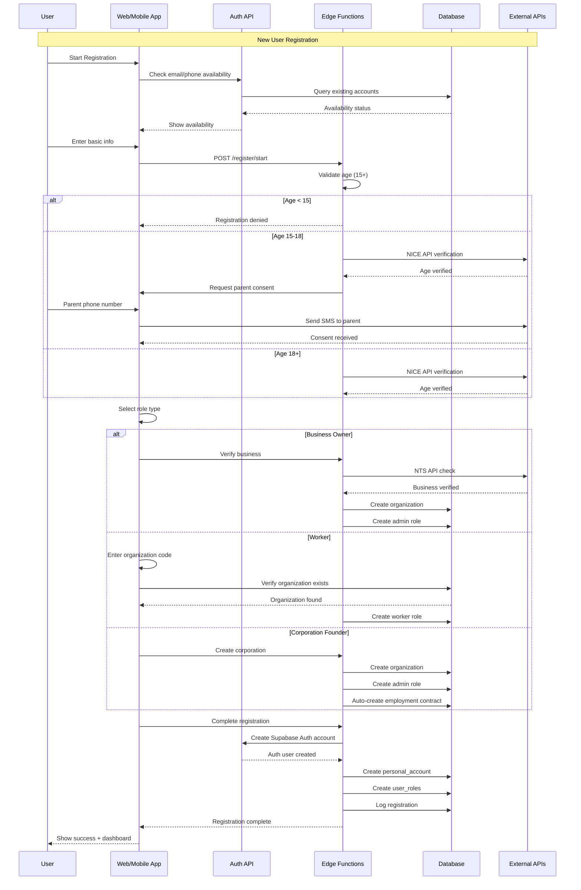
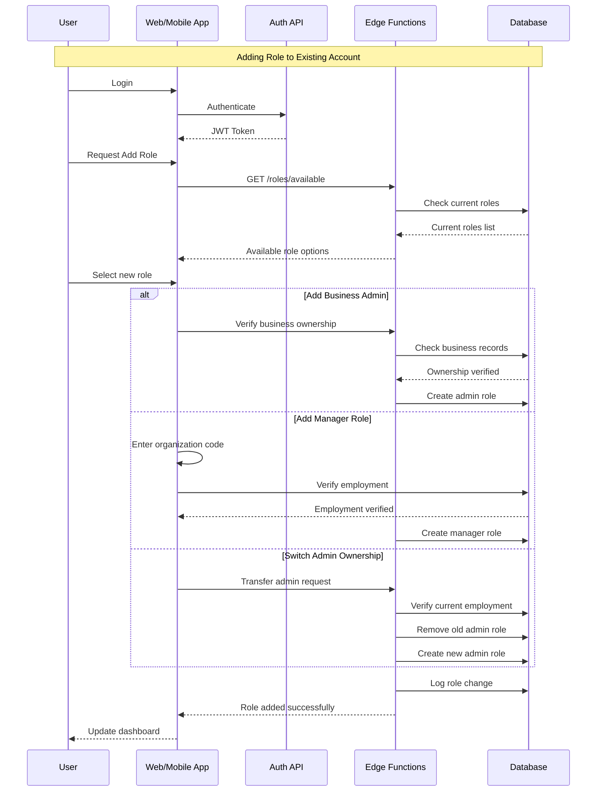

# 🏗️ Registration System Architecture Design

## Executive Summary

This document outlines the comprehensive redesign of the registration system to support the complex multi-role, multi-organization structure defined in the user-permission diagram. The system will support individual accounts that can have multiple roles across different organizations while maintaining strict security and data isolation.

## 📋 Table of Contents
1. [System Overview](#system-overview)
2. [Database Design](#database-design)
3. [API Architecture](#api-architecture)
4. [Registration Flow](#registration-flow)
5. [Security Design](#security-design)
6. [Implementation Plan](#implementation-plan)

---

## 1. System Overview

### Core Concepts

```mermaid
graph TB
    subgraph "Identity Layer"
        PersonalAccount[Personal Account<br/>Single Sign-On Identity]
        MasterAdmin[Master Admin<br/>System Administrator]
    end
    
    subgraph "Organization Layer"
        PersonalBiz[Personal Business<br/>개인사업자]
        Corporation[Corporation<br/>법인]
        Franchise[Franchise HQ<br/>가맹본부]
    end
    
    subgraph "Role Layer"
        Worker[Worker Role<br/>근로자]
        Admin[Admin Role<br/>관리자]
        Manager[Manager Role<br/>매니저]
        FranchiseStaff[Franchise Staff<br/>가맹본부 직원]
    end
    
    PersonalAccount --> Worker
    PersonalAccount --> Admin
    PersonalAccount --> Manager
    PersonalAccount --> FranchiseStaff
    
    Admin --> PersonalBiz
    Admin --> Corporation
    Admin --> Franchise
```



### Key Design Principles

1. **Single Identity, Multiple Roles**: One Supabase Auth account can have multiple roles
2. **Organization Isolation**: Complete data isolation between organizations using RLS
3. **Role-Based Access Control**: Fine-grained permissions based on role and organization
4. **Audit Trail**: Complete audit logging for compliance and security
5. **Age Verification**: Special handling for teen workers (15-18 years)

---

## 2. Database Design

### Enhanced Schema

```sql
-- =====================================================
-- Core Identity Tables
-- =====================================================

-- Personal accounts (Supabase Auth integration)
CREATE TABLE personal_accounts (
    id UUID PRIMARY KEY DEFAULT uuid_generate_v4(),
    auth_user_id UUID UNIQUE NOT NULL, -- Supabase Auth ID
    email VARCHAR(255) UNIQUE NOT NULL,
    phone VARCHAR(20) UNIQUE NOT NULL,
    full_name VARCHAR(255) NOT NULL,
    birth_date DATE NOT NULL,
    age_verified_at TIMESTAMPTZ,
    age_verification_method VARCHAR(50), -- 'nice_api', 'manual'
    resident_id_hash VARCHAR(255), -- Encrypted resident ID
    is_teen BOOLEAN GENERATED ALWAYS AS (
        birth_date > CURRENT_DATE - INTERVAL '18 years'
    ) STORED,
    parent_consent JSONB, -- For teens
    created_at TIMESTAMPTZ DEFAULT NOW(),
    updated_at TIMESTAMPTZ DEFAULT NOW()
);

-- Organization types enum
CREATE TYPE org_type AS ENUM ('personal_business', 'corporation', 'franchise_hq', 'franchise_store');

-- Organizations (businesses)
CREATE TABLE organizations (
    id UUID PRIMARY KEY DEFAULT uuid_generate_v4(),
    code VARCHAR(50) UNIQUE NOT NULL, -- Unique organization code
    name VARCHAR(255) NOT NULL,
    type org_type NOT NULL,
    business_number VARCHAR(20) UNIQUE, -- 사업자등록번호
    business_verified_at TIMESTAMPTZ,
    owner_account_id UUID REFERENCES personal_accounts(id),
    parent_org_id UUID REFERENCES organizations(id), -- For franchise stores
    settings JSONB DEFAULT '{}',
    is_active BOOLEAN DEFAULT true,
    created_at TIMESTAMPTZ DEFAULT NOW(),
    updated_at TIMESTAMPTZ DEFAULT NOW()
);

-- Role types enum
CREATE TYPE role_type AS ENUM ('master', 'admin', 'manager', 'worker', 'franchise_staff');

-- User roles (many-to-many relationship)
CREATE TABLE user_roles (
    id UUID PRIMARY KEY DEFAULT uuid_generate_v4(),
    account_id UUID NOT NULL REFERENCES personal_accounts(id) ON DELETE CASCADE,
    organization_id UUID REFERENCES organizations(id) ON DELETE CASCADE,
    role role_type NOT NULL,
    is_active BOOLEAN DEFAULT true,
    granted_at TIMESTAMPTZ DEFAULT NOW(),
    granted_by UUID REFERENCES personal_accounts(id),
    revoked_at TIMESTAMPTZ,
    revoked_by UUID REFERENCES personal_accounts(id),
    metadata JSONB DEFAULT '{}', -- Additional role-specific data
    
    -- Constraints
    UNIQUE(account_id, organization_id, role), -- One role per org per user
    
    -- Master role doesn't belong to any organization
    CONSTRAINT master_role_no_org CHECK (
        (role = 'master' AND organization_id IS NULL) OR
        (role != 'master' AND organization_id IS NOT NULL)
    ),
    
    -- Only one admin per organization
    CONSTRAINT one_admin_per_org EXCLUDE USING btree (
        organization_id WITH =,
        role WITH =
    ) WHERE (role = 'admin' AND is_active = true)
);

-- Employment contracts
CREATE TABLE employment_contracts (
    id UUID PRIMARY KEY DEFAULT uuid_generate_v4(),
    employee_id UUID NOT NULL REFERENCES personal_accounts(id),
    organization_id UUID NOT NULL REFERENCES organizations(id),
    contract_number VARCHAR(100) UNIQUE NOT NULL,
    start_date DATE NOT NULL,
    end_date DATE,
    status VARCHAR(50) DEFAULT 'active', -- active, terminated, suspended
    wage_type VARCHAR(20) NOT NULL, -- hourly, monthly
    wage_amount DECIMAL(10,2) NOT NULL,
    work_hours_per_week INTEGER,
    contract_document_url TEXT,
    teen_work_permit JSONB, -- For teen workers
    created_at TIMESTAMPTZ DEFAULT NOW(),
    updated_at TIMESTAMPTZ DEFAULT NOW(),
    
    -- Ensure teen work restrictions
    CONSTRAINT teen_work_hours CHECK (
        (EXISTS (
            SELECT 1 FROM personal_accounts 
            WHERE id = employee_id AND is_teen = true
        ) AND work_hours_per_week <= 35) OR
        (NOT EXISTS (
            SELECT 1 FROM personal_accounts 
            WHERE id = employee_id AND is_teen = true
        ))
    )
);

-- Registration flow states
CREATE TABLE registration_flows (
    id UUID PRIMARY KEY DEFAULT uuid_generate_v4(),
    account_id UUID REFERENCES personal_accounts(id),
    session_id VARCHAR(255) UNIQUE NOT NULL,
    current_step VARCHAR(50) NOT NULL,
    flow_type VARCHAR(50) NOT NULL, -- 'new_user', 'add_role', 'create_org'
    flow_data JSONB NOT NULL DEFAULT '{}',
    completed_at TIMESTAMPTZ,
    expires_at TIMESTAMPTZ NOT NULL DEFAULT NOW() + INTERVAL '1 hour',
    created_at TIMESTAMPTZ DEFAULT NOW()
);

-- Age verification records
CREATE TABLE age_verifications (
    id UUID PRIMARY KEY DEFAULT uuid_generate_v4(),
    account_id UUID NOT NULL REFERENCES personal_accounts(id),
    verification_type VARCHAR(50) NOT NULL, -- 'nice_api', 'parent_consent'
    verification_data JSONB NOT NULL,
    verified_by VARCHAR(255), -- Parent phone for teen consent
    is_verified BOOLEAN DEFAULT false,
    verified_at TIMESTAMPTZ,
    created_at TIMESTAMPTZ DEFAULT NOW()
);

-- Business verification records  
CREATE TABLE business_verifications (
    id UUID PRIMARY KEY DEFAULT uuid_generate_v4(),
    organization_id UUID NOT NULL REFERENCES organizations(id),
    business_number VARCHAR(20) NOT NULL,
    verification_method VARCHAR(50), -- 'nts_api', 'manual'
    verification_data JSONB,
    is_verified BOOLEAN DEFAULT false,
    verified_at TIMESTAMPTZ,
    created_at TIMESTAMPTZ DEFAULT NOW()
);

-- Session audit logs
CREATE TABLE registration_audit_logs (
    id UUID PRIMARY KEY DEFAULT uuid_generate_v4(),
    account_id UUID REFERENCES personal_accounts(id),
    action VARCHAR(100) NOT NULL,
    action_data JSONB NOT NULL DEFAULT '{}',
    ip_address INET,
    user_agent TEXT,
    created_at TIMESTAMPTZ DEFAULT NOW()
);

-- =====================================================
-- Indexes for Performance
-- =====================================================

CREATE INDEX idx_personal_accounts_email ON personal_accounts(email);
CREATE INDEX idx_personal_accounts_phone ON personal_accounts(phone);
CREATE INDEX idx_personal_accounts_auth_user ON personal_accounts(auth_user_id);

CREATE INDEX idx_organizations_code ON organizations(code);
CREATE INDEX idx_organizations_business_number ON organizations(business_number);
CREATE INDEX idx_organizations_owner ON organizations(owner_account_id);

CREATE INDEX idx_user_roles_account ON user_roles(account_id);
CREATE INDEX idx_user_roles_organization ON user_roles(organization_id);
CREATE INDEX idx_user_roles_active ON user_roles(is_active);

CREATE INDEX idx_contracts_employee ON employment_contracts(employee_id);
CREATE INDEX idx_contracts_organization ON employment_contracts(organization_id);
CREATE INDEX idx_contracts_status ON employment_contracts(status);

CREATE INDEX idx_registration_flows_session ON registration_flows(session_id);
CREATE INDEX idx_registration_flows_account ON registration_flows(account_id);
CREATE INDEX idx_registration_flows_expires ON registration_flows(expires_at);
```

---

## 3. API Architecture

### Registration Endpoints

```yaml
openapi: 3.0.0
info:
  title: Registration API
  version: 2.0.0

paths:
  /api/v2/registration/check-availability:
    post:
      summary: Check email/phone availability
      requestBody:
        content:
          application/json:
            schema:
              type: object
              properties:
                email:
                  type: string
                  format: email
                phone:
                  type: string
      responses:
        200:
          description: Availability status
          content:
            application/json:
              schema:
                type: object
                properties:
                  email_available:
                    type: boolean
                  phone_available:
                    type: boolean
                  existing_account:
                    type: boolean

  /api/v2/registration/start:
    post:
      summary: Start registration flow
      requestBody:
        content:
          application/json:
            schema:
              type: object
              required: [email, phone, full_name, birth_date]
              properties:
                email:
                  type: string
                  format: email
                phone:
                  type: string
                full_name:
                  type: string
                birth_date:
                  type: string
                  format: date
                registration_type:
                  type: string
                  enum: [personal, business_owner, corporation_founder]
      responses:
        201:
          description: Registration flow started
          content:
            application/json:
              schema:
                type: object
                properties:
                  flow_id:
                    type: string
                    format: uuid
                  session_id:
                    type: string
                  requires_age_verification:
                    type: boolean
                  requires_parent_consent:
                    type: boolean
                  next_step:
                    type: string

  /api/v2/registration/verify-age:
    post:
      summary: Verify age through NICE API
      requestBody:
        content:
          application/json:
            schema:
              type: object
              required: [flow_id, verification_token]
              properties:
                flow_id:
                  type: string
                  format: uuid
                verification_token:
                  type: string
      responses:
        200:
          description: Age verification result

  /api/v2/registration/parent-consent:
    post:
      summary: Request parent consent for teen registration
      requestBody:
        content:
          application/json:
            schema:
              type: object
              required: [flow_id, parent_phone, parent_name]
              properties:
                flow_id:
                  type: string
                  format: uuid
                parent_phone:
                  type: string
                parent_name:
                  type: string
      responses:
        200:
          description: Parent consent requested

  /api/v2/registration/select-role:
    post:
      summary: Select initial role
      requestBody:
        content:
          application/json:
            schema:
              type: object
              required: [flow_id, role_type]
              properties:
                flow_id:
                  type: string
                  format: uuid
                role_type:
                  type: string
                  enum: [worker, business_admin, corp_admin, franchise_admin]
                organization_code:
                  type: string
                  description: For joining existing organization
                business_number:
                  type: string
                  description: For business owners
      responses:
        200:
          description: Role selected

  /api/v2/registration/verify-business:
    post:
      summary: Verify business through NTS API
      requestBody:
        content:
          application/json:
            schema:
              type: object
              required: [flow_id, business_number, business_name]
              properties:
                flow_id:
                  type: string
                  format: uuid
                business_number:
                  type: string
                business_name:
                  type: string
      responses:
        200:
          description: Business verification result

  /api/v2/registration/complete:
    post:
      summary: Complete registration
      requestBody:
        content:
          application/json:
            schema:
              type: object
              required: [flow_id, password]
              properties:
                flow_id:
                  type: string
                  format: uuid
                password:
                  type: string
                  minLength: 8
      responses:
        201:
          description: Registration completed
          content:
            application/json:
              schema:
                type: object
                properties:
                  account_id:
                    type: string
                    format: uuid
                  auth_token:
                    type: string
                  roles:
                    type: array
                    items:
                      type: object
                      properties:
                        role:
                          type: string
                        organization:
                          type: object

  /api/v2/roles/add:
    post:
      summary: Add new role to existing account
      security:
        - BearerAuth: []
      requestBody:
        content:
          application/json:
            schema:
              type: object
              required: [role_type]
              properties:
                role_type:
                  type: string
                  enum: [worker, manager, admin]
                organization_id:
                  type: string
                  format: uuid
                create_organization:
                  type: object
                  properties:
                    name:
                      type: string
                    type:
                      type: string
                    business_number:
                      type: string
      responses:
        201:
          description: Role added successfully
```

### Supabase Edge Functions

```typescript
// supabase/functions/register-user/index.ts
import { serve } from 'https://deno.land/std@0.168.0/http/server.ts'
import { createClient } from 'https://esm.sh/@supabase/supabase-js@2'

interface RegistrationRequest {
  email: string
  phone: string
  fullName: string
  birthDate: string
  password: string
  roleType: 'worker' | 'admin' | 'manager'
  organizationData?: {
    name: string
    type: 'personal_business' | 'corporation' | 'franchise_hq'
    businessNumber?: string
  }
}

serve(async (req: Request) => {
  try {
    const { 
      email, 
      phone, 
      fullName, 
      birthDate, 
      password, 
      roleType,
      organizationData 
    } = await req.json() as RegistrationRequest

    const supabase = createClient(
      Deno.env.get('SUPABASE_URL')!,
      Deno.env.get('SUPABASE_SERVICE_ROLE_KEY')!
    )

    // Start transaction
    const { data: account, error: accountError } = await supabase.rpc(
      'register_user_with_role',
      {
        p_email: email,
        p_phone: phone,
        p_full_name: fullName,
        p_birth_date: birthDate,
        p_password: password,
        p_role_type: roleType,
        p_organization_data: organizationData
      }
    )

    if (accountError) throw accountError

    // Send welcome email
    await sendWelcomeEmail(email, fullName)

    // Log registration
    await logRegistration(account.id, req.headers.get('x-forwarded-for'))

    return new Response(
      JSON.stringify({ 
        success: true, 
        account_id: account.id,
        message: 'Registration completed successfully'
      }),
      { headers: { 'Content-Type': 'application/json' }, status: 201 }
    )
  } catch (error) {
    return new Response(
      JSON.stringify({ success: false, error: error.message }),
      { headers: { 'Content-Type': 'application/json' }, status: 400 }
    )
  }
})
```

---

## 4. Registration Flow

### Complete Registration Sequence



### Role Addition Flow (Existing Users)



---

## 5. Security Design

### Authentication & Authorization

```typescript
// RLS Policies
-- Personal accounts can only view their own data
CREATE POLICY "Users can view own account"
ON personal_accounts FOR SELECT
USING (auth.uid() = auth_user_id);

-- Organization data isolation
CREATE POLICY "Organization data isolation"
ON organizations FOR ALL
USING (
    -- Master admin can see all
    EXISTS (
        SELECT 1 FROM user_roles
        WHERE account_id = auth.uid()
        AND role = 'master'
    )
    OR
    -- Users can see their organizations
    EXISTS (
        SELECT 1 FROM user_roles
        WHERE account_id = auth.uid()
        AND organization_id = organizations.id
        AND is_active = true
    )
);

-- Role-based access for contracts
CREATE POLICY "Contract access control"
ON employment_contracts FOR ALL
USING (
    -- Workers see own contracts
    (employee_id = auth.uid())
    OR
    -- Admins/Managers see organization contracts
    EXISTS (
        SELECT 1 FROM user_roles
        WHERE account_id = auth.uid()
        AND organization_id = employment_contracts.organization_id
        AND role IN ('admin', 'manager')
        AND is_active = true
    )
);
```

### Data Protection

1. **Personal Information Encryption**
   - Resident ID: One-way hash with salt
   - Phone numbers: AES-256 encryption
   - Biometric data: Encrypted at rest

2. **Age Verification**
   - NICE API integration for identity verification
   - Parent consent stored with timestamp and verification method
   - Teen work hour restrictions enforced at database level

3. **Audit Trail**
   - All registration actions logged
   - IP address and user agent tracking
   - Immutable audit log with timestamps

---

## 6. Implementation Plan

### Phase 1: Database Migration (Week 1)
- [ ] Create new schema migrations
- [ ] Migrate existing user data
- [ ] Set up RLS policies
- [ ] Create indexes for performance

### Phase 2: API Development (Week 2-3)
- [ ] Implement registration Edge Functions
- [ ] Create role management endpoints
- [ ] Integrate NICE API for age verification
- [ ] Integrate NTS API for business verification

### Phase 3: Frontend Integration (Week 3-4)
- [ ] Create registration flow UI
- [ ] Implement multi-step forms
- [ ] Add role selection interface
- [ ] Create dashboard for multi-role users

### Phase 4: Testing & Validation (Week 4-5)
- [ ] Unit tests for all endpoints
- [ ] Integration tests for complete flows
- [ ] Security penetration testing
- [ ] Performance testing

### Phase 5: Deployment (Week 5)
- [ ] Stage environment deployment
- [ ] Production migration plan
- [ ] Rollback procedures
- [ ] Monitoring setup

---

## Technical Specifications

### Performance Requirements
- Registration completion: < 30 seconds
- API response time: < 200ms P95
- Database queries: < 50ms P95
- Concurrent registrations: 100/minute

### Scalability Considerations
- Horizontal scaling for Edge Functions
- Database connection pooling
- Caching for organization lookups
- Queue system for email/SMS notifications

### Monitoring & Observability
- Registration funnel analytics
- Error tracking with Sentry
- Performance monitoring with Datadog
- Custom metrics for business KPIs

---

## Migration Strategy

### From Current System

```sql
-- Migration script example
BEGIN;

-- Step 1: Create new tables
CREATE TABLE personal_accounts AS
SELECT 
    id,
    email,
    encrypted_password,
    created_at,
    updated_at
FROM users;

-- Step 2: Migrate roles
INSERT INTO user_roles (account_id, organization_id, role)
SELECT 
    id AS account_id,
    organization_id,
    role
FROM users
WHERE organization_id IS NOT NULL;

-- Step 3: Update foreign keys
ALTER TABLE attendance 
    DROP CONSTRAINT attendance_employee_id_fkey,
    ADD CONSTRAINT attendance_employee_id_fkey 
    FOREIGN KEY (employee_id) 
    REFERENCES personal_accounts(id);

COMMIT;
```

---

## API Examples

### New User Registration

```bash
# Step 1: Start registration
curl -X POST https://api.attendance.com/v2/registration/start \
  -H "Content-Type: application/json" \
  -d '{
    "email": "user@example.com",
    "phone": "010-1234-5678",
    "full_name": "김철수",
    "birth_date": "1990-01-01",
    "registration_type": "business_owner"
  }'

# Response
{
  "flow_id": "550e8400-e29b-41d4-a716-446655440000",
  "session_id": "sess_abc123",
  "requires_age_verification": true,
  "next_step": "verify_age"
}

# Step 2: Verify age
curl -X POST https://api.attendance.com/v2/registration/verify-age \
  -H "Content-Type: application/json" \
  -d '{
    "flow_id": "550e8400-e29b-41d4-a716-446655440000",
    "verification_token": "nice_token_xyz"
  }'

# Step 3: Verify business
curl -X POST https://api.attendance.com/v2/registration/verify-business \
  -H "Content-Type: application/json" \
  -d '{
    "flow_id": "550e8400-e29b-41d4-a716-446655440000",
    "business_number": "123-45-67890",
    "business_name": "김철수 카페"
  }'

# Step 4: Complete registration
curl -X POST https://api.attendance.com/v2/registration/complete \
  -H "Content-Type: application/json" \
  -d '{
    "flow_id": "550e8400-e29b-41d4-a716-446655440000",
    "password": "SecurePass123!"
  }'
```

### Add Role to Existing Account

```bash
# Add manager role
curl -X POST https://api.attendance.com/v2/roles/add \
  -H "Authorization: Bearer jwt_token_here" \
  -H "Content-Type: application/json" \
  -d '{
    "role_type": "manager",
    "organization_id": "550e8400-e29b-41d4-a716-446655440001"
  }'

# Create new business and become admin
curl -X POST https://api.attendance.com/v2/roles/add \
  -H "Authorization: Bearer jwt_token_here" \
  -H "Content-Type: application/json" \
  -d '{
    "role_type": "admin",
    "create_organization": {
      "name": "새로운 사업장",
      "type": "personal_business",
      "business_number": "987-65-43210"
    }
  }'
```

---

## Success Metrics

### Key Performance Indicators
- Registration completion rate: > 80%
- Time to complete registration: < 5 minutes
- Age verification success rate: > 95%
- Business verification accuracy: > 99%
- User satisfaction score: > 4.5/5

### Business Metrics
- Daily new registrations
- Role distribution analytics
- Organization growth rate
- Multi-role user percentage
- Teen worker compliance rate

---

## Conclusion

This comprehensive registration system design provides:

1. **Flexibility**: Support for multiple roles per user
2. **Security**: Strong age verification and data protection
3. **Compliance**: Teen worker protections and audit trails
4. **Scalability**: Designed for growth to 10,000+ organizations
5. **User Experience**: Streamlined multi-step registration flow

The system is ready for implementation following the 5-week plan outlined above.