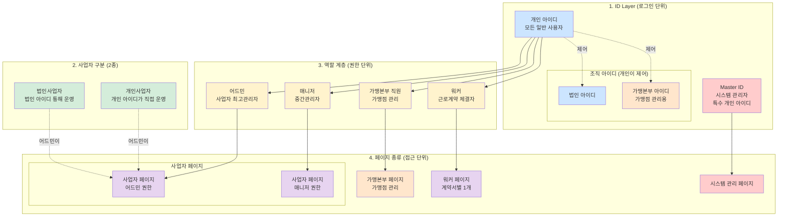
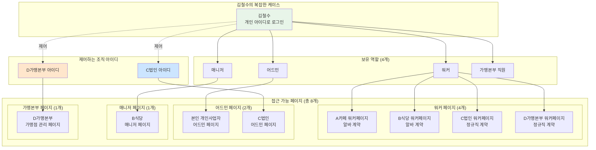
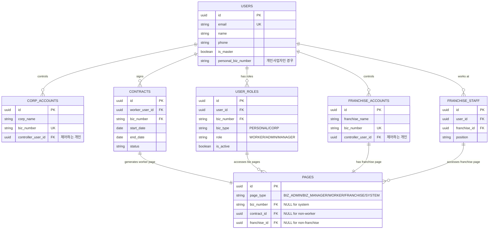
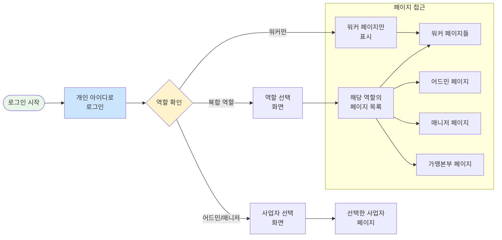
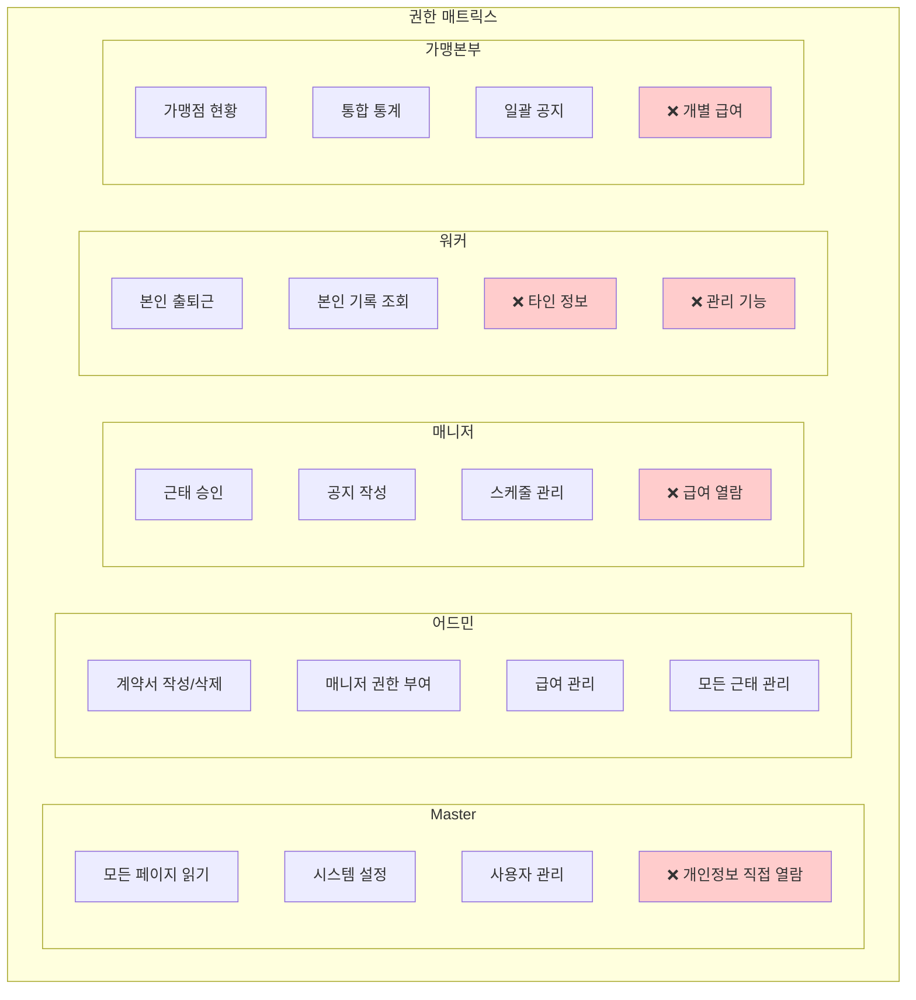
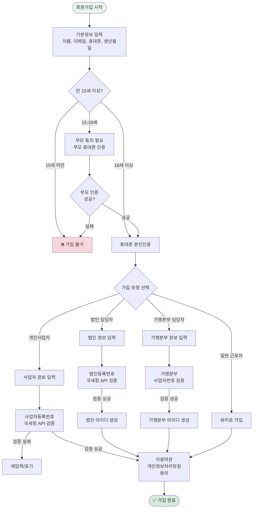

## 📊 전체 시스템 구조 다이어그램 세트

### 1️⃣ 메인 구조도

### 2️⃣ 복합 사용자 예시

### 3️⃣ ERD (데이터베이스 구조)

### 4️⃣ 로그인 플로우

### 5️⃣ 권한 매트릭스

### 6️⃣ 회원가입 플로우

## 📊 핵심 구조 정리

### 아이디 체계
**아이디 3종류**: 개인 아이디가 기본이며, 법인 아이디와 가맹본부 아이디는 개인이 제어하는 조직 아이디입니다.

### 사업자 구분
**사업자 2종류**: 개인사업자와 법인사업자만 존재합니다. 가맹본부는 특별한 권한을 가진 조직이지만 그 자체도 개인사업자 또는 법인사업자입니다.

### 중요 포인트
**가맹본부의 이중성**: 가맹본부는 사업자이면서 동시에 가맹점 관리라는 특수 권한을 가진 조직입니다. 따라서 가맹본부 아이디는 조직 아이디로 존재하며, 가맹점 관리를 위한 특별 페이지를 갖습니다.

**통합 관리**: 모든 사용자는 하나의 개인 아이디로 여러 역할을 수행할 수 있으며, 법인이나 가맹본부도 개인 아이디를 통해 제어됩니다.