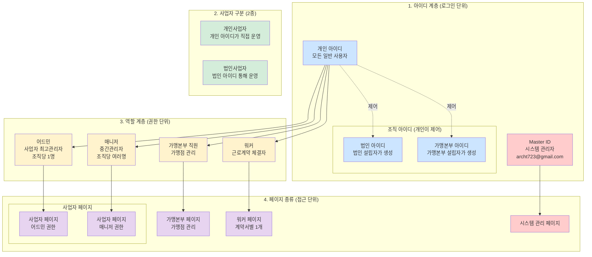
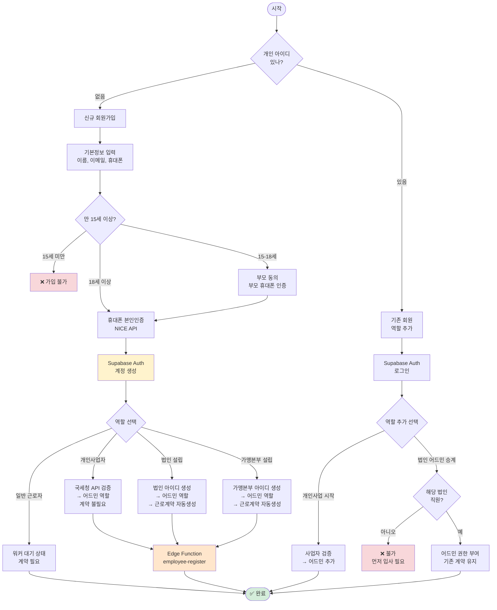
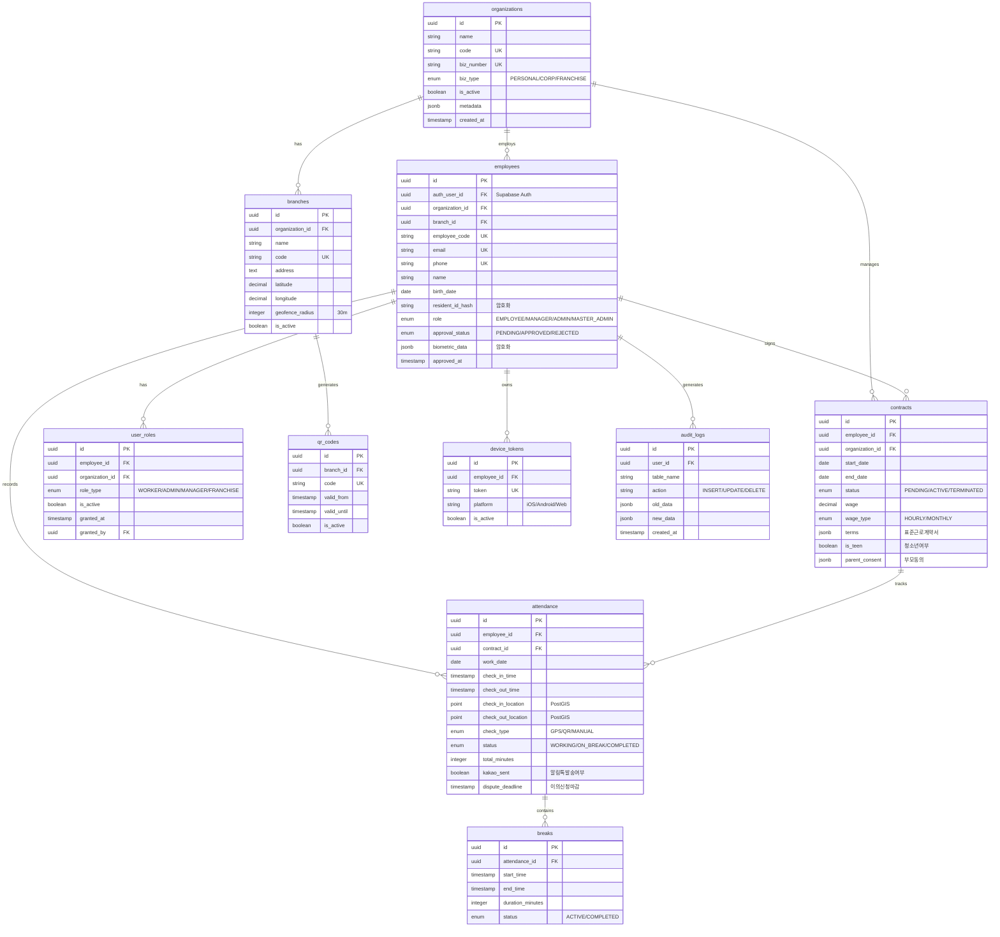
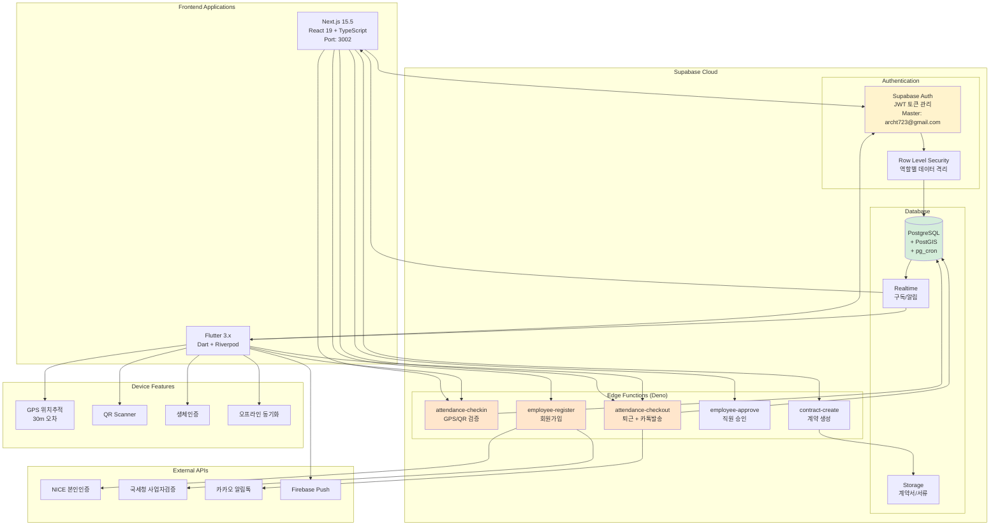
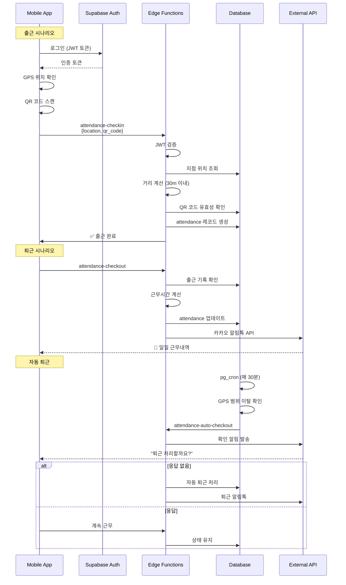
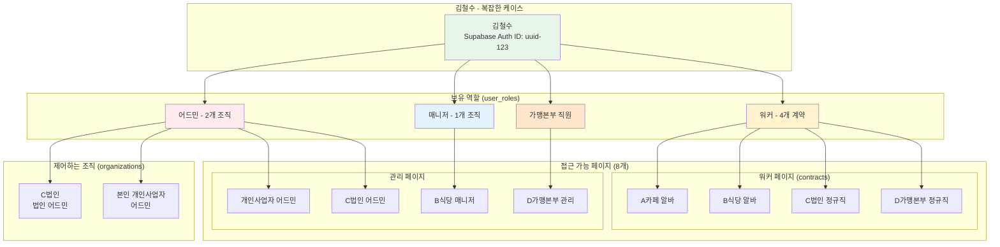
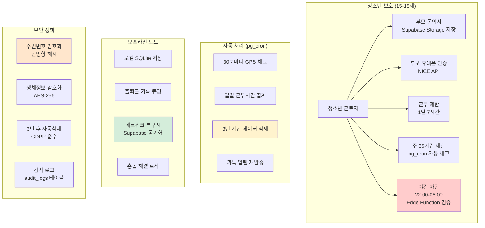
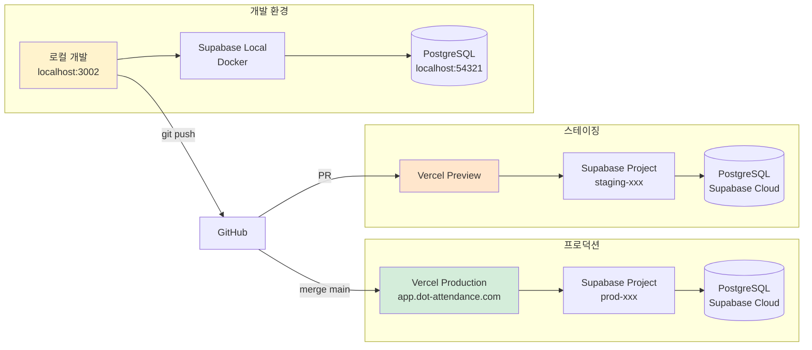
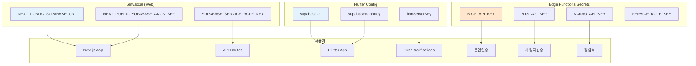

# 📊 근로 관리 SaaS 완전한 시스템 다이어그램 세트 (Supabase 기반)

## 1️⃣ 전체 시스템 구조도



## 2️⃣ 회원가입 및 역할 관리 플로우



## 3️⃣ Supabase 데이터베이스 스키마



## 4️⃣ Supabase 시스템 아키텍처



## 5️⃣ 로그인 및 권한 플로우

```mermaid
flowchart TD
    Start([시작])
    Login[Supabase Auth 로그인<br/>이메일/비밀번호]
    
    Start --> Login
    Login --> CheckMaster{Master 계정?}
    
    CheckMaster -->|예<br/>archt723@gmail.com| MasterDash[시스템 관리 페이지]
    CheckMaster -->|아니오| GetRoles[사용자 역할 조회<br/>user_roles 테이블]
    
    GetRoles --> CheckRoles{역할 확인}
    
    CheckRoles -->|워커만| WorkerFlow{계약 수?}
    CheckRoles -->|어드민/매니저| BizSelect[사업장 선택]
    CheckRoles -->|복합 역할| MultiRole[역할 선택 화면]
    
    WorkerFlow -->|1개| SingleWorker[워커 페이지 직접]
    WorkerFlow -->|여러개| ContractSelect[계약 선택]
    
    BizSelect --> BizPage[선택한 사업자 페이지<br/>RLS 적용]
    
    MultiRole --> RoleChoice{선택}
    RoleChoice -->|어드민| AdminPage[어드민 페이지들]
    RoleChoice -->|매니저| ManagerPage[매니저 페이지들]
    RoleChoice -->|워커| WorkerPage[워커 페이지들]
    RoleChoice -->|가맹본부| FranchisePage[가맹본부 페이지]
    
    style CheckMaster fill:#ffcccc
    style GetRoles fill:#fff3cd
    style BizPage fill:#d4edda
```

## 6️⃣ 출퇴근 프로세스 (Edge Functions)



## 7️⃣ 권한 매트릭스 (RLS 정책)

```mermaid
graph TB
    subgraph "Master Admin (시스템 관리자)"
        M1[✅ 모든 조직 데이터 읽기]
        M2[✅ 사업자 승인/정지]
        M3[✅ 시스템 설정 변경]
        M4[⚠️ 개인정보는 마스킹 처리]
        M5[❌ 급여 직접 수정 불가]
    end
    
    subgraph "Admin (사업자 관리자)"
        A1[✅ 소속 조직 전체 관리]
        A2[✅ 계약서 작성/삭제]
        A3[✅ 매니저 권한 부여]
        A4[✅ 급여 관리]
        A5[✅ 근태 승인/수정]
        A6[⚠️ 조직당 1명만]
    end
    
    subgraph "Manager (중간 관리자)"
        MG1[✅ 근태 승인]
        MG2[✅ 공지 작성]
        MG3[✅ 스케줄 관리]
        MG4[✅ 소속 지점 데이터]
        MG5[❌ 급여 정보 접근 불가]
        MG6[❌ 계약서 수정 불가]
    end
    
    subgraph "Worker (근로자)"
        W1[✅ 본인 출퇴근]
        W2[✅ 본인 기록 조회]
        W3[✅ 본인 계약서 조회]
        W4[❌ 타인 정보 접근 불가]
        W5[❌ 관리 기능 사용 불가]
    end
    
    subgraph "RLS Policies"
        P1[auth.uid() = master_id]
        P2[org_id = auth.jwt() ->> 'org_id']
        P3[branch_id = auth.jwt() ->> 'branch_id']
        P4[employee_id = auth.uid()]
    end
    
    M1 --> P1
    A1 --> P2
    MG1 --> P3
    W1 --> P4
    
    style M4 fill:#fff3cd
    style M5 fill:#ffcccc
    style A6 fill:#fff3cd
    style MG5 fill:#ffcccc
    style MG6 fill:#ffcccc
    style W4 fill:#ffcccc
    style W5 fill:#ffcccc
```

## 8️⃣ 복합 사용자 케이스



## 9️⃣ 특수 케이스 처리



## 🔟 배포 파이프라인



## 1️⃣1️⃣ 환경 변수 설정



이 다이어그램 세트는 Supabase 기반의 완전한 근로 관리 SaaS 시스템을 표현합니다. 실제 ~/desktop/DOT/services/attendance 프로젝트 구조와 완벽히 일치하며, MVP 개발에 바로 사용할 수 있습니다!