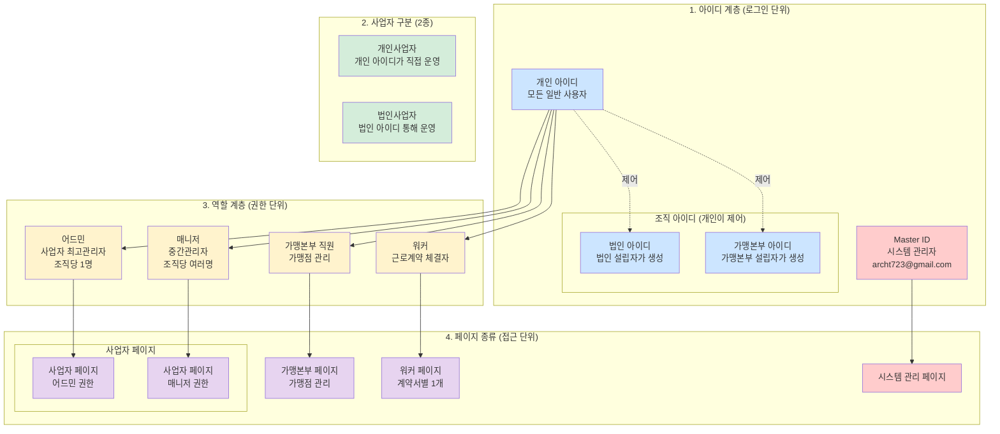
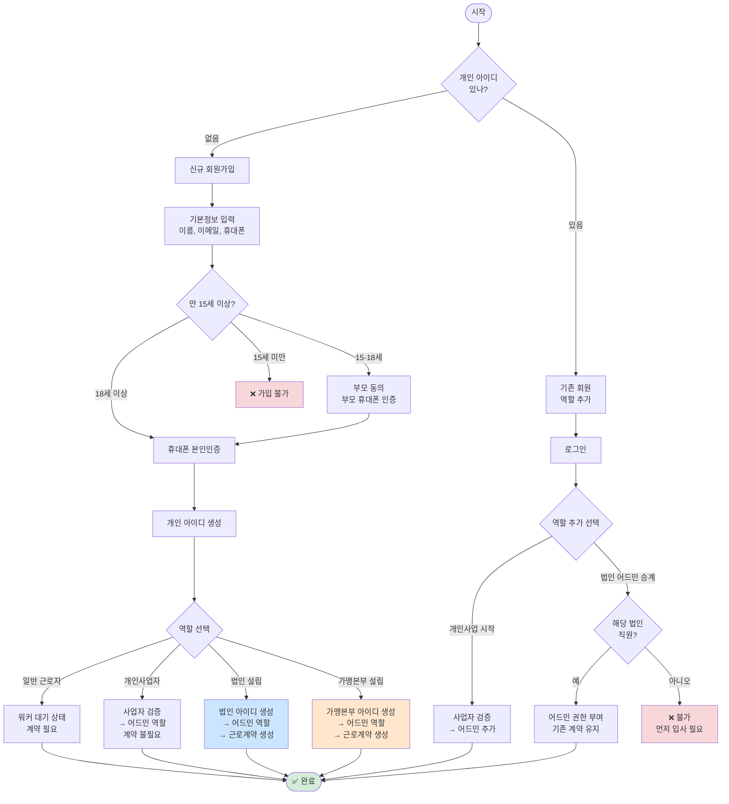
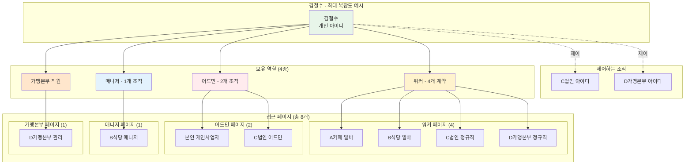
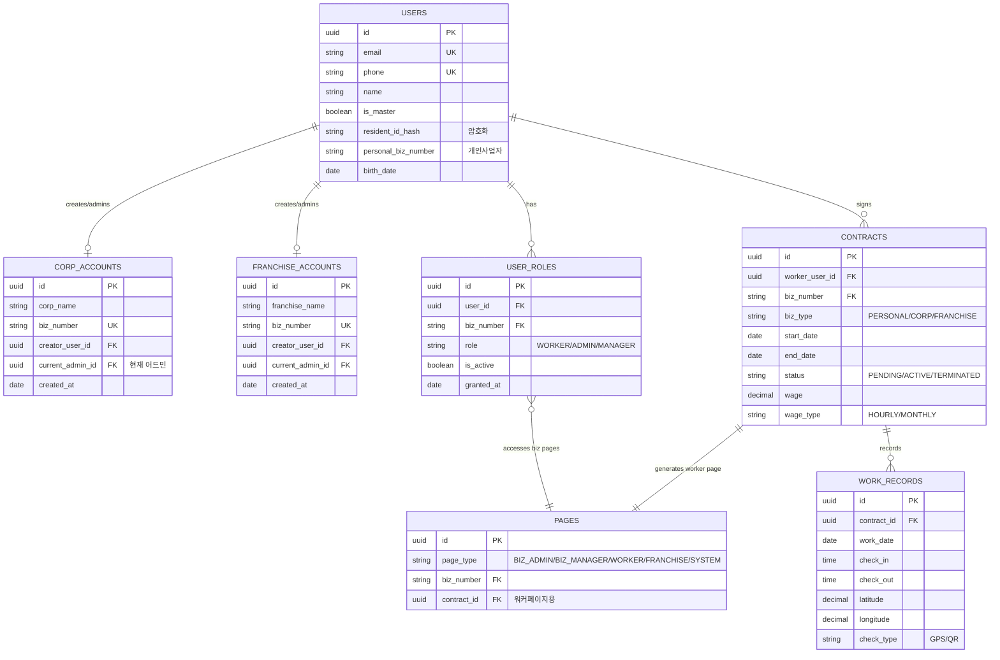
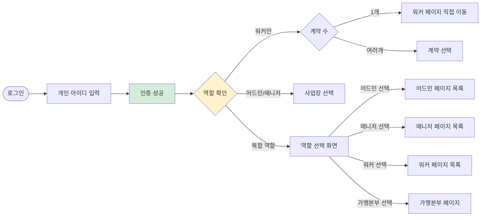
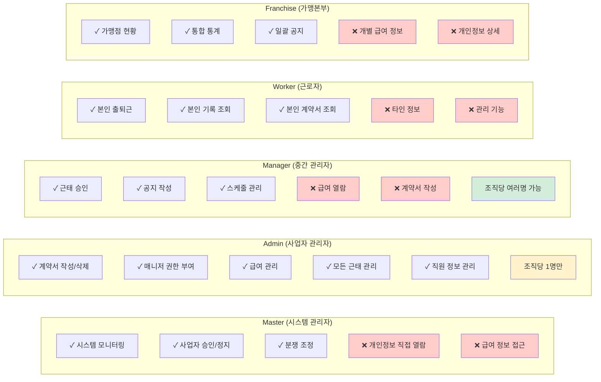
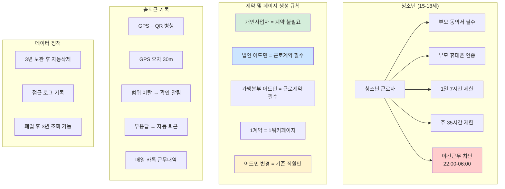
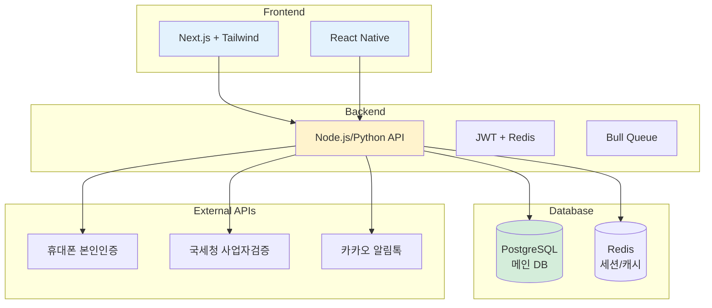

# 📊 근로 관리 SaaS 완벽한 시스템 다이어그램 세트

## 1️⃣ 전체 시스템 구조도

## 2️⃣ 회원가입 및 역할 관리 플로우

## 3️⃣ 복합 사용자 케이스

## 4️⃣ 데이터베이스 ERD

## 5️⃣ 로그인 및 페이지 선택 플로우

## 6️⃣ 권한 매트릭스

## 7️⃣ 특수 케이스 처리

## 8️⃣ 시스템 아키텍처

이 다이어그램 세트가 전체 시스템을 완벽하게 표현합니다. MVP 개발 시 이 구조를 따라가면 됩니다!