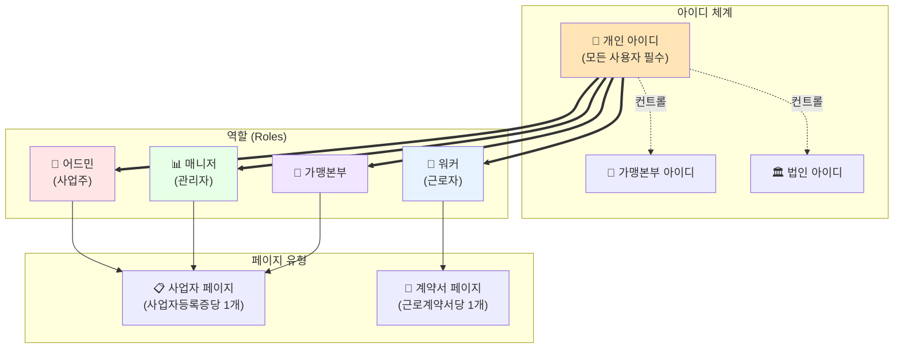
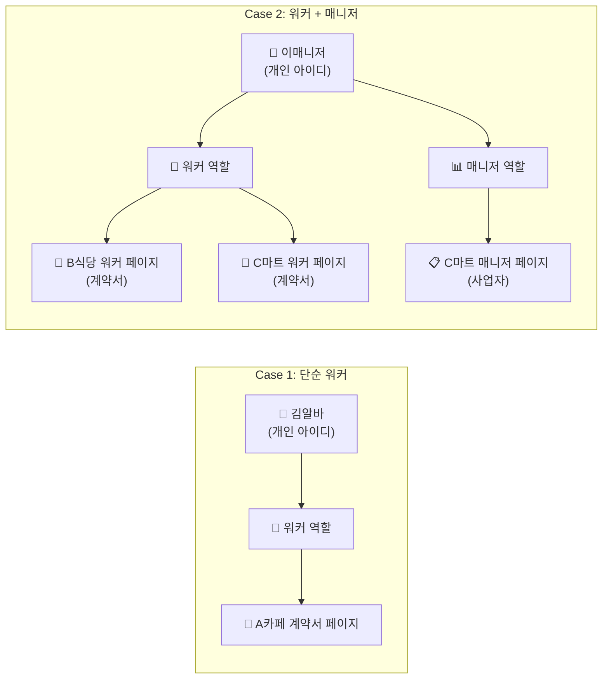
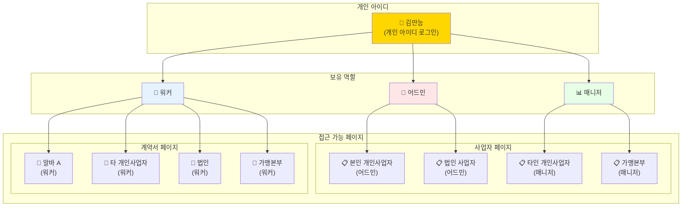
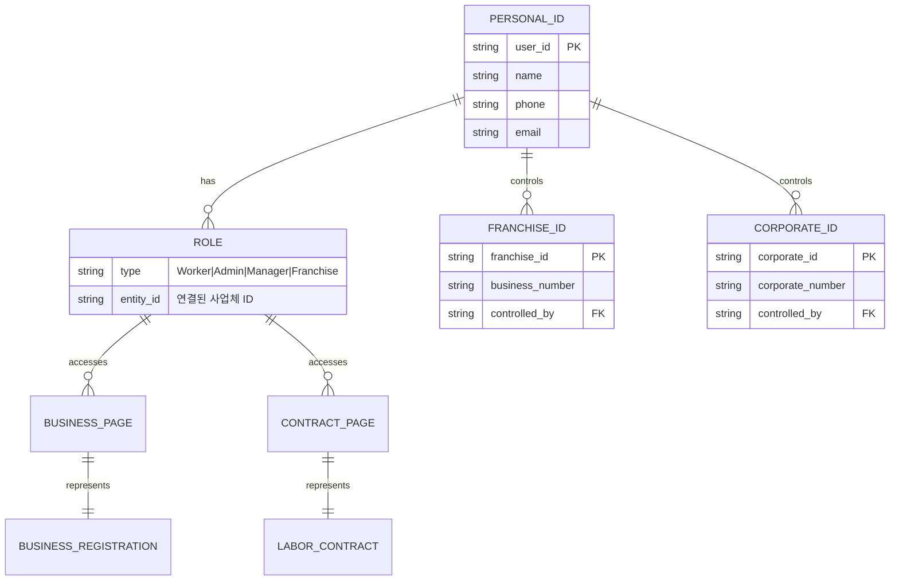

## 권한 및 역할 시스템 다이어그램

## 복잡한 사용자 예시 - Case Study

## 최복잡 케이스 - 다중 역할 사용자

## 시스템 아키텍처 Overview

이 다이어그램들은 복잡한 권한 시스템을 시각화한 것입니다:

1. **기본 구조**: 모든 사용자는 개인 아이디로 로그인
2. **역할 할당**: 한 사용자가 여러 역할 보유 가능
3. **페이지 접근**: 역할에 따라 접근 가능한 페이지 결정
4. **확장성**: 새로운 역할이나 페이지 유형 추가 가능

이해하기 쉽도록 단순한 케이스부터 복잡한 케이스까지 단계적으로 표현했습니다.