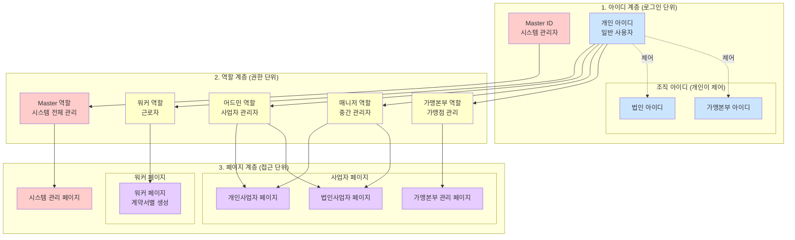
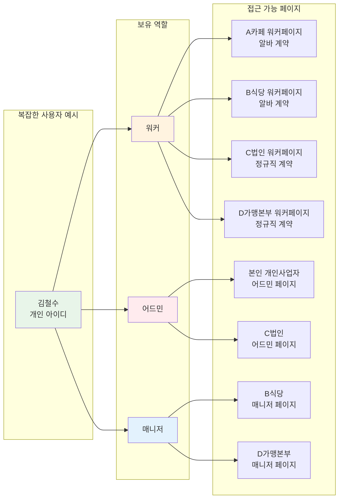
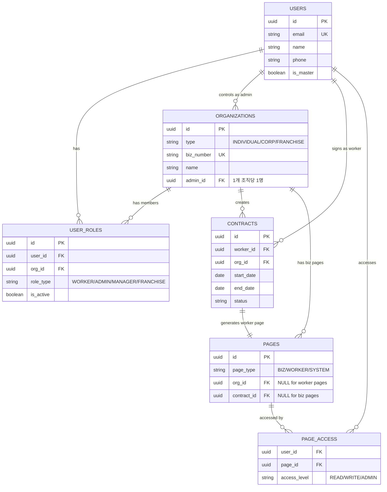

감사합니다! 이제 구조가 명확해졌네요. 추가로 유추한 조건들과 함께 전체 다이어그램을 작성하겠습니다.

## 📊 추가 유추 조건

1. **개인사업자도 어드민은 1명만** (법인과 동일)
2. **Master는 모든 페이지 읽기 권한** (단, 개인정보는 마스킹)
3. **한 개인이 여러 조직의 어드민 가능** (단, 각 조직당 어드민은 1명)
4. **역할 우선순위**: 같은 사업자에서 워커이면서 매니저인 경우 → 매니저 권한 우선

## 🔄 전체 시스템 구조 다이어그램

## 🔀 복합 사례 플로우

## 📊 데이터 관계도 (ERD)

이 구조가 의도하신 시스템과 일치하나요? 수정이나 보완이 필요한 부분이 있으면 알려주세요!