## 📊 전체 시스템 구조 다이어그램 세트

### 1️⃣ 메인 구조도

### 2️⃣ 복합 사용자 예시

```mermaid
flowchart TD
    subgraph "김철수의 복잡한 케이스"
        User[김철수<br/>개인 아이디로 로그인]
    end
    
    subgraph "제어하는 조직 아이디"
        User -.제어.-> Corp[C법인 아이디]
        User -.제어.-> Franchise[D가맹본부 아이디]
    end
    
    subgraph "보유 역할 (4개)"
        User --> R1[워커]
        User --> R2[어드민]
        User --> R3[매니저]  
        User --> R4[가맹본부 직원]
    end
    
    subgraph "접근 가능 페이지 (총 8개)"
        subgraph "워커 페이지 (4개)"
            R1 --> W1[A카페 워커페이지<br/>알바 계약]
            R1 --> W2[B식당 워커페이지<br/>알바 계약]
            R1 --> W3[C법인 워커페이지<br/>정규직 계약]
            R1 --> W4[D가맹본부 워커페이지<br/>정규직 계약]
        end
        
        subgraph "어드민 페이지 (2개)"
            R2 --> A1[본인 개인사업자<br/>어드민 페이지]
            Corp --> A2[C법인<br/>어드민 페이지]
        end
        
        subgraph "매니저 페이지 (1개)"
            R3 --> M1[B식당<br/>매니저 페이지]
        end
        
        subgraph "가맹본부 페이지 (1개)"
            Franchise --> F1[D가맹본부<br/>가맹점 관리 페이지]
        end
    end
    
    style User fill:#e8f5e9
    style Corp fill:#cce5ff
    style Franchise fill:#ffe6cc
```

### 3️⃣ ERD (데이터베이스 구조)

```mermaid
erDiagram
    USERS {
        uuid id PK
        string email UK
        string name
        string phone
        boolean is_master
        string personal_biz_number "개인사업자인 경우"
    }
    
    CORP_ACCOUNTS {
        uuid id PK
        string corp_name
        string biz_number UK
        uuid controller_user_id FK "제어하는 개인"
    }
    
    FRANCHISE_ACCOUNTS {
        uuid id PK
        string franchise_name
        string biz_number UK
        uuid controller_user_id FK "제어하는 개인"
    }
    
    USER_ROLES {
        uuid id PK
        uuid user_id FK
        string biz_number FK
        string biz_type "PERSONAL/CORP"
        string role "WORKER/ADMIN/MANAGER"
        boolean is_active
    }
    
    FRANCHISE_STAFF {
        uuid id PK
        uuid user_id FK
        uuid franchise_id FK
        string position
    }
    
    CONTRACTS {
        uuid id PK
        uuid worker_user_id FK
        string biz_number FK
        date start_date
        date end_date
        string status
    }
    
    PAGES {
        uuid id PK
        string page_type "BIZ_ADMIN/BIZ_MANAGER/WORKER/FRANCHISE/SYSTEM"
        string biz_number FK "NULL for system"
        uuid contract_id FK "NULL for non-worker"
        uuid franchise_id FK "NULL for non-franchise"
    }
    
    USERS ||--o{ USER_ROLES : "has roles"
    USERS ||--o{ CORP_ACCOUNTS : "controls"
    USERS ||--o{ FRANCHISE_ACCOUNTS : "controls"
    USERS ||--o{ FRANCHISE_STAFF : "works at"
    USERS ||--o{ CONTRACTS : "signs"
    CONTRACTS ||--|| PAGES : "generates worker page"
    USER_ROLES ||--o{ PAGES : "accesses biz pages"
    FRANCHISE_ACCOUNTS ||--|| PAGES : "has franchise page"
    FRANCHISE_STAFF ||--o{ PAGES : "accesses franchise page"
```

### 4️⃣ 로그인 플로우

### 5️⃣ 권한 매트릭스

```mermaid
graph TD
    subgraph "권한 매트릭스"
        subgraph "Master"
            M1[모든 페이지 읽기]
            M2[시스템 설정]
            M3[사용자 관리]
            M4[❌ 개인정보 직접 열람]
        end
        
        subgraph "어드민"
            A1[계약서 작성/삭제]
            A2[매니저 권한 부여]
            A3[급여 관리]
            A4[모든 근태 관리]
        end
        
        subgraph "매니저"
            MG1[근태 승인]
            MG2[공지 작성]
            MG3[스케줄 관리]
            MG4[❌ 급여 열람]
        end
        
        subgraph "워커"
            W1[본인 출퇴근]
            W2[본인 기록 조회]
            W3[❌ 타인 정보]
            W4[❌ 관리 기능]
        end
        
        subgraph "가맹본부"
            F1[가맹점 현황]
            F2[통합 통계]
            F3[일괄 공지]
            F4[❌ 개별 급여]
        end
    end
    
    style M4 fill:#ffcccc
    style MG4 fill:#ffcccc
    style W3 fill:#ffcccc
    style W4 fill:#ffcccc
    style F4 fill:#ffcccc
```

## 📊 핵심 구조 정리

### 아이디 체계
**아이디 3종류**: 개인 아이디가 기본이며, 법인 아이디와 가맹본부 아이디는 개인이 제어하는 조직 아이디입니다.

### 사업자 구분
**사업자 2종류**: 개인사업자와 법인사업자만 존재합니다. 가맹본부는 특별한 권한을 가진 조직이지만 그 자체도 개인사업자 또는 법인사업자입니다.

### 중요 포인트
**가맹본부의 이중성**: 가맹본부는 사업자이면서 동시에 가맹점 관리라는 특수 권한을 가진 조직입니다. 따라서 가맹본부 아이디는 조직 아이디로 존재하며, 가맹점 관리를 위한 특별 페이지를 갖습니다.

**통합 관리**: 모든 사용자는 하나의 개인 아이디로 여러 역할을 수행할 수 있으며, 법인이나 가맹본부도 개인 아이디를 통해 제어됩니다.

## 6️⃣ 수정된 회원가입 플로우

```mermaid
flowchart TD
    Start([회원가입 시작])
    
    Start --> BasicInfo[기본정보 입력<br/>이름, 이메일, 휴대폰, 생년월일]
    BasicInfo --> AgeCheck{만 15세 이상?}
    
    AgeCheck -->|15세 미만| Reject[❌ 가입 불가]
    AgeCheck -->|15-18세| TeenConsent[부모 동의 필요<br/>부모 휴대폰 인증]
    AgeCheck -->|18세 이상| PhoneAuth[휴대폰 본인인증]
    
    TeenConsent --> ParentAuth{부모 인증<br/>성공?}
    ParentAuth -->|실패| Reject
    ParentAuth -->|성공| PhoneAuth
    
    PhoneAuth --> RoleSelect{가입 유형 선택}
    
    RoleSelect -->|일반 근로자| WorkerReg[워커로 가입]
    RoleSelect -->|개인사업자| IndivBizReg[사업자 정보 입력]
    RoleSelect -->|법인 담당자| CorpReg[법인 정보 입력]
    RoleSelect -->|가맹본부 담당자| FranchiseReg[가맹본부 정보 입력]
    
    IndivBizReg --> BizVerify[사업자등록번호<br/>국세청 API 검증]
    CorpReg --> CorpVerify[법인등록번호<br/>국세청 API 검증]
    FranchiseReg --> FranVerify[가맹본부<br/>사업자번호 검증]
    
    BizVerify -->|검증 실패| RetryBiz[재입력/포기]
    BizVerify -->|검증 성공| CreatePersonal1[개인 아이디 생성<br/>+ 어드민 역할 부여]
    
    CorpVerify -->|검증 성공| CreateBoth1[개인 아이디 생성<br/>+ 법인 아이디 생성<br/>+ 어드민 역할 부여]
    FranVerify -->|검증 성공| CreateBoth2[개인 아이디 생성<br/>+ 가맹본부 아이디 생성<br/>+ 가맹본부 역할 부여]
    
    WorkerReg --> CreatePersonal2[개인 아이디만 생성<br/>워커 역할 대기]
    
    CreatePersonal1 --> Terms
    CreatePersonal2 --> Terms
    CreateBoth1 --> Terms
    CreateBoth2 --> Terms
    
    Terms[이용약관<br/>개인정보처리방침<br/>동의]
    
    Terms --> Complete([✅ 가입 완료])
    
    style Start fill:#e8f5e9
    style Complete fill:#d4edda
    style Reject fill:#f8d7da
    style CreateBoth1 fill:#cce5ff
    style CreateBoth2 fill:#ffe6cc
    style CreatePersonal1 fill:#fff3cd
```

### 가입 유형별 생성 아이디 정리

```mermaid
graph LR
    subgraph "가입 유형별 생성 결과"
        subgraph "일반 근로자"
            W1[개인 아이디 ✓]
            W2[법인 아이디 ✗]
            W3[가맹본부 아이디 ✗]
            W4[역할: 워커 대기]
        end
        
        subgraph "개인사업자"
            I1[개인 아이디 ✓]
            I2[법인 아이디 ✗]
            I3[가맹본부 아이디 ✗]
            I4[역할: 어드민]
        end
        
        subgraph "법인 담당자"
            C1[개인 아이디 ✓]
            C2[법인 아이디 ✓]
            C3[가맹본부 아이디 ✗]
            C4[역할: 어드민]
        end
        
        subgraph "가맹본부 담당자"
            F1[개인 아이디 ✓]
            F2[법인 아이디 ✗]
            F3[가맹본부 아이디 ✓]
            F4[역할: 가맹본부]
        end
    end
    
    style C1 fill:#cce5ff
    style C2 fill:#cce5ff
    style F1 fill:#ffe6cc
    style F3 fill:#ffe6cc
```

### 계정 생성 상세 플로우

```mermaid
flowchart TD
    subgraph "법인 담당자 가입 상세"
        CorpStart[법인 담당자 선택]
        CorpStart --> InputCorp[법인정보 입력<br/>법인명, 법인번호, 사업자번호]
        InputCorp --> VerifyCorp[국세청 API 검증]
        VerifyCorp -->|성공| CheckExist{해당 법인<br/>이미 존재?}
        
        CheckExist -->|존재| AlreadyExist[이미 등록된 법인<br/>관리자에게 문의]
        CheckExist -->|미존재| CreateTwo[동시 생성<br/>1. 개인 아이디<br/>2. 법인 아이디]
        
        CreateTwo --> LinkAccounts[개인 아이디가<br/>법인 아이디를<br/>제어하도록 연결]
        LinkAccounts --> SetAdmin[개인에게<br/>어드민 역할 부여]
    end
    
    style CreateTwo fill:#cce5ff
    style AlreadyExist fill:#f8d7da
```

- **일반 근로자**: 개인 아이디만
- **개인사업자**: 개인 아이디만 (어드민 역할 자동 부여)
- **법인 담당자**: 개인 아이디 + 법인 아이디
- **가맹본부 담당자**: 개인 아이디 + 가맹본부 아이디