## 📊 전체 시스템 구조 다이어그램 세트

### 1️⃣ 메인 구조도

```mermaid
graph TB
    subgraph "1. 아이디 계층 (로그인 단위)"
        Master[Master ID<br/>시스템 관리자<br/>특수 개인 아이디]
        PersonalID[개인 아이디<br/>모든 일반 사용자]
        
        subgraph "조직 아이디 (개인이 제어)"
            CorpID[법인 아이디]
            FranchiseID[가맹본부 아이디<br/>가맹점 관리용]
        end
    end
    
    subgraph "2. 사업자 구분 (2종)"
        IndivBiz[개인사업자<br/>개인 아이디가 직접 운영]
        CorpBiz[법인사업자<br/>법인 아이디 통해 운영]
    end
    
    subgraph "3. 역할 계층 (권한 단위)"
        WorkerRole[워커<br/>근로계약 체결자]
        AdminRole[어드민<br/>사업자 최고관리자]
        ManagerRole[매니저<br/>중간관리자]
        FranchiseRole[가맹본부 직원<br/>가맹점 관리]
    end
    
    subgraph "4. 페이지 종류 (접근 단위)"
        subgraph "사업자 페이지"
            BizPageAdmin[사업자 페이지<br/>어드민 권한]
            BizPageManager[사업자 페이지<br/>매니저 권한]
        end
        
        FranchisePage[가맹본부 페이지<br/>가맹점 관리]
        WorkerPage[워커 페이지<br/>계약서별 1개]
        SystemPage[시스템 관리 페이지]
    end
    
    %% 관계 연결
    Master --> SystemPage
    PersonalID --> WorkerRole
    PersonalID --> AdminRole
    PersonalID --> ManagerRole
    PersonalID --> FranchiseRole
    PersonalID -.제어.-> CorpID
    PersonalID -.제어.-> FranchiseID
    
    AdminRole --> BizPageAdmin
    ManagerRole --> BizPageManager
    FranchiseRole --> FranchisePage
    WorkerRole --> WorkerPage
    
    IndivBiz -.어드민이.-> BizPageAdmin
    CorpBiz -.어드민이.-> BizPageAdmin
    
    classDef masterClass fill:#ffcccc
    classDef idClass fill:#cce5ff
    classDef bizClass fill:#d4edda
    classDef roleClass fill:#fff3cd
    classDef pageClass fill:#e7d4f0
    classDef franchiseClass fill:#ffe6cc
    
    class Master,SystemPage masterClass
    class PersonalID,CorpID,FranchiseID idClass
    class IndivBiz,CorpBiz bizClass
    class WorkerRole,AdminRole,ManagerRole,FranchiseRole roleClass
    class BizPageAdmin,BizPageManager,WorkerPage pageClass
    class FranchisePage,FranchiseID franchiseClass
```

### 2️⃣ 복합 사용자 예시

```mermaid
flowchart TD
    subgraph "김철수의 복잡한 케이스"
        User[김철수<br/>개인 아이디로 로그인]
    end
    
    subgraph "제어하는 조직 아이디"
        User -.제어.-> Corp[C법인 아이디]
        User -.제어.-> Franchise[D가맹본부 아이디]
    end
    
    subgraph "보유 역할 (4개)"
        User --> R1[워커]
        User --> R2[어드민]
        User --> R3[매니저]  
        User --> R4[가맹본부 직원]
    end
    
    subgraph "접근 가능 페이지 (총 8개)"
        subgraph "워커 페이지 (4개)"
            R1 --> W1[A카페 워커페이지<br/>알바 계약]
            R1 --> W2[B식당 워커페이지<br/>알바 계약]
            R1 --> W3[C법인 워커페이지<br/>정규직 계약]
            R1 --> W4[D가맹본부 워커페이지<br/>정규직 계약]
        end
        
        subgraph "어드민 페이지 (2개)"
            R2 --> A1[본인 개인사업자<br/>어드민 페이지]
            Corp --> A2[C법인<br/>어드민 페이지]
        end
        
        subgraph "매니저 페이지 (1개)"
            R3 --> M1[B식당<br/>매니저 페이지]
        end
        
        subgraph "가맹본부 페이지 (1개)"
            Franchise --> F1[D가맹본부<br/>가맹점 관리 페이지]
        end
    end
    
    style User fill:#e8f5e9
    style Corp fill:#cce5ff
    style Franchise fill:#ffe6cc
```

### 3️⃣ ERD (데이터베이스 구조)

### 4️⃣ 로그인 플로우

```mermaid
flowchart LR
    Start([로그인 시작])
    Login[개인 아이디로<br/>로그인]
    CheckRole{역할 확인}
    
    Start --> Login
    Login --> CheckRole
    
    CheckRole -->|워커만| WorkerOnly[워커 페이지만<br/>표시]
    CheckRole -->|어드민/매니저| BizSelect[사업자 선택<br/>화면]
    CheckRole -->|복합 역할| RoleSelect[역할 선택<br/>화면]
    
    RoleSelect --> PageList[해당 역할의<br/>페이지 목록]
    BizSelect --> BizPage[선택한 사업자<br/>페이지]
    
    subgraph "페이지 접근"
        WorkerOnly --> WP[워커 페이지들]
        PageList --> AP[어드민 페이지]
        PageList --> MP[매니저 페이지]
        PageList --> FP[가맹본부 페이지]
        PageList --> WP
    end
    
    style Start fill:#e8f5e9
    style Login fill:#cce5ff
    style CheckRole fill:#fff3cd
```

### 5️⃣ 권한 매트릭스

```mermaid
graph TD
    subgraph "권한 매트릭스"
        subgraph "Master"
            M1[모든 페이지 읽기]
            M2[시스템 설정]
            M3[사용자 관리]
            M4[❌ 개인정보 직접 열람]
        end
        
        subgraph "어드민"
            A1[계약서 작성/삭제]
            A2[매니저 권한 부여]
            A3[급여 관리]
            A4[모든 근태 관리]
        end
        
        subgraph "매니저"
            MG1[근태 승인]
            MG2[공지 작성]
            MG3[스케줄 관리]
            MG4[❌ 급여 열람]
        end
        
        subgraph "워커"
            W1[본인 출퇴근]
            W2[본인 기록 조회]
            W3[❌ 타인 정보]
            W4[❌ 관리 기능]
        end
        
        subgraph "가맹본부"
            F1[가맹점 현황]
            F2[통합 통계]
            F3[일괄 공지]
            F4[❌ 개별 급여]
        end
    end
    
    style M4 fill:#ffcccc
    style MG4 fill:#ffcccc
    style W3 fill:#ffcccc
    style W4 fill:#ffcccc
    style F4 fill:#ffcccc
```

이 다이어그램 세트가 전체 시스템 구조를 명확하게 보여줍니다. 추가로 필요한 다이어그램이 있으면 말씀해주세요!