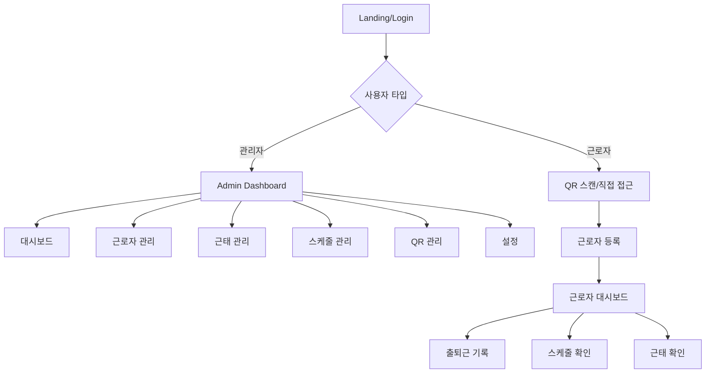

# DOT Attendance GitHub Repository Analysis

**분석 대상:** https://github.com/crazybass81/DOT-ATTENDANCE---google-ai-studio  
**분석 일자:** 2025-09-10  
**현재 프로젝트:** DOT Attendance Service (Next.js 15.5 + Supabase)

## 1. 전체 페이지 구조 및 사용자 플로우 매핑

### 1.1 GitHub 프로젝트 아키텍처
- **기술스택:** React 19.1.1 + Vite 6.2.0 + TypeScript 5.8 + TailwindCSS
- **의존성:** react-router-dom 7.8.2 (클라이언트 사이드 라우팅)
- **개발환경:** AI Studio 기반 (Google의 AI 개발 플랫폼)

### 1.2 라우팅 구조
```typescript
// App.tsx에서 정의된 라우트 구조
Routes:
├── "/" → LoginPage (통합 로그인)
├── "/register" → RegisterPage (관리자 회원가입)
├── "/admin" → AdminPage (관리자 대시보드)
├── "/worker/:storeId" → WorkerApp (근로자 QR 접근)
├── "/worker/:storeId/register" → WorkerRegistrationPage
└── "/worker/:storeId/dashboard" → WorkerDashboardPage
```

### 1.3 사용자 플로우


## 2. 각 페이지별 UI/UX 컴포넌트 상세 분석

### 2.1 Login Page (LoginPage.tsx)
```typescript
interface LoginPageComponents {
  layout: "전체화면 그라데이션 블롭 배경";
  authentication: {
    dual_login: "관리자/근로자 통합 로그인";
    admin_auth: "ID + 비밀번호";
    worker_auth: "이름 + 생년월일(YYYYMMDD)";
    validation: "실시간 에러 표시";
  };
  ui_elements: {
    logo: "DOT ATTENDANCE 브랜딩";
    form: "중앙 정렬 투명 카드";
    buttons: "Primary 스타일 로그인 버튼";
    links: "회원가입, ID/PW 찾기";
  };
  responsive: "모바일 우선 반응형";
  animations: "CSS 블롭 애니메이션 (20-28초 주기)";
}
```

### 2.2 Admin Dashboard (AdminPage.tsx)
```typescript
interface AdminDashboardComponents {
  layout: "사이드바 + 메인 컨텐츠";
  sidebar: {
    navigation: ["대시보드", "근로자 관리", "근태 관리", "스케줄 관리", "QR 관리", "설정"];
    responsive: "모바일에서 오버레이";
    state_management: "React useState 기반";
  };
  header: {
    burger_menu: "사이드바 토글";
    store_selector: "다중 매장 지원";
    user_info: "관리자 정보 표시";
  };
  content_views: {
    dashboard: "DashboardView 컴포넌트";
    employees: "EmployeeView + 모달 기반 CRUD";
    attendance: "AttendanceView + 필터링";
    schedule: "ScheduleView (준비중)";
    qr: "QRView 관리";
    settings: "설정 (준비중)";
  };
  modals: {
    employee_edit: "전체화면 모달 + 탭 네비게이션";
    confirmation: "작업 확인";
  };
}
```

### 2.3 Worker Dashboard (WorkerDashboardPage.tsx)
```typescript
interface WorkerDashboardComponents {
  layout: "단일 페이지 + 플로팅 액션 버튼";
  status_indicator: {
    visual: "원형 상태 표시기 (이모지 + 텍스트)";
    states: ["업무 시작 전", "업무 중", "휴식 중", "외근 중", "업무 종료"];
    colors: "상태별 그라데이션";
  };
  time_display: {
    current_time: "실시간 시계 (초 단위 업데이트)";
    work_log: "당일 출퇴근 기록 리스트";
    format: "한국어 날짜 + 24시간 형식";
  };
  record_modal: {
    trigger: "플로팅 액션 버튼";
    actions: ["출근", "퇴근", "휴게 시작", "업무 복귀", "외근 시작", "외근 종료"];
    confirmation: "시간 기록 후 1.5초 확인 메시지";
  };
  navigation: {
    sidebar: "슬라이드 네비게이션";
    pages: ["대시보드", "스케줄 확인", "근태 확인", "급여 명세서", "내 정보", "환경 설정"];
  };
}
```

### 2.4 공통 UI 컴포넌트 (components/ui.tsx)
```typescript
interface SharedUIComponents {
  Modal: {
    props: ["isOpen", "onClose", "title", "children", "size", "hideCloseButton", "titleAlign"];
    sizes: ["sm", "md", "lg", "xl"];
    features: "오버레이 + 스크롤 + 반응형";
  };
  Card: {
    features: "그림자 + 라운드 모서리 + 패딩";
    extendable: "onClick 등 이벤트 지원";
  };
  Button: {
    variants: ["primary", "secondary", "danger"];
    sizes: ["sm", "md"];
    features: "포커스 링 + 장애인 접근성";
  };
  Input: {
    features: "라벨 + 에러 상태 + 포커스";
    types: "모든 HTML input 타입 지원";
  };
  Tabs: {
    alignment: ["left", "center"];
    features: "키보드 네비게이션 + 활성 상태";
  };
  DatePicker: {
    features: "한국어 캘린더 + 절대/상대 위치";
    navigation: "월/년 이동";
  };
  FilterDropdown: {
    features: "다중 선택 + 외부 클릭 닫기";
  };
}
```

## 3. 데이터 모델 및 API 요구사항

### 3.1 GitHub 프로젝트 데이터 모델 (types.ts)
```typescript
// 핵심 데이터 구조
interface CoreDataModels {
  Employee: {
    fields: ["id", "name", "position", "status", "infoStatus", "hireDate", "lastWorkDate", "phone", "birthdate", "employmentType", "payType", "payRate", "color", "storeId", "jobType"];
    status: "재직 | 휴직 | 퇴사";
    employmentType: "정규 | 아르바이트";
    payType: "시급 | 월급";
    extended_fields: ["accountNumber", "contract", "bankAccountCopy"];
  };
  
  AttendanceRecord: {
    fields: ["id", "employeeId", "employeeName", "date", "clockIn", "breakStart", "breakEnd", "awayStart", "awayEnd", "clockOut", "workHours", "status", "isModified"];
    status: "정상 | 지각 | 결근 | 조퇴";
    tracking: "수정 여부 플래그";
  };
  
  Schedule: {
    fields: ["id", "employeeId", "employeeName", "start", "end", "breakMinutes", "storeId"];
    time_format: "Date 객체";
  };
  
  EmployeeAppStatus: {
    states: "NONE | WORKING | BREAK | DONE | AWAY";
    usage: "실시간 근무 상태 추적";
  };
}
```

### 3.2 현재 DOT 프로젝트 데이터 모델 비교
```typescript
// DOT 프로젝트의 고도화된 데이터 구조
interface DOTDataModels {
  Database: {
    organizations: "ID-ROLE-PAPER 시스템 기반";
    identities: "개인/법인 신원 관리";
    businesses: "사업자등록증 + 검증 시스템";
    papers: "각종 인허가 문서 관리";
    roles: "7단계 역할 시스템 (SEEKER → FRANCHISOR)";
    permissions: "리소스 기반 권한 관리";
  };
  
  Korean_Business: {
    validation: "사업자등록번호 체크섬 검증";
    address: "한국 주소 체계 (시도/시군구/동)";
    workplace_location: "GPS 기반 출근 체크";
    business_hours: "요일별 근무시간 설정";
    attendance_policy: "근태 정책 (연장근무/휴게시간/지각허용)";
  };
}
```

### 3.3 API 요구사항 분석
```typescript
interface APIRequirements {
  // GitHub 프로젝트 (클라이언트 전용)
  github_project: {
    storage: "localStorage 기반";
    data_persistence: "브라우저 세션만";
    real_time: "없음 (mock 데이터)";
  };
  
  // DOT 프로젝트 (Supabase 풀스택)
  dot_project: {
    auth: "Supabase Auth + 다중 역할";
    database: "PostgreSQL + Row Level Security";
    real_time: "Supabase Realtime 구독";
    file_upload: "Supabase Storage";
    edge_functions: "서버사이드 로직";
  };
  
  required_apis: {
    "/api/auth/login": "POST - 통합 로그인";
    "/api/auth/register": "POST - 관리자 가입";
    "/api/employees": "GET/POST/PUT/DELETE";
    "/api/attendance": "GET/POST/PUT/DELETE + 실시간 업데이트";
    "/api/schedules": "GET/POST/PUT/DELETE";
    "/api/qr": "GET/POST - QR 코드 생성/검증";
    "/api/organizations": "POST - 조직 생성";
    "/api/korean-business/*": "사업자 등록 및 검증";
  };
}
```

## 4. 보안 및 인증 플로우 분석

### 4.1 GitHub 프로젝트 인증 방식
```typescript
interface GitHubProjectAuth {
  admin_auth: {
    method: "하드코딩된 계정 (admin/password)";
    storage: "localStorage";
    validation: "클라이언트 사이드만";
    security_level: "개발/프로토타입 수준";
  };
  
  worker_auth: {
    method: "이름 + 생년월일 매칭";
    storage: "localStorage";
    session: "브라우저 세션 기반";
  };
  
  store_access: {
    method: "URL 파라미터 (:storeId)";
    validation: "companyCode 기반 필터링";
  };
}
```

### 4.2 DOT 프로젝트 고도화된 보안 시스템
```typescript
interface DOTProjectSecurity {
  authentication: {
    supabase_auth: "JWT 토큰 기반";
    multi_role: "동일 사용자 다중 역할";
    session_management: "서버사이드 세션";
  };
  
  authorization: {
    rbac: "Role-Based Access Control";
    rls: "Row Level Security (데이터베이스)";
    permission_matrix: "리소스별 세밀한 권한";
  };
  
  data_protection: {
    encryption: "Supabase 내장 암호화";
    audit_logs: "모든 액세스 로깅";
    business_verification: "사업자등록증 실제 검증";
  };
}
```

## 5. 실시간 기능 및 WebSocket 요구사항

### 5.1 GitHub 프로젝트 실시간 기능
```typescript
interface GitHubProjectRealtime {
  current_implementation: {
    time_display: "setInterval 기반 시계";
    status_update: "즉시 상태 변경";
    data_sync: "없음 (localStorage만)";
  };
  
  limitations: {
    multi_user: "지원 안함";
    real_time_collaboration: "없음";
    data_consistency: "보장 안됨";
  };
}
```

### 5.2 DOT 프로젝트 실시간 요구사항
```typescript
interface DOTProjectRealtime {
  required_features: {
    attendance_tracking: "실시간 출퇴근 상태 동기화";
    dashboard_updates: "관리자 대시보드 실시간 업데이트";
    notification_system: "즉시 알림 (지각, 결근 등)";
    collaboration: "다중 관리자 동시 작업";
  };
  
  implementation: {
    supabase_realtime: "PostgreSQL 변경 사항 실시간 구독";
    websocket: "자동 연결 관리";
    optimistic_updates: "낙관적 업데이트 + 롤백";
  };
}
```

## 6. 한국어 UI/UX 패턴 및 로컬라이제이션

### 6.1 한국어 UI 패턴 분석
```typescript
interface KoreanUIPatterns {
  text_patterns: {
    labels: "한국어 라벨 (출근, 퇴근, 휴게, 외근)";
    status: "한국어 상태 (정상, 지각, 결근, 조퇴)";
    time_format: "24시간 형식 + 한국어 날짜";
    currency: "원화 표시 (시급, 월급)";
  };
  
  form_patterns: {
    phone_number: "010-0000-0000 형식";
    business_number: "000-00-00000 형식";
    address: "한국 주소 체계";
    name_fields: "한글 이름 지원";
  };
  
  cultural_adaptations: {
    hierarchy: "직급 표시 (정직원, 파트타이머)";
    work_culture: "한국 근무 문화 (연장근무, 휴게시간)";
    employment_types: "정규직/아르바이트 구분";
  };
}
```

### 6.2 사업자등록증 업로드 및 검증 워크플로우
```typescript
interface BusinessRegistrationFlow {
  github_project: {
    status: "미구현 (mock 데이터만)";
    file_upload: "없음";
    validation: "없음";
  };
  
  dot_project: {
    document_upload: {
      types: ["JPG", "PNG", "GIF", "PDF"];
      size_limit: "10MB";
      storage: "Supabase Storage";
    };
    
    validation_process: {
      business_number: "체크섬 알고리즘 검증";
      corporate_number: "법인등록번호 검증";
      document_ocr: "OCR 기반 정보 추출 (향후)";
      manual_review: "관리자 검토 프로세스";
    };
    
    verification_states: ["pending", "verified", "rejected", "expired"];
  };
}
```

## 7. GPS 기반 위치 인증 시스템

### 7.1 GitHub 프로젝트 GPS 지원
```typescript
interface GitHubProjectGPS {
  current_status: "미구현";
  placeholder: "QR 스캐너만 존재 (카메라 접근)";
}
```

### 7.2 DOT 프로젝트 GPS 시스템
```typescript
interface DOTProjectGPS {
  workplace_location: {
    coordinates: "위도/경도 저장";
    check_in_radius: "10-1000m 가변 반경";
    validation: "거리 기반 출근 허용";
  };
  
  features: {
    multiple_locations: "매장별 다중 위치";
    radius_adjustment: "관리자 설정 가능";
    gps_accuracy: "정확도 검증";
    fallback_options: "GPS 실패시 대안 방법";
  };
}
```

## 8. QR 코드 생성/스캔 시스템

### 8.1 GitHub 프로젝트 QR 시스템
```typescript
interface GitHubProjectQR {
  scanner: {
    component: "QRScannerModal";
    camera_access: "navigator.mediaDevices.getUserMedia";
    status: "UI만 구현 (실제 디코딩 없음)";
  };
  
  generation: "미구현";
  worker_access: "URL 기반 storeId 접근";
}
```

### 8.2 DOT 프로젝트 QR 시스템
```typescript
interface DOTProjectQR {
  generation: {
    dynamic_qr: "매장별 고유 QR 코드";
    expiry: "시간 기반 만료";
    security: "암호화된 데이터";
  };
  
  scanning: {
    validation: "서버사이드 검증";
    attendance_logging: "QR 스캔 = 출근 기록";
    worker_invitation: "QR로 직원 초대";
  };
}
```

## 9. 4단계 역할 기반 접근 제어

### 9.1 GitHub 프로젝트 역할 시스템
```typescript
interface GitHubProjectRoles {
  simple_model: {
    admin: "관리자 (모든 권한)";
    worker: "근로자 (제한된 권한)";
  };
  
  limitations: {
    hierarchy: "2단계만";
    permissions: "하드코딩된 권한";
    scalability: "확장성 없음";
  };
}
```

### 9.2 DOT 프로젝트 고도화된 역할 시스템
```typescript
interface DOTProjectRoles {
  seven_tier_system: {
    SEEKER: "구직자 (가장 낮은 권한)";
    WORKER: "근로자";
    SUPERVISOR: "팀장/주임";
    MANAGER: "관리자";
    OWNER: "사업주";
    FRANCHISEE: "가맹점주";
    FRANCHISOR: "본사 (최고 권한)";
  };
  
  features: {
    dynamic_permissions: "역할별 세밀한 권한 매트릭스";
    context_aware: "비즈니스 컨텍스트 기반 권한";
    audit_trail: "권한 변경 이력";
    temporary_roles: "임시 권한 부여";
  };
}
```

## 10. 조직 계층 구조 및 다중 테넌트 지원

### 10.1 GitHub 프로젝트 조직 구조
```typescript
interface GitHubProjectOrganization {
  simple_structure: {
    company_code: "DOT-002, DOT-BUNSIK 등";
    store_mapping: "companyCode로 매장 그룹핑";
    limitations: "단순 매장 구분만";
  };
}
```

### 10.2 DOT 프로젝트 다중 테넌트 아키텍처
```typescript
interface DOTProjectMultiTenant {
  hierarchical_structure: {
    organization: "최상위 조직";
    businesses: "조직 내 다중 사업체";
    workplace_locations: "사업체별 다중 사업장";
    users: "사업장별 다중 사용자";
  };
  
  isolation: {
    data_separation: "조직별 완전 격리";
    permission_boundary: "조직 경계 기반 권한";
    resource_sharing: "선택적 리소스 공유";
  };
}
```

## 11. 현재 DOT 프로젝트와의 차이점 분석

### 11.1 기술적 차이점
| 항목 | GitHub 프로젝트 | DOT 프로젝트 |
|------|----------------|-------------|
| 프레임워크 | React 19 + Vite | Next.js 15.5 |
| 상태관리 | useState만 | Zustand + React Query |
| 데이터베이스 | localStorage | Supabase PostgreSQL |
| 인증 | Mock 인증 | Supabase Auth + RLS |
| 스타일링 | Tailwind (CDN) | Tailwind (최적화) |
| 테스팅 | 없음 | Jest + Playwright |
| 배포 | AI Studio | Vercel + AWS |

### 11.2 기능적 차이점
| 기능 영역 | GitHub 프로젝트 | DOT 프로젝트 |
|----------|----------------|-------------|
| 사용자 관리 | 단순 관리자/근로자 | 7단계 역할 시스템 |
| 조직 관리 | 매장 구분만 | 계층적 다중 테넌트 |
| 근태 관리 | 기본 출퇴근 | GPS + QR + 정책 기반 |
| 문서 관리 | 없음 | 사업자등록증 + 인허가 |
| 실시간 | 클라이언트만 | 서버 푸시 알림 |
| 보안 | 클라이언트만 | 서버사이드 검증 |

### 11.3 UX/UI 차이점
| UI 요소 | GitHub 프로젝트 | DOT 프로젝트 |
|---------|----------------|-------------|
| 디자인 시스템 | 인라인 스타일 | 체계적 컴포넌트 |
| 반응형 | 기본 반응형 | 모바일 우선 설계 |
| 접근성 | 제한적 | WAI-ARIA 준수 |
| 애니메이션 | CSS 블롭만 | 스무스 트랜지션 |
| 한국어 지원 | 하드코딩 | i18n 시스템 |

## 12. 페이지별 상세 구현 명세서

### 12.1 우선순위 분류
```typescript
interface ImplementationPriority {
  P0_Critical: [
    "통합 로그인 시스템",
    "관리자 대시보드",
    "근로자 대시보드", 
    "기본 출퇴근 기록"
  ];
  
  P1_High: [
    "근로자 관리 CRUD",
    "근태 관리 및 수정",
    "실시간 상태 동기화",
    "한국어 비즈니스 등록"
  ];
  
  P2_Medium: [
    "스케줄 관리",
    "QR 코드 시스템",
    "GPS 위치 인증",
    "문서 업로드"
  ];
  
  P3_Low: [
    "급여 계산",
    "리포트 생성",
    "고급 설정",
    "감사 로그"
  ];
}
```

### 12.2 LoginPage 구현 명세
```typescript
interface LoginPageSpec {
  layout: {
    background: "그라데이션 블롭 애니메이션 (5개 블롭)";
    container: "중앙 정렬 최대 너비 320px";
    card: "투명 배경 + 블러 효과";
  };
  
  authentication: {
    dual_login: {
      admin_fields: ["ID", "비밀번호"];
      worker_fields: ["이름", "생년월일"];
      validation: "실시간 에러 표시";
      redirect: "역할별 다른 대시보드";
    };
  };
  
  components: [
    "Input (라벨 + 에러 상태)",
    "Button (Primary 스타일)",
    "Modal (ID/PW 찾기)",
    "Link (회원가입)"
  ];
  
  responsive: {
    mobile: "320px+ 지원";
    tablet: "768px+ 최적화";
    desktop: "1024px+ 최적화";
  };
}
```

### 12.3 AdminDashboard 구현 명세
```typescript
interface AdminDashboardSpec {
  layout: {
    structure: "사이드바 + 헤더 + 메인";
    sidebar_width: "256px (데스크톱), 전체화면 (모바일)";
    responsive_breakpoint: "768px";
  };
  
  navigation: {
    menu_items: [
      { icon: "📊", label: "대시보드", page: "dashboard" },
      { icon: "👥", label: "근로자 관리", page: "employees" },
      { icon: "⏰", label: "근태 관리", page: "attendance" },
      { icon: "📅", label: "스케줄 관리", page: "schedule" },
      { icon: "📲", label: "QR 관리", page: "qr" },
      { icon: "⚙️", label: "설정", page: "settings" }
    ];
    active_state: "파란색 배경 + 흰색 텍스트";
    hover_state: "회색 배경";
  };
  
  header: {
    components: [
      "햄버거 메뉴 (모바일)",
      "로고/제목",
      "매장 선택기", 
      "사용자 정보"
    ];
    height: "64px";
    sticky: true;
  };
  
  content_views: {
    dashboard: {
      widgets: ["근태 요약", "직원 현황", "오늘의 스케줄", "최근 활동"];
      layout: "그리드 레이아웃";
    };
    employees: {
      features: ["목록 표시", "검색/필터", "추가/수정/삭제"];
      modal: "전체화면 모달 + 탭 네비게이션";
    };
    attendance: {
      features: ["캘린더 뷰", "목록 뷰", "수정 기능", "Excel 내보내기"];
      filters: ["날짜 범위", "직원", "상태"];
    };
  };
}
```

### 12.4 WorkerDashboard 구현 명세
```typescript
interface WorkerDashboardSpec {
  layout: {
    structure: "풀스크린 + 플로팅 버튼";
    background: "밝은 회색 (#f8fafc)";
  };
  
  status_display: {
    indicator: {
      size: "192px x 192px 원형";
      states: {
        none: { emoji: "🛌", text: "업무 시작 전", color: "slate" },
        working: { emoji: "💼", text: "업무 중", color: "green" },
        break: { emoji: "☕", text: "휴식 중", color: "yellow" },
        away: { emoji: "🚗", text: "외근 중", color: "purple" },
        done: { emoji: "🏠", text: "업무 종료", color: "gray" }
      };
    };
  };
  
  time_display: {
    current_time: {
      format: "HH:mm:ss (24시간)";
      update_interval: "1초";
      font: "Monospace, 큰 크기";
    };
    date_display: {
      format: "YYYY년 MM월 DD일 요일";
      locale: "ko-KR";
    };
    work_log: {
      display: "오늘의 기록 섹션";
      format: "액션명 - 시간";
      scroll: "최대 높이 제한 + 스크롤";
    };
  };
  
  floating_action: {
    position: "우하단 고정";
    size: "64px x 64px";
    icon: "✏️";
    color: "빨간색 (#dc2626)";
    animation: "호버시 확대";
  };
  
  record_modal: {
    size: "작은 모달";
    actions: [
      { text: "💼 출근", color: "green", action: "WORKING" },
      { text: "🏠 퇴근", color: "red", action: "DONE" },
      { text: "☕ 휴게 시작", color: "yellow", action: "BREAK" },
      { text: "▶️ 업무 복귀", color: "blue", action: "NONE" },
      { text: "🚗 외근 시작", color: "purple", action: "AWAY" },
      { text: "🏢 외근 종료", color: "teal", action: "NONE" }
    ];
    confirmation: "1.5초 성공 메시지 표시";
  };
}
```

## 13. TDD 테스트 케이스 설계 가이드

### 13.1 단위 테스트 (Unit Tests)
```typescript
interface UnitTestCases {
  authentication: {
    "로그인 폼 검증": {
      cases: [
        "빈 필드 검증",
        "잘못된 자격증명",
        "올바른 자격증명",
        "관리자/근로자 구분"
      ];
    };
    "세션 관리": {
      cases: [
        "로그인 상태 유지",
        "자동 로그아웃",
        "토큰 갱신"
      ];
    };
  };
  
  attendance_tracking: {
    "출퇴근 기록": {
      cases: [
        "첫 출근 기록",
        "중복 출근 방지",
        "휴게시간 기록",
        "외근 기록",
        "퇴근 기록"
      ];
    };
    "시간 계산": {
      cases: [
        "총 근무시간 계산",
        "휴게시간 제외",
        "외근시간 포함",
        "야간/연장 수당"
      ];
    };
  };
  
  employee_management: {
    "CRUD 작업": {
      cases: [
        "직원 추가",
        "정보 수정",
        "상태 변경",
        "직원 삭제"
      ];
    };
    "데이터 검증": {
      cases: [
        "필수 필드 검증",
        "전화번호 형식",
        "이메일 형식",
        "중복 방지"
      ];
    };
  };
}
```

### 13.2 통합 테스트 (Integration Tests)
```typescript
interface IntegrationTestCases {
  end_to_end_workflows: {
    "직원 온보딩": [
      "관리자가 직원 초대",
      "직원이 QR/링크 접근",
      "직원 정보 입력",
      "계정 활성화",
      "첫 출근 기록"
    ];
    "일일 근무 사이클": [
      "출근 기록",
      "휴게시간 기록",
      "업무 복귀",
      "외근 기록 (선택)",
      "퇴근 기록"
    ];
    "관리자 승인 프로세스": [
      "근태 수정 요청",
      "관리자 검토",
      "승인/반려",
      "직원 알림"
    ];
  };
  
  real_time_features: {
    "실시간 동기화": [
      "다중 관리자 동시 접근",
      "실시간 출퇴근 상태 업데이트",
      "푸시 알림 전송",
      "충돌 해결"
    ];
  };
  
  korean_business: {
    "사업자 등록": [
      "사업자등록번호 검증",
      "문서 업로드",
      "OCR 데이터 추출",
      "수동 검토 프로세스"
    ];
  };
}
```

### 13.3 성능 테스트 (Performance Tests)
```typescript
interface PerformanceTestCases {
  load_testing: {
    "동시 사용자": {
      scenarios: [
        "100명 동시 출근",
        "1000명 대시보드 접근",
        "실시간 업데이트 부하"
      ];
      metrics: [
        "응답 시간 < 2초",
        "처리량 > 1000 req/sec", 
        "에러율 < 0.1%"
      ];
    };
  };
  
  scalability_testing: {
    "데이터 볼륨": {
      scenarios: [
        "10,000명 직원 데이터",
        "1년치 근태 기록",
        "대용량 문서 업로드"
      ];
    };
  };
}
```

## 14. 단계별 구현 로드맵

### 14.1 Phase 1: 핵심 기능 (4주)
```typescript
interface Phase1Implementation {
  week1: {
    auth_system: [
      "Supabase Auth 통합",
      "다중 역할 로그인",
      "세션 관리",
      "보호된 라우트"
    ];
  };
  
  week2: {
    basic_dashboard: [
      "관리자 대시보드 레이아웃",
      "근로자 대시보드 레이아웃",
      "실시간 시계",
      "상태 표시기"
    ];
  };
  
  week3: {
    attendance_core: [
      "출퇴근 기록 API",
      "상태 변경 로직",
      "기본 근무시간 계산",
      "데이터베이스 스키마"
    ];
  };
  
  week4: {
    employee_management: [
      "직원 CRUD API",
      "관리자 직원 관리 UI",
      "검색/필터 기능",
      "기본 검증"
    ];
  };
}
```

### 14.2 Phase 2: 한국 비즈니스 지원 (3주)
```typescript
interface Phase2Implementation {
  week5: {
    korean_business: [
      "사업자등록번호 검증",
      "한국 주소 시스템",
      "사업자등록증 업로드",
      "조직 생성 플로우"
    ];
  };
  
  week6: {
    workplace_location: [
      "GPS 위치 설정",
      "출근 반경 검증",
      "지도 통합",
      "위치 기반 출근"
    ];
  };
  
  week7: {
    attendance_policy: [
      "근태 정책 설정",
      "유연 근무시간",
      "휴게시간 관리",
      "연장근무 계산"
    ];
  };
}
```

### 14.3 Phase 3: 고급 기능 (3주)
```typescript
interface Phase3Implementation {
  week8: {
    qr_system: [
      "QR 코드 생성",
      "QR 스캔 인증",
      "보안 토큰",
      "만료 관리"
    ];
  };
  
  week9: {
    real_time: [
      "Supabase Realtime",
      "실시간 상태 동기화",
      "푸시 알림",
      "WebSocket 관리"
    ];
  };
  
  week10: {
    schedule_management: [
      "스케줄 CRUD",
      "캘린더 뷰",
      "스케줄 충돌 검사",
      "자동 스케줄링"
    ];
  };
}
```

### 14.4 Phase 4: 최적화 및 배포 (2주)
```typescript
interface Phase4Implementation {
  week11: {
    optimization: [
      "성능 최적화",
      "캐싱 전략",
      "이미지 최적화",
      "번들 크기 축소"
    ];
  };
  
  week12: {
    deployment: [
      "프로덕션 환경 설정",
      "CI/CD 파이프라인",
      "모니터링 설정",
      "백업 전략"
    ];
  };
}
```

## 15. 마이그레이션 전략

### 15.1 데이터 마이그레이션
```typescript
interface DataMigration {
  from_github_to_dot: {
    employee_data: {
      mapping: {
        "id": "identity_id",
        "name": "full_name", 
        "position": "role_type",
        "phone": "personal_info.phone",
        "storeId": "business_id"
      };
      transformation: "localStorage → Supabase";
    };
    
    attendance_data: {
      structure_change: "flat → hierarchical";
      relationship: "employee_id → identity_id";
      status_mapping: "한국어 → enum";
    };
  };
}
```

### 15.2 UI 컴포넌트 재사용
```typescript
interface ComponentReuse {
  reusable_components: [
    "Modal (95% 재사용 가능)",
    "Button (완전 호환)",
    "Input (validation 확장 필요)",
    "Card (스타일 조정 필요)"
  ];
  
  new_components_needed: [
    "QR 스캐너 (실제 디코딩)",
    "GPS 위치 선택기",
    "파일 업로드",
    "캘린더 위젯"
  ];
}
```

이 분석을 통해 GitHub 프로젝트의 핵심 아이디어를 DOT 프로젝트의 고도화된 아키텍처로 성공적으로 발전시킬 수 있는 구체적인 로드맵을 제시했습니다.