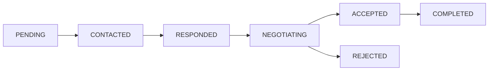
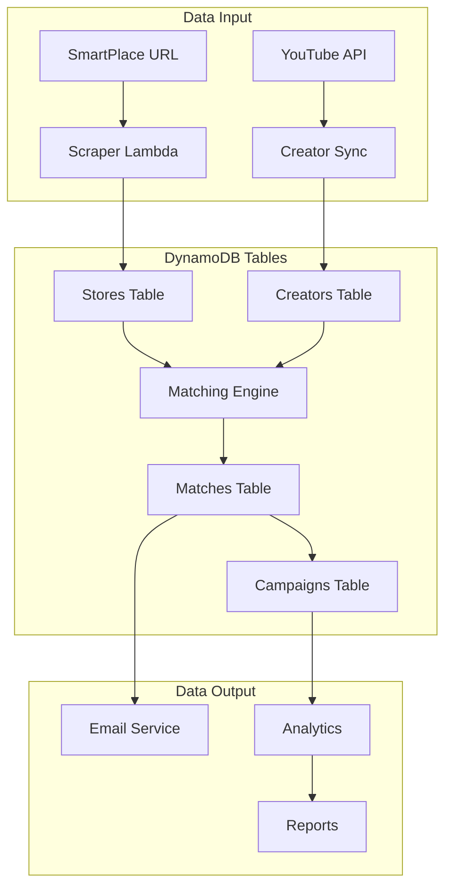

# 📊 DynamoDB Architecture Documentation

## Overview

Marketing Service는 AWS DynamoDB를 활용한 서버리스 NoSQL 데이터베이스 아키텍처를 구현합니다. Single Table Design 대신 도메인별 다중 테이블 구조를 채택하여 관리 용이성과 확장성을 확보했습니다.

## 🏗️ Database Design Principles

### 1. Key Design Pattern
```
Primary Key (PK): Entity Type + Unique Identifier
Sort Key (SK): Relationship or Timestamp
```

### 2. Access Patterns First
모든 테이블은 예상되는 액세스 패턴을 기반으로 설계되었습니다:
- **Query efficiency**: GSI를 통한 다양한 쿼리 지원
- **Scalability**: Pay-per-request 빌링으로 자동 스케일링
- **Cost optimization**: TTL을 통한 자동 데이터 정리

## 📋 Table Specifications

### 1. Stores Table (`dot-marketing-stores`)

**Purpose**: 가게 프로필 및 분석 데이터 저장

```yaml
Primary Key:
  PK: STORE#<storeId>
  SK: PROFILE#<timestamp>

Attributes:
  - storeId: string (UUID)
  - storeName: string
  - sourceUrl: string (Naver URL)
  - primaryCategory: string
  - location: map
  - priceAnalysis: map
  - sentiment: map
  - status: string
  - ttl: number (캐시 만료)

Global Secondary Indexes:
  GSI1 (store-category-index):
    PK: CATEGORY#<category>
    SK: STORE#<storeId>
    
  GSI2 (store-location-index):
    PK: LOCATION#<city>#<district>
    SK: STORE#<storeId>
    
  GSI3 (store-price-index):
    PK: PRICE#<level>
    SK: STORE#<storeId>
```

**Access Patterns**:
| Pattern | Operation | Index |
|---------|-----------|-------|
| Get store by ID | Query on PK | Primary |
| List stores by category | Query on GSI1 | GSI1 |
| Find stores in area | Query on GSI2 | GSI2 |
| Filter by price range | Query on GSI3 | GSI3 |

### 2. Creators Table (`dot-marketing-creators`)

**Purpose**: 크리에이터 프로필 및 통계 관리

```yaml
Primary Key:
  PK: CREATOR#<creatorId>
  SK: PLATFORM#<platform>#<channelId>

Attributes:
  - creatorId: string (UUID)
  - channelName: string
  - platform: string (youtube|instagram|tiktok)
  - statistics: map
    - subscribers: number
    - avgViews: number
    - engagementRate: number
  - influenceTier: string
  - status: string

Global Secondary Indexes:
  GSI1 (creator-category-index):
    PK: CATEGORY#<category>
    SK: CREATOR#<creatorId>
    
  GSI2 (creator-location-index):
    PK: LOCATION#<region>
    SK: CREATOR#<creatorId>
    
  GSI3 (creator-platform-index):
    PK: PLATFORM#<platform>
    SK: INFLUENCE#<subscribers>
    
  GSI4 (creator-influence-index):
    PK: INFLUENCE_TIER#<tier>
    SK: ENGAGEMENT#<rate>
```

**Influence Tier Classification**:
```typescript
type InfluenceTier = 
  | 'nano'   // < 1K subscribers
  | 'micro'  // 1K - 10K
  | 'mid'    // 10K - 100K
  | 'macro'  // 100K - 1M
  | 'mega'   // > 1M
```

### 3. Matches Table (`dot-marketing-matches`)

**Purpose**: 매칭 결과 및 상태 추적

```yaml
Primary Key:
  PK: MATCH#<matchId>
  SK: STORE#<storeId>#CREATOR#<creatorId>

Attributes:
  - matchId: string (UUID)
  - matchScore: number (0-100)
  - confidence: string (high|medium|low)
  - status: string (enum)
  - statusHistory: list
  - communication: map
  - priority: string
  - ttl: number (30 days)

Global Secondary Indexes:
  GSI1 (match-score-index):
    PK: SCORE#<scoreRange>
    SK: MATCH#<matchId>
    
  GSI2 (match-status-index):
    PK: STATUS#<status>
    SK: DATE#<date>
    
  GSI3 (match-date-index):
    PK: DATE#<YYYY-MM-DD>
    SK: SCORE#<score>
```

**Match Status Workflow**:


### 4. Campaigns Table (`dot-marketing-campaigns`)

**Purpose**: 마케팅 캠페인 관리

```yaml
Primary Key:
  PK: CAMPAIGN#<campaignId>
  SK: STORE#<storeId>

Attributes:
  - campaignId: string
  - campaignType: string
  - status: string
  - budget: map
  - timeline: map
  - creators: list
  - performance: map

Global Secondary Indexes:
  GSI1 (campaign-status-index):
    PK: STATUS#<status>
    SK: DATE#<startDate>
    
  GSI2 (campaign-store-index):
    PK: STORE#<storeId>
    SK: DATE#<createdAt>
```

## 🔄 Data Flow Architecture



## 🚀 Performance Optimization

### 1. Composite Keys Strategy
```typescript
// Efficient range queries
const PK = `STORE#${storeId}`;
const SK_PREFIX = 'PROFILE#';

// Get latest profile
const latestProfile = await query({
  KeyConditionExpression: 'PK = :pk AND begins_with(SK, :prefix)',
  ScanIndexForward: false,
  Limit: 1
});
```

### 2. GSI Design Patterns
```typescript
// Score-based pagination
const scoreRange = Math.floor(minScore / 10) * 10;
const GSI1PK = `SCORE#${String(scoreRange).padStart(3, '0')}`;

// Efficient score queries
const highScoreMatches = await queryGSI({
  IndexName: 'match-score-index',
  KeyConditionExpression: 'GSI1PK = :scoreRange'
});
```

### 3. TTL Management
```typescript
// Automatic cleanup
const ttl = Math.floor(Date.now() / 1000) + (30 * 24 * 60 * 60); // 30 days
```

## 📈 Capacity Planning

### Read/Write Patterns
| Table | Read Pattern | Write Pattern | Scaling |
|-------|--------------|---------------|---------|
| Stores | High (caching) | Low | On-demand |
| Creators | High | Medium (daily sync) | On-demand |
| Matches | Medium | High (real-time) | On-demand |
| Campaigns | Low | Low | On-demand |

### Cost Optimization
- **TTL**: Automatic deletion of expired data
- **Compression**: Store large JSON as compressed strings
- **Caching**: 7-day cache for scraping results
- **Batch Operations**: Reduce API calls

## 🔐 Security Considerations

### 1. Encryption
- **At Rest**: AWS managed encryption
- **In Transit**: TLS 1.2+
- **Field Level**: Sensitive data encryption

### 2. Access Control
```yaml
IAM Policy:
  - Read: Lambda functions, API Gateway
  - Write: Admin Lambda, Batch jobs
  - Delete: Admin only
```

### 3. Audit Trail
- DynamoDB Streams for change tracking
- CloudTrail for API access logs
- X-Ray for performance tracing

## 🔧 Operations

### Backup Strategy
```bash
# Automated daily backups
aws dynamodb create-backup \
  --table-name dot-marketing-stores \
  --backup-name stores-backup-$(date +%Y%m%d)
```

### Monitoring
- **CloudWatch Alarms**:
  - ConsumedReadCapacityUnits
  - ConsumedWriteCapacityUnits
  - UserErrors
  - SystemErrors

### Migration Scripts
```typescript
// Table migration example
async function migrateTable(oldTable: string, newTable: string) {
  const items = await scan({ TableName: oldTable });
  
  for (const batch of chunk(items, 25)) {
    await batchWrite({
      RequestItems: {
        [newTable]: batch.map(item => ({ PutRequest: { Item: item } }))
      }
    });
  }
}
```

## 📊 Metrics & KPIs

### Performance Metrics
- **Query Latency**: < 50ms p99
- **Write Latency**: < 100ms p99
- **Error Rate**: < 0.1%
- **Availability**: 99.9%

### Business Metrics
- **Cache Hit Rate**: > 80%
- **Match Success Rate**: > 60%
- **Data Freshness**: < 7 days

## 🎯 Best Practices

1. **Always use batch operations** for multiple items
2. **Implement exponential backoff** for retries
3. **Use projection expressions** to reduce data transfer
4. **Leverage DynamoDB Streams** for real-time processing
5. **Monitor hot partitions** and adjust keys if needed

## 🔄 Future Improvements

1. **Global Tables**: Multi-region replication
2. **DAX Integration**: Microsecond latency caching
3. **Point-in-time Recovery**: Continuous backups
4. **Auto-scaling**: Predictive capacity management
5. **GraphQL Integration**: AppSync for real-time subscriptions