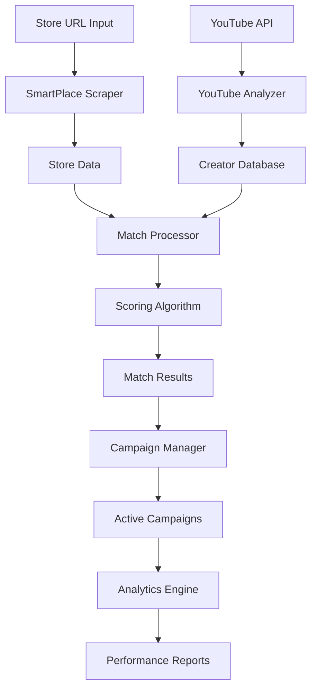

# Matching Engine Architecture

## Overview

The DOT Marketing Matching Engine is a sophisticated system designed to connect Naver SmartPlace stores with relevant YouTube creators for marketing collaborations. It uses a multi-criteria weighted scoring algorithm to find optimal matches based on various factors.

## Core Components

### 1. Matching Algorithm (`matching-algorithm.ts`)

The heart of the matching system, implementing a weighted scoring mechanism across six key criteria:

```typescript
const DEFAULT_WEIGHTS = {
  category: 0.30,     // Business category alignment
  location: 0.20,     // Geographic proximity
  audience: 0.25,     // Target audience demographics
  style: 0.15,        // Content style compatibility
  influence: 0.10     // Creator influence tier
}
```

#### Scoring Components

##### Category Matching (30%)
- **Primary Category**: 100 points for exact match
- **Sub-category**: 75 points for match
- **Related Categories**: 50 points for related industries
- **Keyword Overlap**: Up to 30 points based on tag similarity

##### Location Scoring (20%)
- **Same District**: 100 points
- **Same City**: 75 points  
- **Same Province**: 50 points
- **National**: 25 points
- **Distance-based**: Inverse scoring based on km distance

##### Audience Alignment (25%)
- **Demographics Match**: Age, gender, interests alignment
- **Size Compatibility**: Creator reach vs store capacity
- **Engagement Quality**: High engagement rates boost score

##### Style Compatibility (15%)
- **Content Format**: Video length, production quality
- **Tone Matching**: Professional vs casual
- **Visual Style**: Aesthetic alignment

##### Influence Tier (10%)
- **Mega (1M+)**: 100 points
- **Macro (100K-1M)**: 80 points
- **Mid (10K-100K)**: 60 points
- **Micro (1K-10K)**: 40 points
- **Nano (<1K)**: 20 points

### 2. Data Scrapers

#### SmartPlace Scraper (`smartplace-scraper.ts`)
Extracts store information from Naver SmartPlace URLs:

```typescript
interface SmartPlaceData {
  storeId: string
  storeName: string
  category: string
  subcategory?: string
  location: LocationData
  keywords: string[]
  description: string
  ratings: RatingData
  menuItems?: MenuItem[]
  businessHours: BusinessHours
  amenities: string[]
}
```

**Key Features:**
- Caching with 7-day TTL to reduce API calls
- Rate limiting (10 requests/second)
- Fallback mechanisms for incomplete data
- Business verification status checking

#### YouTube Analyzer (`youtube-analyzer.ts`)
Analyzes creator channels and content:

```typescript
interface YouTubeAnalysis {
  channelId: string
  channelName: string
  subscriberCount: number
  viewCount: number
  videoCount: number
  averageViews: number
  engagementRate: number
  topCategories: string[]
  audienceDemographics: Demographics
  contentStyle: ContentStyle
  uploadFrequency: number
}
```

**Analysis Metrics:**
- Content category classification using YouTube API
- Engagement rate calculation (likes + comments / views)
- Upload consistency scoring
- Audience demographic inference
- Geographic focus detection from video titles/descriptions

### 3. Match Processor (`match-processor.ts`)

Orchestrates the matching workflow:

```typescript
class MatchProcessor {
  async processMatch(storeUrl: string): Promise<MatchResult[]> {
    // 1. Scrape store data
    const storeData = await this.scrapeStore(storeUrl)
    
    // 2. Find potential creators
    const creators = await this.findCreators(storeData)
    
    // 3. Calculate match scores
    const matches = await this.calculateMatches(storeData, creators)
    
    // 4. Rank and filter results
    const filtered = this.filterMatches(matches, MIN_SCORE)
    
    // 5. Enrich with additional data
    const enriched = await this.enrichMatches(filtered)
    
    // 6. Save to database
    await this.saveMatches(enriched)
    
    return enriched
  }
}
```

**Processing Pipeline:**
1. **Data Collection**: Parallel scraping of store data
2. **Creator Discovery**: Query creators by category, location
3. **Scoring**: Parallel score calculation for all candidates
4. **Filtering**: Apply minimum score threshold (60/100)
5. **Enrichment**: Add engagement metrics, recent performance
6. **Persistence**: Save matches with TTL for caching

### 4. Campaign Manager (`campaign-manager.ts`)

Manages the lifecycle of marketing campaigns:

```typescript
interface Campaign {
  campaignId: string
  storeId: string
  creatorIds: string[]
  status: CampaignStatus
  budget: Budget
  timeline: Timeline
  deliverables: Deliverable[]
  performance: PerformanceMetrics
}
```

**Campaign Workflow:**
1. **Creation**: Store initiates campaign with requirements
2. **Matching**: System suggests creators based on algorithm
3. **Invitation**: Selected creators receive invitations
4. **Negotiation**: Terms discussion and agreement
5. **Execution**: Content creation and publishing
6. **Monitoring**: Real-time performance tracking
7. **Settlement**: Payment and completion

## Data Flow



## Optimization Strategies

### 1. Caching Strategy
- **Store Data**: 7-day cache for scraped SmartPlace data
- **Creator Data**: 24-hour cache for YouTube metrics
- **Match Results**: 30-day cache with invalidation triggers
- **Redis/ElastiCache**: In-memory caching for hot data

### 2. Performance Optimization
- **Parallel Processing**: Concurrent scraping and scoring
- **Batch Operations**: Process multiple matches in batches
- **Database Indexing**: GSIs for common query patterns
- **Connection Pooling**: Reuse HTTP connections

### 3. Scalability Design
- **Horizontal Scaling**: Stateless workers for processing
- **Queue-based Architecture**: SQS for async processing
- **Auto-scaling**: Based on queue depth and CPU usage
- **Database Sharding**: Partition by storeId for large scale

## Machine Learning Integration

### Current ML Features
- **Category Classification**: NLP-based category matching
- **Sentiment Analysis**: Review and comment analysis
- **Trend Detection**: Identifying rising creators

### Future ML Enhancements
- **Deep Learning Matching**: Neural network for complex patterns
- **Predictive Analytics**: Campaign success prediction
- **Personalization**: Store-specific weighting adjustment
- **Anomaly Detection**: Fraud and fake engagement detection

## Security Considerations

### Data Protection
- **Encryption**: All sensitive data encrypted at rest
- **API Keys**: Stored in AWS Secrets Manager
- **PII Handling**: Compliance with privacy regulations

### Rate Limiting
- **YouTube API**: 100 requests/minute quota management
- **SmartPlace**: 10 requests/second with backoff
- **Internal APIs**: Token bucket algorithm

### Access Control
- **IAM Roles**: Least privilege principle
- **API Authentication**: JWT tokens with refresh
- **Audit Logging**: CloudTrail for all operations

## Monitoring and Observability

### Key Metrics
- **Match Quality**: Average match scores, acceptance rates
- **Processing Time**: P50, P95, P99 latencies
- **API Usage**: Quota consumption, error rates
- **Campaign Success**: Conversion rates, ROI

### Logging
- **Structured Logs**: JSON format with correlation IDs
- **Log Levels**: DEBUG, INFO, WARN, ERROR, FATAL
- **Log Aggregation**: CloudWatch Logs with filtering

### Alerting
- **Critical Alerts**: API failures, database errors
- **Warning Alerts**: High latency, quota warnings
- **Business Alerts**: Low match quality, campaign failures

## Testing Strategy

### Unit Tests
- Algorithm accuracy validation
- Score calculation verification
- Edge case handling

### Integration Tests
- End-to-end matching flow
- External API integration
- Database operations

### Load Testing
- Concurrent match processing
- API rate limit handling
- Database connection pooling

### A/B Testing
- Algorithm weight variations
- UI/UX improvements
- Campaign format testing

## Deployment Architecture

### Infrastructure
- **Compute**: AWS Lambda for serverless processing
- **Storage**: DynamoDB for data, S3 for media
- **Caching**: ElastiCache Redis
- **Queue**: SQS for async processing
- **API**: API Gateway with CloudFront

### CI/CD Pipeline
1. Code commit triggers GitHub Actions
2. Run tests and linting
3. Build and package
4. Deploy to staging
5. Run integration tests
6. Deploy to production
7. Monitor and rollback if needed

## Future Roadmap

### Phase 1 (Current)
- ✅ Basic matching algorithm
- ✅ SmartPlace scraping
- ✅ YouTube analysis
- ✅ DynamoDB storage

### Phase 2 (Q2 2024)
- Real-time matching with EventBridge
- Advanced ML models
- Multi-platform support (Instagram, TikTok)
- A/B testing framework

### Phase 3 (Q3 2024)
- Automated campaign management
- Performance prediction
- ROI optimization
- Global expansion

### Phase 4 (Q4 2024)
- AI-powered content generation
- Blockchain-based contracts
- Advanced analytics dashboard
- Partner API ecosystem