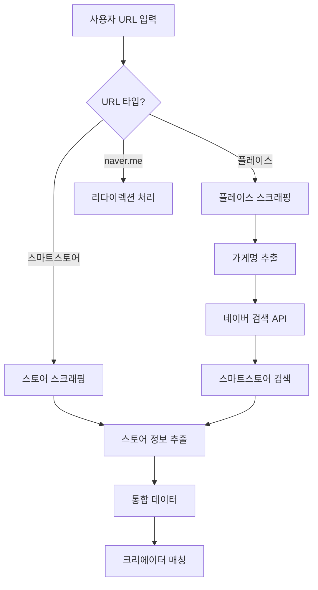

# 스마트스토어 정보 수집 방법 가이드

## 📊 네이버 스마트스토어 정보 접근 방법

### 1. 네이버 커머스 API (파트너사만 가능) 🔒
```javascript
// 네이버 커머스 API - 파트너/판매자만 접근 가능
const response = await fetch('https://api.commerce.naver.com/external/v2/products', {
  headers: {
    'Authorization': 'Bearer YOUR_ACCESS_TOKEN'
  }
});
```
**제한사항**: 
- 판매자 본인 상품만 조회 가능
- 제3자 접근 불가

### 2. 스마트스토어 검색 API (공개) ✅
```javascript
// 네이버 쇼핑 검색 API
const response = await fetch('https://openapi.naver.com/v1/search/shop.json?query=상품명', {
  headers: {
    'X-Naver-Client-Id': 'YOUR_CLIENT_ID',
    'X-Naver-Client-Secret': 'YOUR_SECRET'
  }
});

// 반환 데이터
{
  "title": "상품명",
  "link": "https://smartstore.naver.com/store/products/123456",
  "image": "https://shopping-phinf.pstatic.net/...",
  "lprice": "10000",
  "hprice": "20000",
  "mallName": "스토어명",
  "productId": "123456789",
  "productType": "1",
  "brand": "브랜드명",
  "maker": "제조사",
  "category1": "패션의류",
  "category2": "여성의류"
}
```

### 3. 스마트스토어 페이지 스크래핑 🤖
```javascript
// 스토어 홈 URL 패턴
https://smartstore.naver.com/{storeId}
https://brand.naver.com/stores/{storeId}

// 상품 상세 URL 패턴
https://smartstore.naver.com/{storeId}/products/{productId}

// 스크래핑 가능한 정보
- 스토어명
- 대표 상품들
- 카테고리
- 판매자 정보
- 리뷰/평점
```

### 4. 스토어 정보 추출 전략 💡

#### A. 직접 URL 입력 시
```javascript
// URL 예: https://smartstore.naver.com/main/products/5853222039
const storeId = extractStoreId(url);  // 'main'
const productId = extractProductId(url);  // '5853222039'

// 스토어 정보 스크래핑
const storeInfo = await scrapeStoreHome(`https://smartstore.naver.com/${storeId}`);
```

#### B. 플레이스 연동 시
```javascript
// 1. 플레이스에서 브랜드/스토어 링크 찾기
const storeLink = await page.$eval('a[href*="smartstore.naver.com"]', el => el.href);

// 2. 없으면 가게명으로 검색
const storeName = await getStoreName();
const searchResults = await naverShopAPI.search(storeName);

// 3. 매칭되는 스토어 찾기
const matchedStore = findBestMatch(searchResults, storeName);
```

### 5. 통합 데이터 수집 플로우 🔄



### 6. 실제 구현 예제 📝

```javascript
class SmartStoreAnalyzer {
  async analyzeStore(url: string) {
    // 1. 스토어 ID 추출
    const storeId = this.extractStoreId(url);
    
    // 2. 스토어 홈 스크래핑
    const browser = await chromium.launch();
    const page = await browser.newPage();
    await page.goto(`https://smartstore.naver.com/${storeId}`);
    
    // 3. 스토어 정보 추출
    const storeInfo = await page.evaluate(() => {
      return {
        name: document.querySelector('h1.store_name')?.textContent,
        category: document.querySelector('.store_category')?.textContent,
        description: document.querySelector('.store_desc')?.textContent,
        rating: document.querySelector('.store_rating')?.textContent,
        products: Array.from(document.querySelectorAll('.product_item')).map(el => ({
          name: el.querySelector('.name')?.textContent,
          price: el.querySelector('.price')?.textContent,
          image: el.querySelector('img')?.src
        }))
      };
    });
    
    // 4. 판매자 정보 (API 필요)
    const sellerInfo = await this.getSellerInfo(storeId);
    
    return { storeInfo, sellerInfo };
  }
  
  async searchStoreByName(storeName: string) {
    // 네이버 쇼핑 검색 API 사용
    const response = await fetch(`https://openapi.naver.com/v1/search/shop.json?query=${encodeURIComponent(storeName)}`, {
      headers: {
        'X-Naver-Client-Id': process.env.NAVER_CLIENT_ID,
        'X-Naver-Client-Secret': process.env.NAVER_CLIENT_SECRET
      }
    });
    
    const data = await response.json();
    
    // 스토어명으로 필터링
    const storeProducts = data.items.filter(item => 
      item.mallName?.includes(storeName) || 
      item.title?.includes(storeName)
    );
    
    return storeProducts;
  }
}
```

### 7. 데이터 연동 시나리오 🔗

#### 시나리오 1: 플레이스 → 스마트스토어
```javascript
// 플레이스 페이지에서 스마트스토어 링크 찾기
const hasSmartStore = await checkSmartStoreLink(placeUrl);
if (hasSmartStore) {
  const storeData = await analyzeSmartStore(storeUrl);
  return combineData(placeData, storeData);
}
```

#### 시나리오 2: 가게명으로 검색
```javascript
// 플레이스에서 가게명 추출
const storeName = placeData.name;

// 스마트스토어 검색
const storeResults = await searchSmartStore(storeName);

// 최적 매칭 찾기
const bestMatch = findBestMatch(storeResults, {
  name: storeName,
  category: placeData.category,
  location: placeData.address
});
```

#### 시나리오 3: 통합 분석
```javascript
// 모든 소스에서 데이터 수집
const data = {
  place: await analyzePlaceData(url),
  store: await analyzeSmartStore(url),
  search: await searchNaverAPIs(storeName),
  social: await findSocialProfiles(storeName)
};

// 데이터 통합
return mergeAllData(data);
```

### 8. 환경변수 설정 필요 ⚙️

```env
# .env.local
NAVER_CLIENT_ID=your_client_id
NAVER_CLIENT_SECRET=your_client_secret
NAVER_COOKIE=NID_AUT=xxx; NID_SES=xxx  # 로그인 필요한 경우
```

### 9. 법적/윤리적 고려사항 ⚠️

- **robots.txt 확인**: 스크래핑 허용 여부 확인
- **Rate Limiting**: 과도한 요청 자제
- **개인정보**: 수집된 데이터의 개인정보 보호
- **상업적 이용**: 네이버 서비스 약관 확인

### 10. 추천 구현 순서 📋

1. **네이버 검색 API 연동** (가장 쉬움)
2. **플레이스 스크래핑 개선** (현재 진행중)
3. **스마트스토어 검색 API 추가**
4. **통합 데이터 매칭 로직**
5. **캐싱 및 최적화**