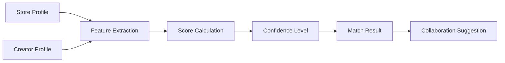

# 🚀 DOT Marketing Service - 크리에이터 매칭 시스템

> 네이버 스마트플레이스 기반 AI 크리에이터 매칭 플랫폼

## 📋 목차

- [개요](#-개요)
- [핵심 기능](#-핵심-기능)
- [기술 스택](#-기술-스택)
- [프로젝트 구조](#-프로젝트-구조)
- [설치 및 실행](#-설치-및-실행)
- [API 문서](#-api-문서)
- [데이터베이스](#-데이터베이스)
- [매칭 엔진](#-매칭-엔진)
- [테스트](#-테스트)
- [배포](#-배포)

## 🎯 개요

DOT Marketing Service는 한국 음식점과 크리에이터를 자동으로 매칭하는 B2B SaaS 플랫폼입니다. 네이버 스마트플레이스 URL만으로 가게를 분석하고, YouTube/Instagram 크리에이터와 최적의 매칭을 제공합니다.

### 핵심 가치
- **Zero-Config 매칭**: URL 하나로 완벽한 분석
- **AI 기반 매칭**: 6개 기준의 정교한 알고리즘
- **한국 시장 최적화**: 네이버 플랫폼 완벽 통합

## 🌟 핵심 기능

### 1. 스마트플레이스 분석
- 🔍 **자동 스크래핑**: 가게 정보, 메뉴, 리뷰 수집
- 📊 **감성 분석**: 리뷰 기반 강점/약점 파악
- 🎯 **타겟 분석**: 고객층 및 방문 패턴 추출

### 2. 크리에이터 매칭
- 🤖 **AI 매칭 엔진**: 6개 평가 기준
- 📈 **영향력 분석**: 구독자, 참여율, 성장률
- 🌍 **지역 매칭**: 활동 지역 기반 최적화

### 3. 캠페인 관리
- 📧 **자동 이메일 생성**: 맞춤형 협업 제안
- 📊 **성과 추적**: ROI 및 KPI 모니터링
- 💼 **계약 관리**: 협업 프로세스 자동화

## 🛠 기술 스택

### Frontend
- **Framework**: Next.js 14.2.11 (App Router)
- **UI**: React 18.3.1 + TailwindCSS 3.4
- **State**: React Hooks
- **Testing**: Jest + React Testing Library

### Backend
- **Runtime**: Node.js + TypeScript 5.5
- **Database**: AWS DynamoDB (9 tables, 16 GSIs)
- **Scraping**: Playwright + Python Lambda
- **APIs**: YouTube Data API v3, Naver SmartPlace

### Infrastructure
- **AWS Services**:
  - DynamoDB (NoSQL Database)
  - Lambda (Serverless Functions)
  - SES (Email Service)
  - EventBridge (Event-driven)
  - Parameter Store (Config)
- **Monitoring**: CloudWatch, X-Ray
- **Cache**: Redis/ElastiCache

## 📂 프로젝트 구조

```
services/marketing/
├── 📱 app/                       # Next.js App Router
│   ├── api/                     # API Routes
│   │   ├── smartplace/analyze/  # 스마트플레이스 분석
│   │   └── youtube/              # YouTube API 통합
│   ├── layout.tsx               # Root Layout
│   └── page.tsx                 # Homepage
│
├── 🧩 components/                # React Components
│   ├── CreatorList.tsx          # 크리에이터 목록
│   ├── CreatorSearch.tsx        # 검색 UI
│   └── EmailTemplates.tsx       # 이메일 템플릿
│
├── 💾 src/                       # Core Business Logic
│   ├── matching-engine/         # 매칭 엔진
│   │   ├── core/               
│   │   │   └── matching-algorithm.ts # 핵심 알고리즘
│   │   └── types.ts            # TypeScript 타입
│   │
│   └── lib/database/           # DynamoDB Layer
│       ├── dynamodb-client.ts  # 클라이언트 설정
│       ├── models/             # 데이터 모델
│       │   ├── store.model.ts
│       │   ├── creator.model.ts
│       │   ├── match.model.ts
│       │   └── campaign.model.ts
│       └── repositories/       # Repository Pattern
│           ├── store.repository.ts
│           ├── creator.repository.ts
│           ├── match.repository.ts
│           └── campaign.repository.ts
│
├── 📚 lib/                      # Utilities
│   ├── smartplace/             # 스크래핑 로직
│   │   ├── scraper.ts
│   │   ├── parser.ts
│   │   └── analyzer.ts
│   ├── youtube-api.ts          # YouTube 클라이언트
│   ├── email-templates.ts      # 이메일 생성
│   └── scoring.ts              # 매칭 점수
│
├── 🐍 scraper-python/           # Python Lambda
│   └── smartplace_scraper.py   # 스크래핑 워커
│
├── 📝 scripts/                  # 유틸리티 스크립트
│   └── create-dynamodb-tables.ts # 테이블 생성
│
└── 📋 docs/                     # 문서
    ├── SMARTPLACE_MVP_DESIGN.md
    └── PROJECT_STRUCTURE.md
```

## 🚀 설치 및 실행

### Prerequisites
```bash
# Required
- Node.js 18+
- Docker & Docker Compose
- AWS CLI configured
- Python 3.9+ (for Lambda)
```

### 1. 환경 설정
```bash
# Clone repository
git clone https://github.com/your-org/DOT.git
cd DOT/services/marketing

# Install dependencies
npm install

# Copy environment variables
cp .env.example .env
# Edit .env with your credentials
```

### 2. 로컬 DynamoDB 설정
```bash
# Start local DynamoDB
docker-compose up -d dynamodb-local dynamodb-admin

# Create tables
npx ts-node scripts/create-dynamodb-tables.ts

# Verify at http://localhost:8001 (DynamoDB Admin)
```

### 3. 개발 서버 실행
```bash
# Development mode
npm run dev

# Open http://localhost:3000
```

## 📡 API 문서

### SmartPlace Analysis
```typescript
POST /api/smartplace/analyze
{
  "url": "https://pcmap.place.naver.com/restaurant/..."
}

Response: {
  "storeProfile": StoreProfile,
  "analyzedAt": "2024-01-15T10:00:00Z",
  "confidence": 95
}
```

### Creator Search
```typescript
POST /api/youtube/search
{
  "query": "강남 맛집",
  "maxResults": 50,
  "filters": {
    "minSubscribers": 10000,
    "location": "서울"
  }
}

Response: {
  "creators": Creator[],
  "totalResults": 150
}
```

### Matching API
```typescript
POST /api/matching/calculate
{
  "storeId": "store-123",
  "creatorIds": ["creator-1", "creator-2"],
  "options": {
    "weights": {
      "category": 0.3,
      "location": 0.2
    }
  }
}

Response: {
  "matches": MatchingResult[],
  "topMatch": MatchingResult
}
```

## 💾 데이터베이스

### DynamoDB Tables (9)

#### 1. Stores Table
```yaml
Table: dot-marketing-stores
PK: STORE#<storeId>
SK: PROFILE#<timestamp>
GSIs:
  - store-category-index
  - store-location-index
  - store-price-index
```

#### 2. Creators Table
```yaml
Table: dot-marketing-creators
PK: CREATOR#<creatorId>
SK: PLATFORM#<platform>#<channelId>
GSIs:
  - creator-category-index
  - creator-location-index
  - creator-platform-index
  - creator-influence-index
```

#### 3. Matches Table
```yaml
Table: dot-marketing-matches
PK: MATCH#<matchId>
SK: STORE#<storeId>#CREATOR#<creatorId>
GSIs:
  - match-score-index
  - match-status-index
  - match-date-index
```

### Access Patterns

| Pattern | Table | Index | Key Condition |
|---------|-------|-------|---------------|
| Get store by ID | Stores | Primary | PK = STORE#id |
| Stores by category | Stores | GSI1 | GSI1PK = CATEGORY#food |
| Creators by platform | Creators | GSI3 | GSI3PK = PLATFORM#youtube |
| High score matches | Matches | GSI1 | GSI1PK = SCORE#80 |

## 🤖 매칭 엔진

### 평가 기준 (Weights)

```typescript
const DEFAULT_WEIGHTS = {
  category: 0.30,  // 카테고리 일치도
  location: 0.20,  // 지역 매칭
  audience: 0.25,  // 타겟층 일치
  style: 0.15,     // 콘텐츠 스타일
  influence: 0.10  // 영향력 지수
};
```

### 매칭 프로세스



### Score Interpretation

| Score | Confidence | Action |
|-------|------------|--------|
| 80-100 | High | 즉시 협업 제안 |
| 60-79 | Medium | 조건부 협업 가능 |
| 40-59 | Low | 추가 검토 필요 |
| 0-39 | Very Low | 매칭 부적합 |

## 🧪 테스트

### Unit Tests
```bash
# Run all tests
npm test

# With coverage
npm run test:coverage

# Watch mode
npm run test:watch
```

### Integration Tests
```bash
# Test DynamoDB operations
npm run test:db

# Test scraping
npm run test:scraper
```

### E2E Tests
```bash
# Playwright tests
npm run test:e2e
```

## 🚢 배포

### Development
```bash
# Deploy to dev environment
npm run deploy:dev
```

### Production
```bash
# Build
npm run build

# Deploy
npm run deploy:prod

# Verify
npm run health-check
```

### Docker
```dockerfile
FROM node:18-alpine
WORKDIR /app
COPY package*.json ./
RUN npm ci
COPY . .
RUN npm run build
EXPOSE 3000
CMD ["npm", "start"]
```

## 📊 모니터링

### CloudWatch Dashboards
- Request latency
- Error rates
- DynamoDB capacity
- Lambda invocations

### Alerts
- Error rate > 1%
- Latency > 2s
- DynamoDB throttling
- Lambda errors

## 🔒 보안

- API Key authentication
- JWT for session management
- IAM roles for AWS services
- Secrets in Parameter Store
- Data encryption at rest

## 🤝 기여하기

1. Fork the repository
2. Create feature branch
3. Commit changes
4. Push to branch
5. Open Pull Request

## 📄 라이선스

Proprietary - Internal Use Only

## 👥 팀

- **Product**: Product Team
- **Engineering**: Platform Team
- **DevOps**: Infrastructure Team

## 📞 지원

- Slack: #dot-marketing-support
- Email: marketing-team@company.com
- Wiki: [Internal Wiki](https://wiki.company.com/dot-marketing)