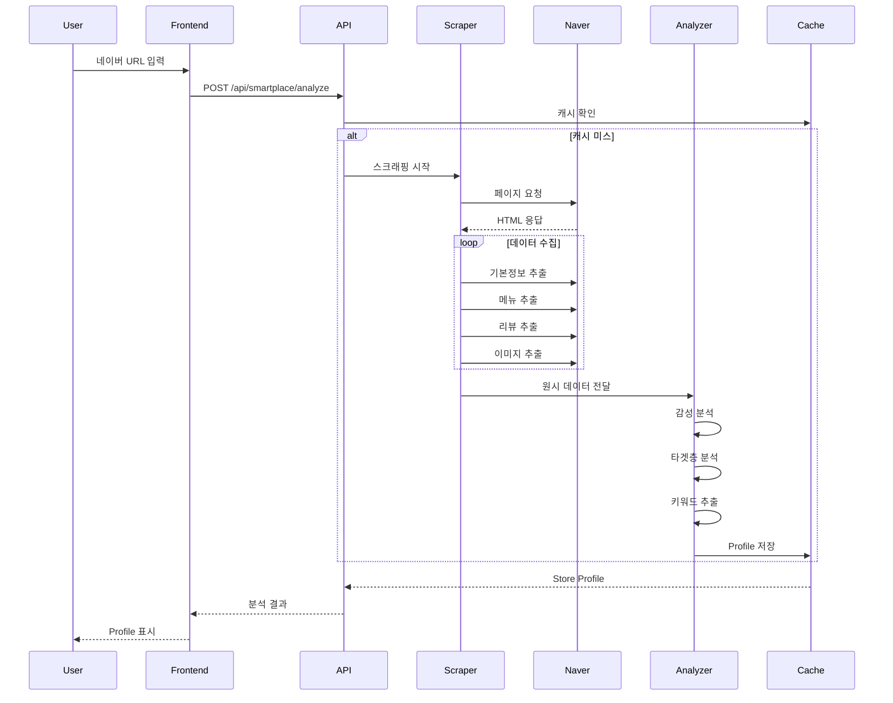
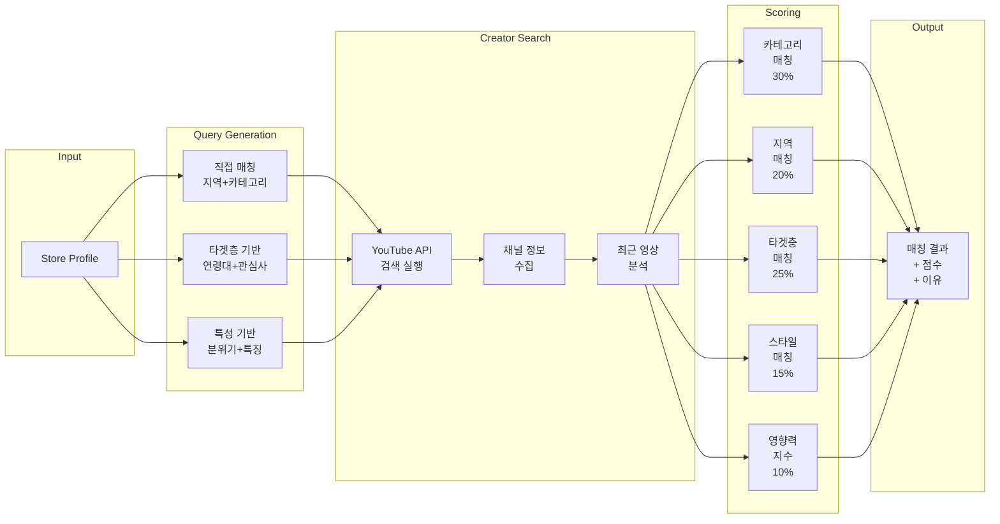
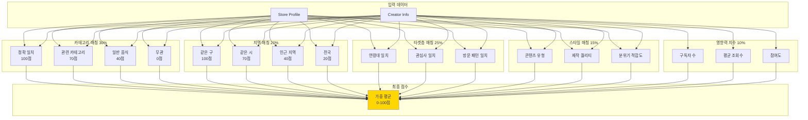
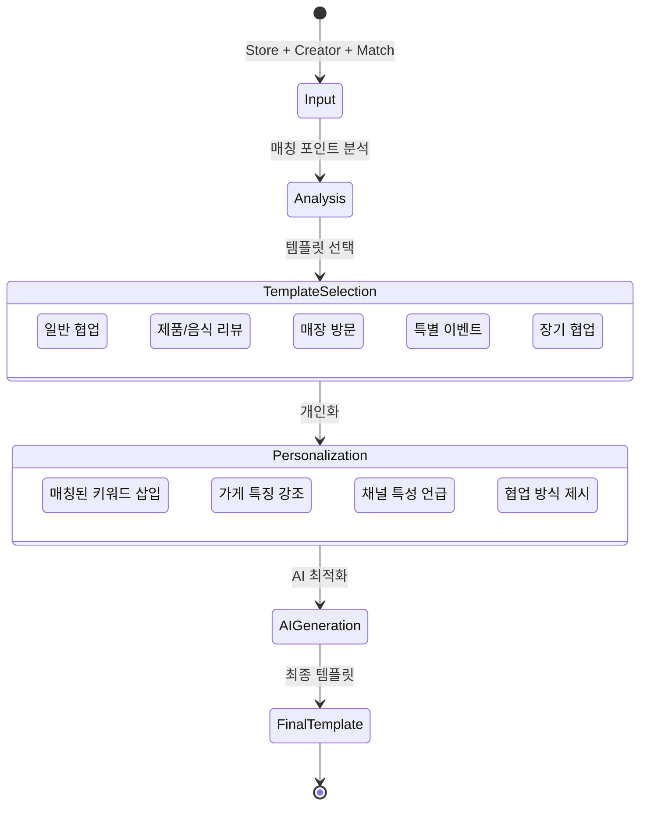
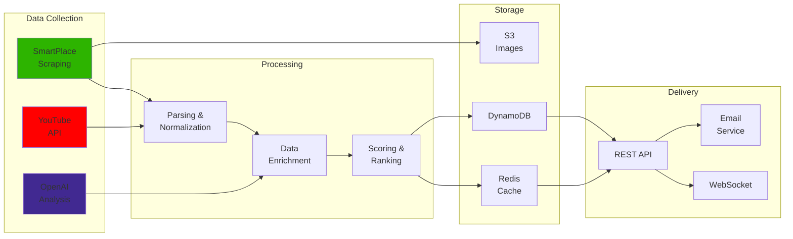
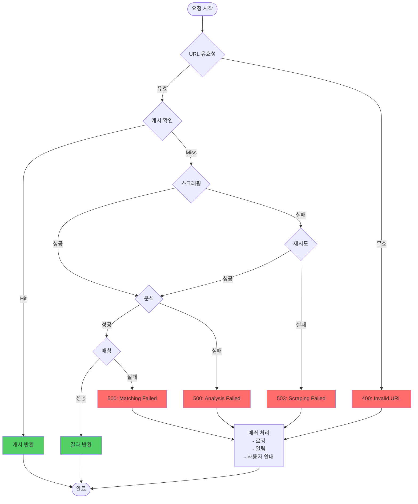
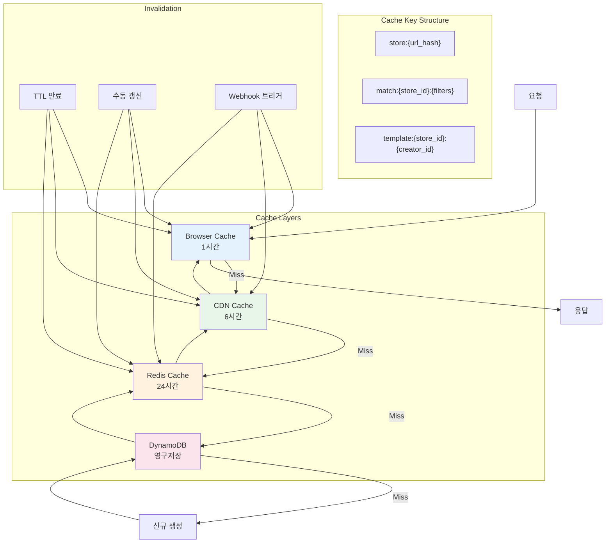

# SmartPlace 시스템 플로우 다이어그램

## 1. 전체 시스템 아키텍처

```mermaid
graph TB
    subgraph Frontend["Frontend Layer"]
        UI[SmartPlace URL Input]
        Profile[Store Profile Display]
        Matches[Creator Match Results]
        Email[Email Management]
    end
    
    subgraph API["API Layer"]
        API1[/api/smartplace/analyze]
        API2[/api/creators/match]
        API3[/api/email/generate]
        API4[/api/email/send]
    end
    
    subgraph Business["Business Logic Layer"]
        Scraper[SmartPlace Scraper]
        Analyzer[Store Analyzer]
        Matcher[AI Matching Engine]
        Template[Template Generator]
    end
    
    subgraph External["External Services"]
        Naver[Naver SmartPlace]
        YouTube[YouTube Data API]
        OpenAI[OpenAI API]
        SES[AWS SES]
    end
    
    subgraph Storage["Data Storage"]
        Cache[(Cache Store Profiles)]
        DB[(DynamoDB Campaigns)]
    end
    
    UI --> API1
    API1 --> Scraper
    Scraper --> Naver
    Scraper --> Analyzer
    Analyzer --> Cache
    
    Profile --> API2
    API2 --> Matcher
    Matcher --> YouTube
    Matcher --> OpenAI
    
    Matches --> API3
    API3 --> Template
    Template --> OpenAI
    
    Email --> API4
    API4 --> SES
    API4 --> DB
    
    style UI fill:#e1f5fe
    style Naver fill:#2db400
    style YouTube fill:#ff0000
    style OpenAI fill:#412991
    style SES fill:#ff9900
```

## 2. SmartPlace 분석 프로세스



## 3. AI 매칭 프로세스



## 4. 매칭 점수 계산 상세



## 5. 이메일 템플릿 생성 플로우



## 6. 데이터 파이프라인



## 7. 에러 처리 플로우



## 8. 캐싱 전략

