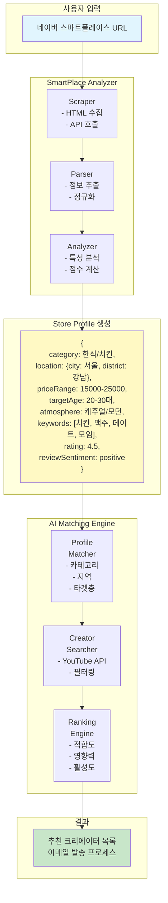
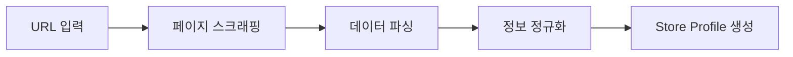
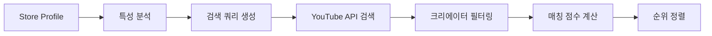
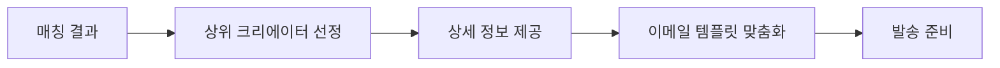

# 네이버 스마트플레이스 기반 크리에이터 매칭 시스템 설계

## 🎯 핵심 컨셉
**"가게 URL 하나로 완벽한 크리에이터 매칭"**
- 사용자는 네이버 스마트플레이스 URL만 입력
- 시스템이 자동으로 가게 정보를 분석하고 최적의 크리에이터 추천
- 복잡한 조건 설정 없이 AI 기반 자동 매칭

## 🏗️ 시스템 아키텍처



## 📊 데이터 수집 및 분석

### 1. SmartPlace Scraper
네이버 스마트플레이스에서 수집할 정보:

```typescript
interface SmartPlaceData {
  // 기본 정보
  name: string;
  category: string;
  address: string;
  phoneNumber: string;
  
  // 영업 정보
  businessHours: {
    [day: string]: { open: string; close: string; }
  };
  
  // 메뉴/상품 정보
  menuItems: Array<{
    name: string;
    price: number;
    description: string;
    imageUrl: string;
  }>;
  
  // 리뷰 데이터
  reviews: Array<{
    rating: number;
    text: string;
    date: Date;
    keywords: string[];
  }>;
  
  // 통계 정보
  statistics: {
    averageRating: number;
    totalReviews: number;
    visitorReviews: number;
    blogReviews: number;
  };
  
  // 이미지
  images: {
    main: string;
    interior: string[];
    menu: string[];
    atmosphere: string[];
  };
}
```

### 2. Store Analyzer
수집된 데이터를 분석하여 가게 특성 추출:

```typescript
interface StoreProfile {
  // 카테고리 분석
  primaryCategory: string;      // "치킨"
  secondaryCategories: string[]; // ["호프", "펍"]
  
  // 위치 분석
  location: {
    city: string;              // "서울"
    district: string;          // "강남구"
    neighborhood: string;      // "역삼동"
    nearbyLandmarks: string[]; // ["강남역", "역삼역"]
  };
  
  // 가격대 분석
  priceAnalysis: {
    range: { min: number; max: number; };
    level: 'budget' | 'moderate' | 'premium' | 'luxury';
    averageSpending: number;
  };
  
  // 타겟 고객층 분석 (리뷰 기반)
  targetDemographics: {
    ageGroups: string[];       // ["20대", "30대"]
    interests: string[];       // ["데이트", "모임", "혼술"]
    visitPatterns: string[];   // ["저녁", "주말", "심야"]
  };
  
  // 분위기 분석 (리뷰 + 이미지)
  atmosphere: {
    style: string[];           // ["모던", "캐주얼", "아늑한"]
    noise: 'quiet' | 'moderate' | 'lively';
    suitable: string[];        // ["데이트", "가족모임", "회식"]
  };
  
  // 강점 분석
  strengths: {
    menuHighlights: string[];  // ["양념치킨", "크림생맥주"]
    serviceFeatures: string[]; // ["친절한", "빠른", "포장"]
    uniquePoints: string[];    // ["수제", "특제소스", "인스타그래머블"]
  };
  
  // 감성 분석
  sentiment: {
    overall: 'positive' | 'neutral' | 'negative';
    aspects: {
      taste: number;      // 0-100
      service: number;
      atmosphere: number;
      value: number;
      cleanliness: number;
    };
  };
  
  // 키워드 추출
  keywords: {
    menu: string[];       // ["치킨", "맥주", "안주"]
    experience: string[]; // ["맛있다", "분위기좋다", "친절하다"]
    hashtags: string[];   // ["#강남치킨", "#데이트맛집"]
  };
}
```

## 🤖 AI 매칭 알고리즘

### 1. Creator-Store Matching Score

```typescript
interface MatchingCriteria {
  // 1. 카테고리 매칭 (30%)
  categoryMatch: {
    exact: boolean;          // 정확히 일치 (예: 치킨 리뷰어)
    related: number;         // 관련도 (예: 음식 리뷰어)
    score: number;          // 0-100
  };
  
  // 2. 지역 매칭 (20%)
  locationMatch: {
    sameDistrict: boolean;   // 같은 구
    sameCity: boolean;       // 같은 시
    coverage: string[];      // 크리에이터 활동 지역
    score: number;          // 0-100
  };
  
  // 3. 타겟층 매칭 (25%)
  audienceMatch: {
    ageOverlap: number;      // 연령대 일치도
    interestOverlap: number; // 관심사 일치도
    score: number;          // 0-100
  };
  
  // 4. 콘텐츠 스타일 매칭 (15%)
  styleMatch: {
    contentType: string;     // "리뷰", "먹방", "브이로그"
    production: string;      // "고퀄리티", "캐주얼", "정보성"
    fitScore: number;       // 가게 분위기와의 적합도
    score: number;          // 0-100
  };
  
  // 5. 영향력 지수 (10%)
  influence: {
    subscribers: number;
    avgViews: number;
    engagement: number;
    score: number;          // 0-100
  };
}

// 최종 매칭 점수 계산
function calculateMatchScore(criteria: MatchingCriteria): number {
  return (
    criteria.categoryMatch.score * 0.30 +
    criteria.locationMatch.score * 0.20 +
    criteria.audienceMatch.score * 0.25 +
    criteria.styleMatch.score * 0.15 +
    criteria.influence.score * 0.10
  );
}
```

### 2. 자동 검색 쿼리 생성

```typescript
function generateSearchQueries(profile: StoreProfile): string[] {
  const queries: string[] = [];
  
  // 1. 직접 매칭 쿼리
  queries.push(`${profile.location.district} ${profile.primaryCategory} 맛집`);
  queries.push(`${profile.primaryCategory} 리뷰`);
  
  // 2. 타겟층 기반 쿼리
  profile.targetDemographics.ageGroups.forEach(age => {
    queries.push(`${age} ${profile.primaryCategory} 추천`);
  });
  
  // 3. 특성 기반 쿼리
  profile.strengths.uniquePoints.forEach(point => {
    queries.push(`${point} ${profile.primaryCategory}`);
  });
  
  // 4. 지역 + 분위기 쿼리
  profile.atmosphere.suitable.forEach(use => {
    queries.push(`${profile.location.district} ${use} 맛집`);
  });
  
  return queries;
}
```

## 🔄 처리 플로우

### Phase 1: 정보 수집


### Phase 2: 분석 및 매칭


### Phase 3: 결과 제공


## 📋 API 엔드포인트

### 1. SmartPlace 분석 API
```typescript
POST /api/smartplace/analyze
{
  url: string;  // 네이버 스마트플레이스 URL
}

Response: {
  storeProfile: StoreProfile;
  analyzedAt: Date;
}
```

### 2. 크리에이터 매칭 API
```typescript
POST /api/creators/match
{
  storeProfile: StoreProfile;
  options?: {
    minSubscribers?: number;
    maxResults?: number;
    excludeCategories?: string[];
  }
}

Response: {
  creators: Array<{
    creator: Creator;
    matchScore: number;
    matchDetails: MatchingCriteria;
    suggestedTemplate: string;
  }>;
}
```

### 3. 맞춤 템플릿 생성 API
```typescript
POST /api/email/generate
{
  storeProfile: StoreProfile;
  creator: Creator;
  matchDetails: MatchingCriteria;
}

Response: {
  template: string;
  subject: string;
  personalization: {
    mentionPoints: string[];  // 언급할 포인트
    commonInterests: string[]; // 공통 관심사
    proposalType: string;      // 제안 유형
  };
}
```

## 🎯 핵심 차별화 포인트

### 1. Zero-Config 매칭
- 사용자가 복잡한 조건 설정 불필요
- URL 하나로 모든 분석 자동화

### 2. 컨텍스트 기반 매칭
- 단순 카테고리 매칭이 아닌 종합적 분석
- 리뷰, 이미지, 메뉴 등 모든 데이터 활용

### 3. 스마트 템플릿
- 가게와 크리에이터의 매칭 포인트 자동 삽입
- 개인화된 협업 제안 생성

### 4. 데이터 기반 의사결정
- 추측이 아닌 실제 데이터 기반 매칭
- 투명한 매칭 점수 제공

## 🚀 구현 우선순위

### Phase 1 (MVP)
1. SmartPlace 기본 정보 스크래핑
2. 카테고리/지역 기반 매칭
3. 기본 이메일 템플릿

### Phase 2
1. 리뷰 감성 분석
2. 타겟층 분석
3. 맞춤형 템플릿 생성

### Phase 3
1. 이미지 분석 (분위기 파악)
2. 경쟁업체 분석
3. 캠페인 성과 예측

## 🔧 기술 스택

### 스크래핑 & 분석
- Playwright/Puppeteer: 동적 페이지 스크래핑
- Cheerio: HTML 파싱
- Natural/KoNLPy: 한국어 자연어 처리

### AI/ML
- OpenAI API: 텍스트 분석 및 매칭
- TensorFlow.js: 이미지 분석 (선택)

### 백엔드
- Next.js API Routes
- AWS Lambda (스크래핑 워커)
- DynamoDB (프로필 캐싱)

### 프론트엔드
- React/Next.js
- TailwindCSS
- Framer Motion (애니메이션)